# The Uni Black Book

> **The definitive reference for Uni DB** — an embedded, object-store-backed graph database with OpenCypher queries, columnar analytics, vector search, CRDTs, and logic programming.

---

## Table of Contents

- [Part I: Executive Summary & Vision](#part-i-executive-summary--vision)
- [Part II: Architecture Deep Dive](#part-ii-architecture-deep-dive)
- [Part III: Identity Model & Data Types](#part-iii-identity-model--data-types)
- [Part IV: Schema Design Guide](#part-iv-schema-design-guide)
- [Part V: Storage Engine](#part-v-storage-engine)
- [Part VI: Indexing Deep Dive](#part-vi-indexing-deep-dive)
- [Part VII: Cypher Query Language](#part-vii-cypher-query-language)
- [Part VIII: Cypher Extensions & Procedures](#part-viii-cypher-extensions--procedures)
- [Part IX: Graph Algorithms](#part-ix-graph-algorithms)
- [Part X: Locy Framework](#part-x-locy-framework)
- [Part XI: Transactions, Sessions & Concurrency](#part-xi-transactions-sessions--concurrency)
- [Part XII: Snapshots & Time Travel](#part-xii-snapshots--time-travel)
- [Part XIII: Auto-Compaction](#part-xiii-auto-compaction)
- [Part XIV: Python Bindings](#part-xiv-python-bindings)
- [Part XV: Configuration Reference](#part-xv-configuration-reference)
- [Appendices](#appendices)

---

# Part I: Executive Summary & Vision

## What Is Uni?

Uni is an **embedded, serverless graph database** that runs inside your process — no separate server, no network hops, no ops overhead. It persists to **object stores** (S3, GCS, Azure, or local filesystem), supports **OpenCypher** queries, **columnar analytics** via Apache Arrow/DataFusion, **vector similarity search**, **CRDT-based conflict-free data types**, and **Locy** — a Datalog-inspired logic programming language that extends Cypher with recursive reasoning.

Think of Uni as: **SQLite for graphs, but with the analytical power of DuckDB, the vector search of Pinecone, and the reasoning capabilities of Datalog.**

## Why Uni Exists

Traditional graph databases force you to choose:

| Trade-off | Traditional Choice | Uni's Answer |
|---|---|---|
| Embedded vs. Server | Server (Neo4j, TigerGraph) | Embedded (single process) |
| OLTP vs. OLAP | Pick one | Both (Arrow columnar + graph traversal) |
| Graph vs. Vector | Separate systems | Unified (LanceDB vector indexes) |
| Schema vs. Schemaless | Pick one | Both (schema-defined + overflow JSONB) |
| Simple queries vs. Reasoning | Simple pattern matching | Cypher + Locy recursive rules |
| Local vs. Cloud | Pick one | Both (local, S3/GCS/Azure, hybrid) |

## Key Differentiators

1. **Embedded/Serverless** — `Uni::open("./my-graph").build()` and you're running. No Docker, no ports, no configuration servers.
2. **Object-Store-First** — Data lives in S3/GCS/Azure. Local filesystem is just another backend. Designed for 100ms latency round trips.
3. **OpenCypher Compatible** — Standard graph query language with MATCH, CREATE, MERGE, aggregations, and path patterns.
4. **Columnar Analytics** — Apache Arrow record batches, DataFusion query engine, predicate pushdown. Run analytical queries at columnar speed.
5. **Vector Search** — HNSW, IVF-PQ, and flat indexes with L2, Cosine, and Dot distance metrics. Auto-embedding via Candle models.
6. **CRDTs** — 8 conflict-free replicated data types (GCounter, GSet, ORSet, LWWRegister, LWWMap, Rga, VectorClock, VCRegister) for merge-friendly distributed data.
7. **Locy** — Logic programming as a Cypher superset. Recursive rules, path accumulation, stratified fixpoint evaluation, hypothetical reasoning, abductive inference.
8. **LSM-Style Storage** — Write-optimized 3-tier architecture (L0 memory → L1 sorted runs → L2 compacted base) with automatic background compaction.
9. **Snapshot Isolation** — Single-writer, multi-reader with MVCC versioning. Time travel queries via `VERSION AS OF` and `TIMESTAMP AS OF`.
10. **Python-Native** — PyO3 bindings (`uni-db`) plus a Pydantic OGM (`uni-pydantic`) with type-safe models, lifecycle hooks, and async support.

## Target Use Cases

Uni excels in scenarios that combine graph structure with analytics, search, or reasoning:

- **Fraud Detection** — Model transaction networks, propagate risk scores via Locy rules, detect anomalous patterns with graph algorithms
- **RAG / Knowledge Graphs** — Store documents with vector embeddings, traverse knowledge relationships, combine vector search with graph context
- **Recommendation Engines** — Collaborative filtering via graph similarity algorithms, content-based via vector search, hybrid via Locy rules
- **Supply Chain Analysis** — Model supplier networks, trace provenance with recursive path queries, detect vulnerabilities via centrality algorithms
- **RBAC & Access Control** — Model permission hierarchies, resolve effective permissions via Locy priority rules
- **Infrastructure Monitoring** — Blast radius analysis via graph traversal, dependency mapping, impact assessment with Locy reasoning

```mermaid
graph TB
    subgraph "Uni Capability Map"
        direction TB
        A[Graph Database] --> A1[Property Graph Model]
        A --> A2[OpenCypher Queries]
        A --> A3[40+ Graph Algorithms]

        B[Analytical Engine] --> B1[Apache Arrow Columnar]
        B --> B2[DataFusion SQL Engine]
        B --> B3[Aggregations & Window Functions]

        C[Vector Search] --> C1[HNSW / IVF-PQ Indexes]
        C --> C2[Auto-Embedding via Candle]
        C --> C3[Hybrid Search with RRF]

        D[Logic Programming] --> D1[Recursive Rules]
        D --> D2[Stratified Fixpoint]
        D --> D3[Hypothetical & Abductive Reasoning]

        E[Storage Engine] --> E1[Object Store S3/GCS/Azure]
        E --> E2[LSM-Style Compaction]
        E --> E3[Snapshot Isolation & Time Travel]
    end
```

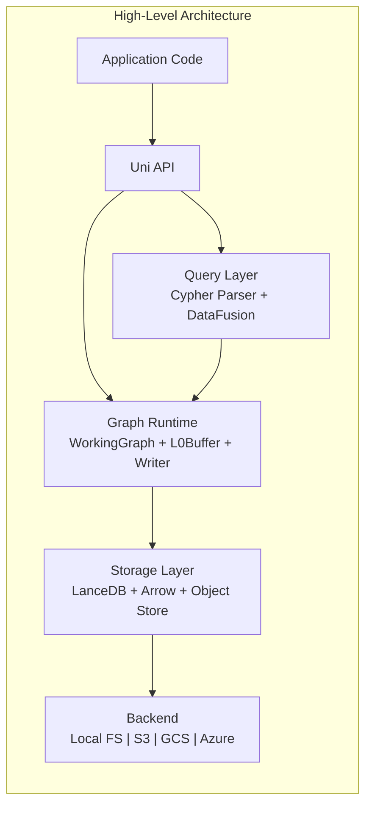

---

# Part II: Architecture Deep Dive

## Layered Design

Uni follows a strict three-layer architecture. Each layer has clear responsibilities and well-defined interfaces:

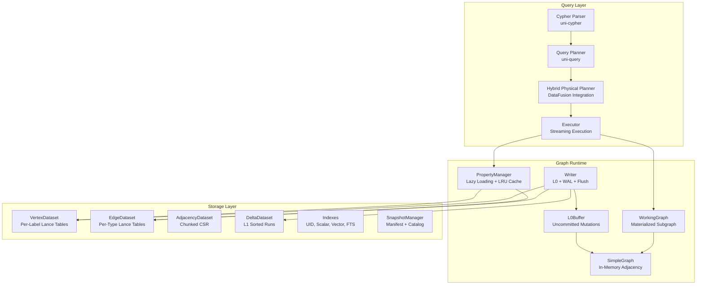

### Query Layer (`uni-cypher` + `uni-query`)

The query layer translates OpenCypher text into a streaming execution plan:

1. **Parser** (`uni-cypher`): pest-based Cypher parser that produces an AST supporting MATCH, CREATE, MERGE, WITH, RETURN, WHERE, UNWIND, DELETE, SET, REMOVE, CALL, WITH RECURSIVE, UNION, and DDL commands.
2. **Planner** (`uni-query`): Converts AST into a logical plan, extracting vector similarity calls, inverted index lookups, and pushdown predicates.
3. **Physical Planner**: Maps logical plan to DataFusion physical operators — `GraphScanExec`, `GraphTraverseExec`, `GraphVectorKnnExec`, `MutationExec`, etc.
4. **Executor**: Streams Arrow `RecordBatch` results through the DataFusion pipeline.

### Graph Runtime (`uni-common` + `uni-algo` + `uni`)

The runtime manages in-memory graph state and write coordination:

- **WorkingGraph**: A materialized subgraph loaded from storage into a `SimpleGraph` for algorithm execution.
- **L0Buffer**: In-memory buffer backed by `SimpleGraph` for uncommitted mutations. Tracks topology, properties, tombstones, versions, and timestamps.
- **Writer**: Coordinates writes through WAL → L0 → flush → L1 → compact → L2.
- **PropertyManager**: Lazy-loads vertex/edge properties from Lance with an LRU cache, with L0 overlay taking priority.

### Storage Layer (`uni-store`)

Persistent storage using LanceDB (Arrow-native columnar format):

- **VertexDataset**: Per-label Lance tables (`vertices_{label}`) with schema-defined columns plus JSONB overflow.
- **EdgeDataset**: Per-type Lance tables (`edges_{type}`) with endpoint VIDs and properties.
- **AdjacencyDataset**: Chunked CSR format for O(1) neighbor lookups.
- **DeltaDataset**: LSM-style L1 sorted runs with Insert/Delete operations.
- **Indexes**: UID (SHA3-256), scalar (BTree/Hash/Bitmap), vector (HNSW/IVF-PQ), full-text (BM25), inverted, JSON FTS.
- **SnapshotManager**: JSON manifests capturing consistent views of all datasets.

## Workspace Structure

```
crates/
├── uni/            # Main library crate — public API, Session, Transaction, UniBuilder
├── uni-common/     # Identity (Vid/Eid/UniId), Schema, DataType, Config, Snapshots, SimpleGraph
├── uni-store/      # Lance datasets, CSR adjacency, L0Buffer, Writer, WAL, Indexes
├── uni-algo/       # 35 graph algorithms, GraphProjection
├── uni-query/      # Query executor, DataFusion integration, pushdown, UDFs
├── uni-cypher/     # Cypher parser (pest-based), Locy parser
├── uni-crdt/       # 8 CRDT types with merge semantics
├── uni-locy/       # Locy compiler (stratify, wardedness, typecheck, orchestrator)
├── uni-cli/        # CLI (import, query, repl, snapshot)
├── uni-tck/        # OpenCypher TCK compliance tests
└── uni-locy-tck/   # Locy TCK tests
bindings/
├── uni-db/         # PyO3 Python bindings (sync + async)
└── uni-pydantic/   # Pydantic OGM layer
```

## Crate Dependency Graph

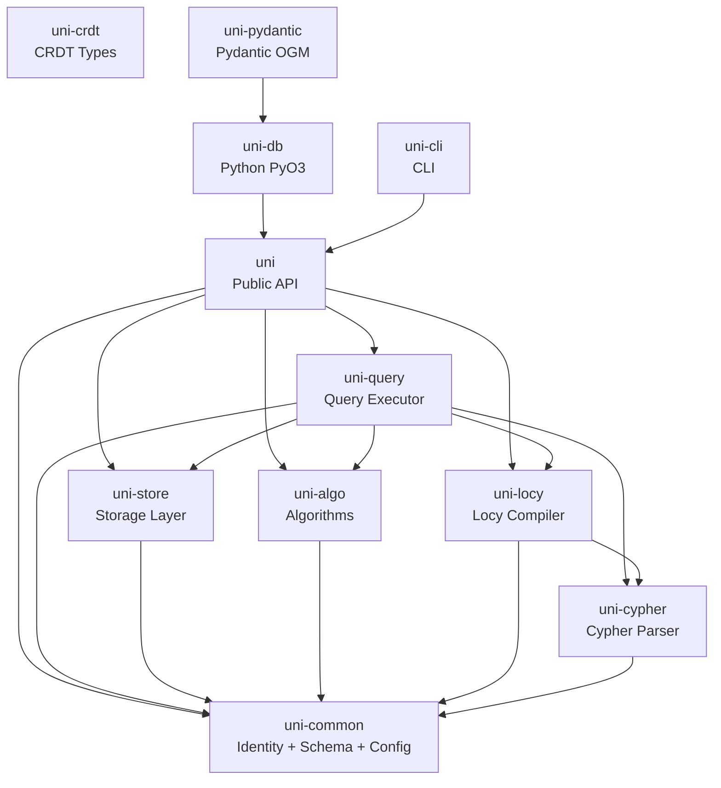

## Key Dependencies

| Crate | Purpose |
|---|---|
| `lancedb` / `lance` | Columnar storage with versioning, vector indexes, full-text search |
| `arrow` / `arrow-array` | In-memory columnar data format (RecordBatch, Array types) |
| `datafusion` | Query engine — physical planning, expression evaluation, aggregation |
| `pest` / `pest_derive` | PEG parser generator powering `uni-cypher`'s Cypher and Locy grammars |
| `object_store` | S3/GCS/Azure/local filesystem abstraction |
| `pyo3` | Python bindings (FFI) |
| `candle-core` / `candle-transformers` | Native Rust ML inference for auto-embedding |
| `uni-xervo` | Embedding + generation runtime used by auto-embedding and host-side multimodal model calls |
| `sha3` | SHA3-256 hashing for UniId content addressing |
| `serde` / `rmp-serde` | MessagePack serialization for CRDTs and CypherValues |

## Write Path (End-to-End)

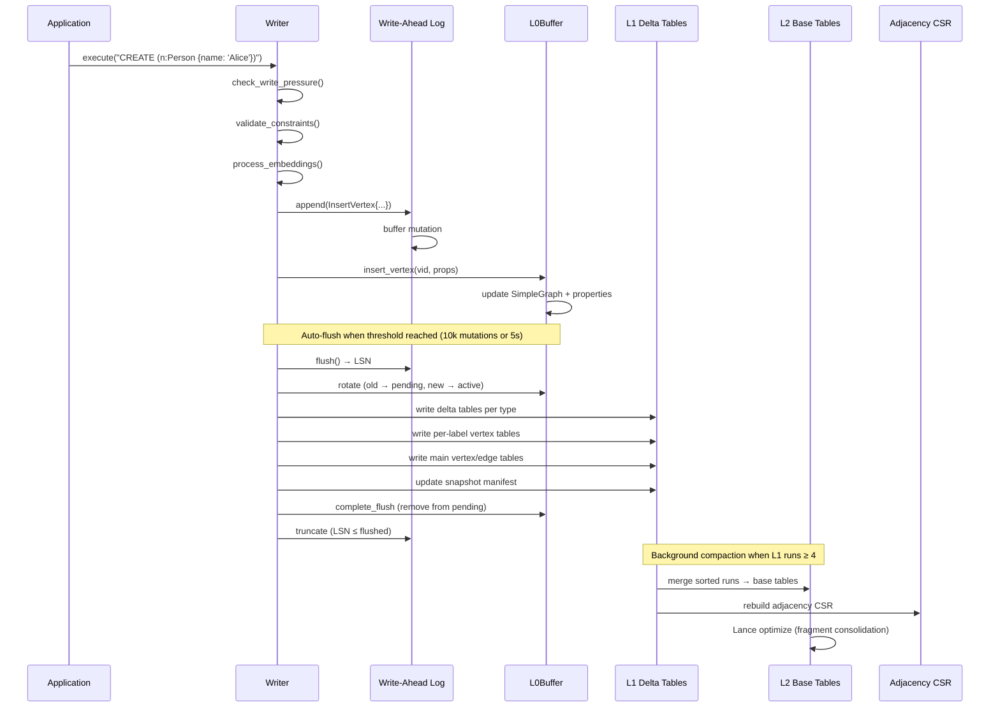

## Read Path (End-to-End)

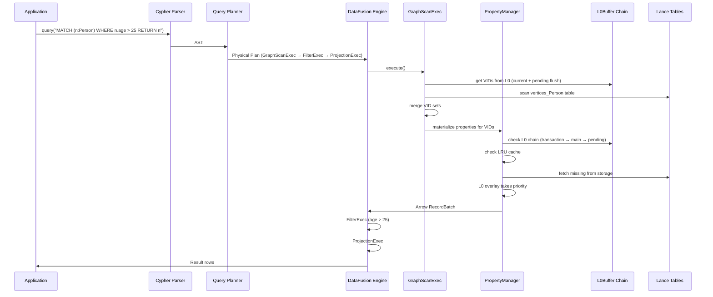

## Design Principles

These principles, drawn from the original design documents, guide every architectural decision in Uni:

1. **Object-Store-First**: Minimize round trips. Assume 100ms latency. Batch reads. Self-contained chunks where one read gets everything needed.
2. **Simplicity Over Generality**: Explicit constraints, fewer options. A custom `SimpleGraph` instead of a generic graph library.
3. **LSM-Style Writes**: Optimized for write-heavy workloads. Memory buffer → sorted runs → compacted base. Same proven pattern as LevelDB/RocksDB, adapted for graph data.
4. **Columnar Everything**: Arrow arrays for properties, DataFusion for query execution. Get analytical performance without a separate OLAP system.
5. **Content Addressing**: UniId (SHA3-256) provides stable references across systems and decouples identity from storage location. UID is a lookup index, not a uniqueness constraint — multiple vertices may share a UID.
6. **Single-Writer Simplicity**: One writer at a time eliminates write-write conflicts. Multi-reader with snapshot isolation provides consistent reads without locking.

---

# Part III: Identity Model & Data Types

## Identity System Overview

Uni uses a **dual-identity** system. Each vertex has both an internal dense identifier (VID) for efficient storage and an external content-addressed identifier (UniId) for stable cross-system references.

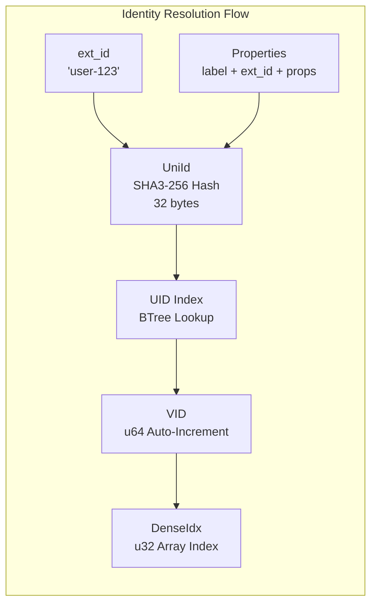

## VID (Vertex ID)

The internal vertex identifier — a 64-bit auto-incrementing integer.

| Field | Details |
|---|---|
| **Type** | `u64` |
| **Encoding** | Pure auto-increment (no embedded label/offset bits) |
| **Sentinel** | `Vid::INVALID = u64::MAX` |
| **Purpose** | O(1) array indexing during query execution |
| **Label Resolution** | Via `VidLabelsIndex` (separate in-memory bidirectional map) |

VIDs are dense, sequential, and never reused. They serve as the primary key in all Lance tables (`_vid` column) and as array offsets in CSR adjacency structures.

## EID (Edge ID)

The internal edge identifier — a 64-bit auto-incrementing integer.

| Field | Details |
|---|---|
| **Type** | `u64` |
| **Encoding** | Pure auto-increment |
| **Sentinel** | `Eid::INVALID = u64::MAX` |
| **Purpose** | Uniquely identifies edges, supports parallel edges |

Multiple edges of the same type between the same vertices are allowed — each gets a unique EID with potentially different properties.

## Edge Type ID Encoding

Edge type IDs use a 32-bit integer with a special bit flag to distinguish schema-defined from schemaless types:

```
Bit 31 = 0: Schema-defined edge type (from schema.json)
Bit 31 = 1: Schemaless edge type (dynamically assigned at runtime)

┌─────────────────────────────────────────┐
│ Bit 31 │     Bits 30..0 (local ID)      │
│  flag  │     up to 2^31 - 1 types       │
└─────────────────────────────────────────┘
```

- `is_schemaless_edge_type(id)` — checks bit 31
- `make_schemaless_id(local_id)` — sets bit 31 flag (`0x8000_0000`)
- `extract_local_id(id)` — masks off bit 31

## DenseIdx

A 32-bit index used for O(1) array access during graph algorithm execution.

| Field | Details |
|---|---|
| **Type** | `u32` |
| **Sentinel** | `DenseIdx::INVALID = u32::MAX` |
| **Purpose** | Remaps sparse VIDs to dense array positions |
| **Remapper** | `VidRemapper` maintains sparse-to-dense mapping |

When algorithms build a `GraphProjection`, VIDs (which may be sparse across the u64 range) are remapped to contiguous `DenseIdx` values for cache-friendly array access.

## UniId (Content-Addressed Identifier)

A SHA3-256 hash that provides **stable, content-addressed identity** for vertices across systems.

| Field | Details |
|---|---|
| **Type** | `[u8; 32]` (256-bit SHA3 hash) |
| **Encoding** | 53-character Base32Lower multibase string |
| **Example** | `z3asjk42...` (z prefix = Base32Lower) |
| **Computation** | `SHA3-256(label ‖ ext_id ‖ sorted_properties)` |

UniId enables:
- **Content lookup**: Find vertices by content hash (multiple vertices may share a UID)
- **Cross-system references**: IDs are stable regardless of which Uni instance created them
- **Content verification**: Detect data corruption or tampering

> **Note:** UID is a lookup index, not a uniqueness constraint. `CREATE (:Label), (:Label)` freely creates two vertices with different VIDs even if they produce the same UID.

The UID Index provides O(log N) lookup from UniId → VID via a BTree index on the hex-encoded UID column.

## ext_id (External ID)

A user-provided string primary key, unique per label. This is the most common way users reference vertices.

```cypher
// Create with ext_id
CREATE (n:Person {ext_id: 'user-123', name: 'Alice'})

// Lookup by ext_id
MATCH (n:Person {ext_id: 'user-123'}) RETURN n
```

## Complete Type System

Uni supports a rich type system mapped to Apache Arrow types for columnar storage:

### Primitive Types

| Uni Type | Arrow Type | Description |
|---|---|---|
| `String` | `Utf8` | UTF-8 text |
| `Int32` | `Int32` | 32-bit signed integer |
| `Int64` (alias: `Int`) | `Int64` | 64-bit signed integer |
| `Float32` | `Float32` | 32-bit IEEE 754 |
| `Float64` (alias: `Float`) | `Float64` | 64-bit IEEE 754 |
| `Bool` | `Boolean` | true/false |

### Temporal Types

| Uni Type | Arrow Type | Description |
|---|---|---|
| `Timestamp` | `Timestamp(Nanosecond, UTC)` | UTC timestamp with nanosecond precision |
| `Date` | `Date32` | Calendar date (days since epoch) |
| `Time` | Struct(`nanos_since_midnight: i64`, `offset_seconds: i32`) | Time of day with timezone offset |
| `DateTime` | Struct(`nanos_since_epoch: i64`, `offset_seconds: i32`, `timezone_name: Option<Utf8>`) | Full date-time with timezone |
| `Duration` | `LargeBinary` (CypherValue codec) | Time duration |

### Complex Types

| Uni Type | Arrow Type | Description |
|---|---|---|
| `CypherValue` | `LargeBinary` | MessagePack-tagged binary (any Cypher value) |
| `Vector { dimensions }` | `FixedSizeList(Float32, N)` | Fixed-dimension embedding vector |
| `List(T)` | `List(T)` | Variable-length list of type T |
| `Map(K, V)` | `List(Struct(key: K, value: V))` | Key-value map |

### Spatial Types

| Uni Type | Arrow Type | Description |
|---|---|---|
| `Point(Geographic)` | Struct(`latitude`, `longitude`, `crs`: Float64) | WGS84 geographic coordinates |
| `Point(Cartesian2D)` | Struct(`x`, `y`, `crs`: Float64) | 2D Cartesian point |
| `Point(Cartesian3D)` | Struct(`x`, `y`, `z`, `crs`: Float64) | 3D Cartesian point |

### CRDT Types

| Uni Type | Arrow Type | Description |
|---|---|---|
| `Crdt(GCounter)` | `Binary` (MessagePack) | Grow-only counter |
| `Crdt(GSet)` | `Binary` (MessagePack) | Grow-only set |
| `Crdt(ORSet)` | `Binary` (MessagePack) | Observed-remove set |
| `Crdt(LWWRegister)` | `Binary` (MessagePack) | Last-write-wins register |
| `Crdt(LWWMap)` | `Binary` (MessagePack) | Last-write-wins map |
| `Crdt(Rga)` | `Binary` (MessagePack) | Replicated growable array |
| `Crdt(VectorClock)` | `Binary` (MessagePack) | Vector clock for causal ordering |
| `Crdt(VCRegister)` | `Binary` (MessagePack) | Vector-clock register |

## CRDT Types Deep Dive

CRDTs (Conflict-free Replicated Data Types) enable automatic, deterministic merging of concurrent updates without coordination. Every CRDT merge is **commutative**, **associative**, and **idempotent** — the order and number of merges doesn't matter.

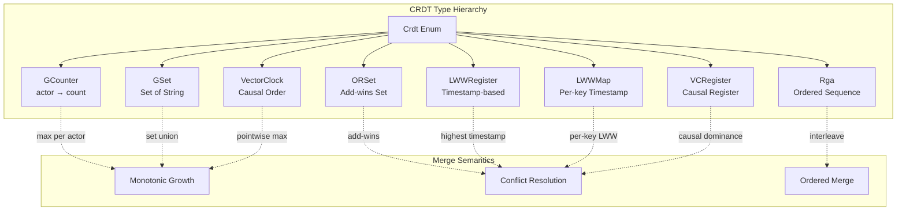

### GCounter (Grow-Only Counter)

```
Structure: HashMap<ActorId, u64>
Merge: max(self[actor], other[actor]) for each actor
Value: sum of all actor counts
```

Use case: Distributed counters (page views, event counts) where only increment is needed.

### GSet (Grow-Only Set)

```
Structure: HashSet<String>
Merge: set union
```

Use case: Tags, labels, or categories that are only added, never removed.

### ORSet (Observed-Remove Set)

```
Structure: Elements with unique UUID tags
Merge: add-wins conflict resolution
```

Use case: Mutable sets where elements can be added and removed. If concurrent add and remove, add wins.

### LWWRegister (Last-Write-Wins Register)

```
Structure: (value: T, timestamp: u64)
Merge: highest timestamp wins
```

Use case: Simple mutable values where "latest write wins" is acceptable.

### LWWMap (Last-Write-Wins Map)

```
Structure: HashMap<K, (V, timestamp)>
Merge: per-key highest timestamp wins
```

Use case: Property maps where individual keys can be updated independently.

### Rga (Replicated Growable Array)

```
Structure: Ordered sequence with unique position IDs
Merge: interleave by position ID ordering
Operations: insert_at(pos, value), delete_at(pos)
```

Use case: Collaborative text editing, ordered lists.

### VectorClock

```
Structure: HashMap<ActorId, u64>
Merge: pointwise maximum
Comparison: partial order (concurrent, before, after)
```

Use case: Tracking causal ordering between events from different actors.

### VCRegister (Vector-Clock Register)

```
Structure: (value: T, vector_clock: VectorClock)
Merge: causally dominant value wins; concurrent → LWW fallback
```

Use case: Values that need causal consistency rather than simple timestamp ordering.

### Serialization

All CRDT values are serialized using MessagePack with serde-tagged abbreviations:

| Tag | CRDT Type |
|---|---|
| `gc` | GCounter |
| `gs` | GSet\<String\> |
| `os` | ORSet\<String\> |
| `lr` | LWWRegister\<serde_json::Value\> |
| `lm` | LWWMap\<String, serde_json::Value\> |
| `rg` | Rga\<String\> |
| `vc` | VectorClock |
| `vr` | VCRegister\<serde_json::Value\> |

On upsert, if a property has a CRDT type, Uni automatically merges the new value with the existing one using the CRDT's merge function. Non-CRDT properties use last-write-wins (LWW) semantics.

---

# Part IV: Schema Design Guide

## Schema Concepts

Every Uni database has a **schema** that defines the structure of its graph. The schema is stored as `schema.json` at the database root and contains:

- **Labels**: Vertex categories (e.g., `Person`, `Product`, `Document`)
- **Edge Types**: Relationship categories (e.g., `KNOWS`, `PURCHASED`, `SIMILAR_TO`)
- **Properties**: Typed fields on labels and edge types
- **Indexes**: Secondary indexes for query acceleration
- **Constraints**: Uniqueness, existence, and check constraints
- **Schemaless Registry**: Dynamically-assigned edge type IDs for types not in the schema

### Schema Metadata

```rust
Schema {
    schema_version: u32,                  // Incremented on changes
    labels: HashMap<String, LabelMeta>,
    edge_types: HashMap<String, EdgeTypeMeta>,
    properties: HashMap<String, HashMap<String, PropertyMeta>>,  // label → prop → meta
    indexes: Vec<IndexDefinition>,
    constraints: Vec<Constraint>,
    schemaless_registry: SchemalessEdgeTypeRegistry,
}
```

### LabelMeta

```rust
LabelMeta {
    id: u16,                        // Unique label identifier (never reused)
    created_at: DateTime<Utc>,
    state: SchemaElementState,      // Active | Hidden | Tombstone
}
```

### EdgeTypeMeta

```rust
EdgeTypeMeta {
    id: u32,                        // Unique edge type identifier
    src_labels: Vec<String>,        // Allowed source labels (empty = any)
    dst_labels: Vec<String>,        // Allowed destination labels (empty = any)
    state: SchemaElementState,
}
```

### PropertyMeta

```rust
PropertyMeta {
    r#type: DataType,               // String, Int64, Vector{384}, Crdt(GCounter), etc.
    nullable: bool,
    added_in: u32,                  // Schema version when this property was added
    state: SchemaElementState,
    generation_expression: Option<String>,  // For computed/generated properties
}
```

## Schema Element Lifecycle

Schema elements follow a soft-delete lifecycle to enable safe evolution without data loss:

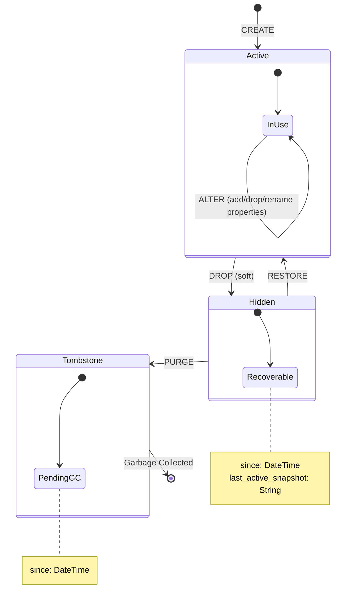

Key rules:
- **Label/type IDs are never reused** — append-only registry in `schema.json`
- **Nullable properties require no data rewrite** — existing rows return NULL
- **Defaults can be backfilled asynchronously** after schema changes

## Defining a Schema

### Rust API (SchemaBuilder)

```rust
use uni_db::{Uni, DataType, IndexType, ScalarType};

let db = Uni::open("./my-graph")
    .schema_file("schema.json")  // Load from file at build time
    .build()
    .await?;

// Or build programmatically via the fluent SchemaBuilder
db.schema()
    .label("Person")
        .property("name", DataType::String)
        .property("age", DataType::Int64)
        .property_nullable("email", DataType::String)
        .index("name", IndexType::Scalar(ScalarType::BTree))
    .label("Document")
        .property("title", DataType::String)
        .property("content", DataType::String)
        .vector("embedding", 384)
    .edge_type("KNOWS", &["Person"], &["Person"])
        .property("since", DataType::Date)
        .property("weight", DataType::Float64)
    .apply().await?;
```

### Cypher DDL

```cypher
// Create labels with properties
CREATE LABEL Person {
    name: STRING,
    age: INTEGER,
    email: STRING UNIQUE
}

CREATE LABEL Document {
    title: STRING,
    content: STRING,
    embedding: VECTOR(384)
}

// Create edge types with source/destination constraints
CREATE EDGE TYPE KNOWS FROM [Person] TO [Person] {
    since: DATE,
    weight: FLOAT
}

CREATE EDGE TYPE AUTHORED FROM [Person] TO [Document]

// Alter existing schema
ALTER LABEL Person ADD PROPERTY phone: STRING
ALTER LABEL Person DROP PROPERTY age
ALTER LABEL Person RENAME PROPERTY name TO full_name

// Drop with soft-delete
DROP LABEL IF EXISTS TempData
DROP EDGE TYPE IF EXISTS OLD_RELATION
```

### Python API

```python
from uni_db import Uni, DataType

db = Uni.open("./my-graph")

# Fluent schema builder via db.schema()
db.schema() \
    .label("Person") \
        .property("name", DataType.STRING()) \
        .property("age", DataType.INT64()) \
        .property_nullable("email", DataType.STRING()) \
        .vector("embedding", 384) \
    .done() \
    .edge_type("KNOWS", ["Person"], ["Person"]) \
        .property("since", DataType.DATE()) \
        .property("weight", DataType.FLOAT64()) \
    .apply()
```

## Schema Design Best Practices

### Label Design

**One label per entity type.** Each label maps to a Lance table. Labels are the primary unit of storage organization.

```cypher
// GOOD: Clear entity separation
CREATE LABEL Person { name: STRING, age: INTEGER }
CREATE LABEL Company { name: STRING, founded: DATE }

// BAD: Mega-label mixing entity types
CREATE LABEL Entity { type: STRING, name: STRING, age: INTEGER, founded: DATE }
```

### Edge Type Modeling

**Use directional semantics** that read naturally in English. Specify source/destination label constraints when the relationship has clear domain semantics.

```cypher
// GOOD: Clear directional semantics with constraints
CREATE EDGE TYPE WORKS_AT FROM [Person] TO [Company] { since: DATE }
CREATE EDGE TYPE MANAGES FROM [Person] TO [Person]
CREATE EDGE TYPE PURCHASED FROM [Customer] TO [Product] { quantity: INTEGER }

// BAD: Ambiguous direction
CREATE EDGE TYPE RELATED_TO  // Which direction means what?
```

### Property Type Selection

| Use Case | Recommended Type | Why |
|---|---|---|
| Short text (names, codes) | `String` | Indexable, searchable |
| Counts, IDs | `Int64` | Efficient comparison, aggregation |
| Measurements, scores | `Float64` | IEEE 754, aggregation-friendly |
| Timestamps | `Timestamp` | Nanosecond precision, UTC |
| Embeddings | `Vector{N}` | Fixed-size, vector-indexable |
| Distributed counters | `Crdt(GCounter)` | Merge-friendly increments |
| Tag collections | `Crdt(GSet)` | Add-only, merge-friendly |
| Mutable sets | `Crdt(ORSet)` | Add/remove with add-wins |
| Mutable scalars (distributed) | `Crdt(LWWRegister)` | Last-write-wins |
| Feature maps | `Map(String, Float64)` | Structured key-value |
| Multi-value fields | `List(String)` | Variable-length lists |

### When to Use CRDTs vs Regular Properties

Use CRDTs when:
- Multiple writers may update the same property concurrently
- You need deterministic merge semantics without coordination
- The property represents a distributed aggregate (counter, set, clock)

Use regular properties when:
- Single-writer access pattern
- Simple last-write-wins is acceptable
- You need maximum query performance (CRDTs have serialization overhead)

### Multi-Label Vertices

Vertices can carry multiple labels. Each vertex is stored in every label's table with its full label list preserved.

```cypher
// Create a vertex with multiple labels
CREATE (n:Person:Employee {name: 'Alice', employee_id: 'E001'})

// Query by any label
MATCH (n:Employee) RETURN n.name
MATCH (n:Person) RETURN n.name  // Same vertex appears in both
```

Use multi-labels when an entity naturally belongs to multiple categories. Avoid excessive labels — each additional label means the vertex is stored in one more Lance table.

## Schema Anti-Patterns

| Anti-Pattern | Problem | Solution |
|---|---|---|
| **Over-labeling** | Vertex stored in too many tables, duplicating data | Limit to 2-3 labels per vertex |
| **Mega-nodes** | Vertices with millions of edges | Introduce intermediate nodes or edge bucketing |
| **Missing indexes** | Full table scans on filtered properties | Index every property used in WHERE clauses |
| **Strings for numbers** | Can't do range queries or aggregations | Use Int64/Float64 for numeric data |
| **Large blobs as properties** | Bloats Lance tables, slows scans | Store blobs externally, keep references |
| **Schemaless everything** | Properties in overflow JSONB lose columnar benefits | Define schema for frequently-queried properties |

---

# Part V: Storage Engine

## On-Disk Storage Layout

When you open or create a Uni database at a path (e.g., `./my-graph`), the following directory tree is created on disk (or in the object store):

```
my-graph/                                   # Database root (the URI you pass to Uni::open)
├── schema.json                             # Legacy schema location (may exist in older DBs)
│
└── storage/                                # All persistent data lives here
    │
    ├── catalog/                            # Metadata & snapshot management
    │   ├── schema.json                     # Authoritative schema definition
    │   ├── latest                          # File containing current snapshot UUID
    │   ├── named_snapshots.json            # { "name" → "snapshot_id" } mapping
    │   └── manifests/                      # One JSON file per snapshot
    │       ├── a1b2c3d4-....json           # SnapshotManifest (versions, counts, etc.)
    │       └── e5f6g7h8-....json
    │
    ├── wal/                                # Write-Ahead Log segments
    │   ├── 00000000000000000001_<uuid>.wal  # WAL segment (JSON-serialized mutations)
    │   ├── 00000000000000000002_<uuid>.wal  # LSN zero-padded to 20 digits
    │   └── ...                              # Lexicographic ordering = LSN ordering
    │
    ├── vertices_Person/                    # LanceDB table: per-label vertex data
    │   ├── _versions/                      # Lance versioning metadata
    │   ├── data/                           # Arrow IPC data files (*.lance)
    │   └── _indices/                       # Lance-managed indexes
    │
    ├── vertices_Document/                  # Another per-label table
    │   └── ...
    │
    ├── vertices/                           # LanceDB table: unified main vertex table
    │   └── ...                             # (all vertices regardless of label)
    │
    ├── edges/                              # LanceDB table: unified main edge table
    │   └── ...                             # (all edges regardless of type)
    │
    ├── deltas_KNOWS_fwd/                   # LanceDB table: forward edge deltas
    │   └── ...                             # (sorted by src_vid)
    │
    ├── deltas_KNOWS_bwd/                   # LanceDB table: backward edge deltas
    │   └── ...                             # (sorted by dst_vid)
    │
    ├── adjacency_KNOWS_fwd/                # LanceDB table: forward CSR adjacency
    │   └── ...                             # (row-per-vertex with neighbor lists)
    │
    ├── adjacency_KNOWS_bwd/                # LanceDB table: backward CSR adjacency
    │   └── ...
    │
    └── indexes/                            # Secondary indexes
        ├── uni_id_to_vid/                  # UID Index (UniId → VID mapping)
        │   ├── Person/
        │   │   └── index.lance/            # BTree on hex-encoded UID
        │   └── Document/
        │       └── index.lance/
        │
        ├── idx_Person___email/             # JSON path index (label___path)
        │   └── ...                         # Special chars → underscore
        │
        └── Person_tags_inverted/           # Inverted index (label_property_inverted)
            └── ...                         # Term → VID postings
```

### Path Construction Patterns

Table names are constructed by `LanceDbStore` methods:

```rust
LanceDbStore::vertex_table_name("Person")          // → "vertices_Person"
LanceDbStore::delta_table_name("KNOWS", "fwd")     // → "deltas_KNOWS_fwd"
LanceDbStore::delta_table_name("KNOWS", "bwd")     // → "deltas_KNOWS_bwd"
LanceDbStore::adjacency_table_name("KNOWS", "fwd") // → "adjacency_KNOWS_fwd"
```

Index paths:

```
UID Index:      storage/indexes/uni_id_to_vid/{label}/index.lance
JSON Path:      storage/indexes/idx_{label}___{safe_path}
Inverted:       storage/indexes/{label}_{property}_inverted
```

### Storage Modes

| Mode | Where Data Lives | Use Case |
|---|---|---|
| **Local** | Local filesystem at the URI path | Development, single-machine |
| **Remote** | S3/GCS/Azure at the URI (e.g., `s3://bucket/path`) | Cloud production |
| **Hybrid** | WAL + ID allocation local; bulk data in cloud | Low-latency writes + cloud durability |

In hybrid mode, the local path contains `wal/` and ID allocation state, while `storage/` tables are in the remote object store.

## LSM-Style 3-Tier Architecture

Uni's storage engine uses an **LSM-tree-inspired** design optimized for graph data. Writes go to an in-memory buffer (L0), flush to sorted runs in LanceDB (L1), and compact into base tables (L2).

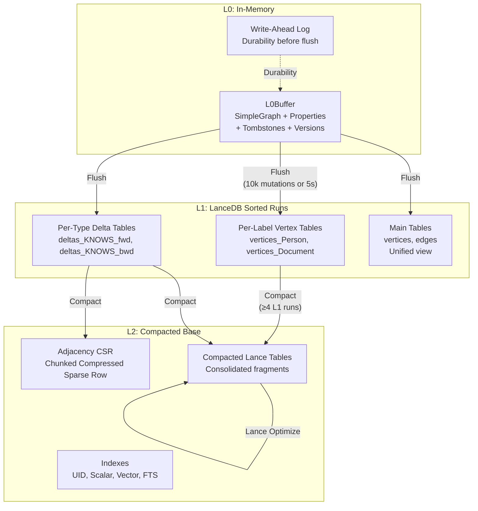

### Design Reasoning

The 3-tier design provides:

1. **Write Performance**: L0 is pure in-memory. Writes are O(1) amortized — just append to the SimpleGraph and property maps.
2. **Read Consistency**: Reads merge L0 overlay with L1/L2 storage. L0 always takes priority (newest data).
3. **Background Maintenance**: Compaction runs asynchronously, never blocking reads or writes.
4. **Crash Recovery**: WAL ensures durability. On restart, replay WAL segments since last flush.

## Vertex Storage

### Per-Label Vertex Tables (`vertices_{label}`)

Each label gets its own LanceDB table with typed columns:

| Column | Arrow Type | Description |
|---|---|---|
| `_vid` | UInt64 | Vertex ID (primary key) |
| `_uid` | FixedSizeBinary(32) | UniId (SHA3-256) |
| `_deleted` | Boolean | Soft-delete flag |
| `_version` | UInt64 | MVCC version number |
| `ext_id` | Utf8 (nullable) | User-provided external ID |
| `_labels` | List\<Utf8\> | All labels on this vertex |
| `_created_at` | Timestamp(ns) | Creation timestamp |
| `_updated_at` | Timestamp(ns) | Last update timestamp |
| *property columns* | *schema-defined* | One column per schema property |
| `overflow_json` | LargeBinary | JSONB for non-schema properties |

### Main Vertex Table (`vertices`)

A unified table containing all vertices regardless of label:

| Column | Arrow Type | Description |
|---|---|---|
| `_vid` | UInt64 | Primary key |
| `_uid` | FixedSizeBinary(32) | UniId |
| `ext_id` | Utf8 (nullable) | External ID |
| `labels` | List\<Utf8\> | All labels |
| `props_json` | LargeBinary | All properties as JSONB |
| `_deleted` | Boolean | Soft-delete |
| `_version` | UInt64 | MVCC version |
| `_created_at`, `_updated_at` | Timestamp(ns) | Timestamps |

The main table enables cross-label queries without scanning every per-label table.

### Overflow Properties (Schemaless)

Properties not defined in the schema are stored in the `overflow_json` column as JSONB binary. Queries against overflow properties are automatically rewritten to use Lance JSONB functions (`json_get_string`, `json_get_int`, etc.).

Read-your-writes semantics apply to schemaless properties too: direct property access and `properties(node)` consult the L0 overlay before storage, so `SET n.extra = 42` is visible immediately without an explicit flush. The same overflow properties are preserved through flush and later compaction cycles.

```cypher
// This property is in overflow_json if not in schema
MATCH (n:Person) WHERE n.nickname = 'Bob' RETURN n

// Internally rewritten to:
// ... WHERE json_get_string(overflow_json, 'nickname') = 'Bob'
```

## Edge Storage

### Delta Tables (`deltas_{edge_type}_{direction}`)

Each edge type gets **two** delta tables — one for forward direction (indexed by `src_vid`) and one for backward (indexed by `dst_vid`):

| Column | Arrow Type | Description |
|---|---|---|
| `src_vid` | UInt64 | Source vertex |
| `dst_vid` | UInt64 | Destination vertex |
| `eid` | UInt64 | Edge ID |
| `op` | UInt8 | 0=Insert, 1=Delete |
| `_version` | UInt64 | MVCC version |
| `_created_at`, `_updated_at` | Int64 (nullable) | Nanoseconds since epoch |
| *property columns* | *schema-defined* | Edge properties |
| `overflow_json` | LargeBinary | Non-schema edge properties |

**L1Entry structure** per delta row:

```rust
L1Entry {
    src_vid: Vid,
    dst_vid: Vid,
    eid: Eid,
    op: Op,            // Insert or Delete
    version: u64,
    properties: Properties,
    created_at: Option<i64>,
    updated_at: Option<i64>,
}
```

**OOM Protection**: `DEFAULT_MAX_COMPACTION_ROWS = 5,000,000` with `ENTRY_SIZE_ESTIMATE = 145 bytes` per entry.

### Main Edge Table (`edges`)

| Column | Arrow Type | Description |
|---|---|---|
| `_eid` | UInt64 | Edge ID |
| `src_vid`, `dst_vid` | UInt64 | Endpoint vertices |
| `type` | Utf8 | Edge type name |
| `props_json` | LargeBinary | All properties as JSONB |
| `_deleted`, `_version` | Boolean, UInt64 | MVCC fields |
| `_created_at`, `_updated_at` | Timestamp(ns) | Timestamps |

## Adjacency / CSR Format

The Compressed Sparse Row (CSR) format provides O(1) neighbor lookups — critical for graph traversal performance.

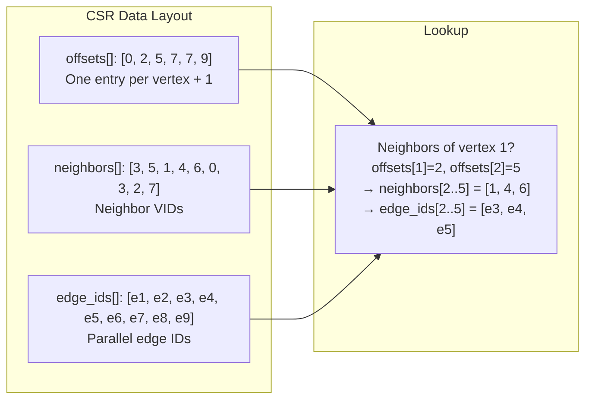

### CompressedSparseRow

```rust
CompressedSparseRow {
    offsets: Vec<u32>,        // O(1) neighbor range lookup
    neighbors: Vec<DenseIdx>, // Dense indices for algorithms
    neighbor_vids: Vec<Vid>,  // Actual VID values
    edge_ids: Vec<Eid>,       // Edge IDs parallel to neighbors
}
```

- **Lookup**: `offsets[vid]..offsets[vid+1]` gives the range into `neighbors[]` and `edge_ids[]`
- **Memory**: `offsets.len() × 4 + neighbors.len() × 4 + neighbor_vids.len() × 8 + edge_ids.len() × 8`

### MainCsr (Versioned CSR)

For MVCC support, `MainCsr` stores per-edge version metadata:

```rust
MainCsr {
    offsets: Vec<u32>,
    entries: Vec<CsrEdgeEntry>,  // neighbor_vid, eid, created_version
}
```

Each `CsrEdgeEntry` carries a `created_version` field, enabling snapshot queries without rebuilding the CSR.

### AdjacencyDataset (Persistent CSR)

Stored as a LanceDB table (`adjacency_{edge_type}_{direction}`) with row-per-vertex format:

| Column | Arrow Type |
|---|---|
| `src_vid` | UInt64 |
| `neighbors` | List\<UInt64\> |
| `edge_ids` | List\<UInt64\> |

## LanceDB Table Naming Conventions

| Entity | Table Name | Purpose |
|---|---|---|
| All Vertices | `vertices` | Cross-label vertex lookups |
| Per-Label Vertices | `vertices_{label}` | Label-specific scans with typed columns |
| All Edges | `edges` | Cross-type edge lookups |
| Forward Deltas | `deltas_{edge_type}_fwd` | Forward edge mutations (by src_vid) |
| Backward Deltas | `deltas_{edge_type}_bwd` | Backward edge mutations (by dst_vid) |
| Forward Adjacency | `adjacency_{edge_type}_fwd` | Forward CSR adjacency |
| Backward Adjacency | `adjacency_{edge_type}_bwd` | Backward CSR adjacency |

## Write Path Detailed

### Regular Writer

1. **Validate**: `check_write_pressure()` — enforce write throttle limits
2. **Embed**: `process_embeddings_for_labels()` — auto-generate vector embeddings if configured
3. **Constrain**: Validate constraints (NOT NULL, UNIQUE, EXISTS, CHECK, global ext_id uniqueness)
4. **Merge**: `prepare_vertex_upsert()` — CRDT merge for CRDT properties, LWW for others
5. **Log**: `WAL::append(mutation)` — buffer mutation for durability
6. **Buffer**: Write to L0Buffer (SimpleGraph topology + property maps + version tracking)

### L0 → L1 Flush

Triggered when `mutation_count >= auto_flush_threshold` (default: 10,000) or `auto_flush_interval` (default: 5s) elapses with `auto_flush_min_mutations` met:

1. Flush WAL to durable storage → capture LSN
2. Rotate L0: old → `pending_flush` list, new empty L0 → `current`
3. Collect edges and tombstones into delta runs per edge type
4. Write per-label vertex tables with indexes (`_vid`, `_uid`, `ext_id` BTree)
5. Incremental inverted index updates for custom indexes
6. Dual-write to main tables (`vertices`, `edges`)
7. Write new snapshot manifest
8. Complete flush: remove old L0 from `pending_flush`
9. Truncate WAL segments with LSN ≤ flushed LSN

### BulkWriter Path

For large data loads, `BulkWriter` bypasses WAL for performance:

- `insert_vertices(label, vertices)` — allocate VIDs, buffer by label, flush at `batch_size` (10k) or `max_buffer_size_bytes` (1GB)
- `insert_edges(edge_type, edges)` — allocate EIDs, buffer, flush at thresholds
- No WAL; rollback via LanceDB table versioning
- Deferred index rebuilds (sync or async) on `commit()`

## L0Buffer

The L0Buffer is the in-memory write buffer, backed by a `SimpleGraph` for topology:

```rust
L0Buffer {
    graph: SimpleGraph,                          // In-memory adjacency lists
    tombstones: HashMap<Eid, TombstoneEntry>,    // Soft-deleted edges
    vertex_tombstones: HashSet<Vid>,             // Soft-deleted vertices
    edge_properties: HashMap<Eid, Properties>,   // Edge properties
    vertex_properties: HashMap<Vid, Properties>, // Vertex properties
    edge_endpoints: HashMap<Eid, (Vid, Vid, u32)>, // EID → (src, dst, type)
    vertex_labels: HashMap<Vid, Vec<String>>,    // Multi-label support
    edge_types: HashMap<Eid, String>,            // EID → type name
    current_version: u64,                        // MVCC version counter
    mutation_count: usize,                       // For flush decisions
    mutation_stats: MutationStats,               // Per-type mutation counters
    estimated_size: usize,                       // O(1) maintained estimate
    constraint_index: HashMap<Vec<u8>, Vid>,     // Unique constraint lookups
    wal: Option<Arc<WriteAheadLog>>,             // Durability
    wal_lsn_at_flush: u64,                       // WAL LSN at rotation
    // Version tracking
    edge_versions: HashMap<Eid, u64>,            // MVCC edge version
    vertex_versions: HashMap<Vid, u64>,          // MVCC vertex version
    // Timestamp tracking
    vertex_created_at: HashMap<Vid, i64>,
    vertex_updated_at: HashMap<Vid, i64>,
    edge_created_at: HashMap<Eid, i64>,
    edge_updated_at: HashMap<Eid, i64>,
}
```

**Size Estimation**: Maintained incrementally on every mutation (O(1) per write, avoids O(V+E) traversal).

## L0 Visibility Chain

Reads see a **chain** of L0 buffers — the transaction-local L0 (if in a transaction), the current main L0, and any L0s pending flush:

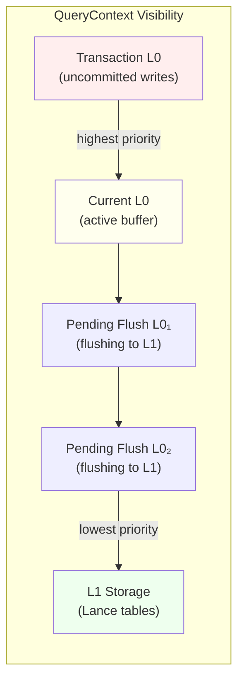

Priority order: **Transaction L0 > Current L0 > Pending Flush L0s > L1 Storage**

The L0Manager coordinates this chain:

```rust
L0Manager {
    current: RwLock<Arc<RwLock<L0Buffer>>>,               // Active L0
    pending_flush: RwLock<Vec<Arc<RwLock<L0Buffer>>>>,     // L0s being flushed
}
```

## WAL (Write-Ahead Log)

The WAL ensures durability before flush. Each WAL segment is stored as a JSON file in the object store:

| Field | Details |
|---|---|
| **Filename** | `{LSN:020}_{uuid}.wal` (zero-padded for lexicographic ordering) |
| **Format** | JSON-serialized `WalSegment { lsn: u64, mutations: Vec<Mutation> }` |
| **Mutations** | `InsertVertex`, `DeleteVertex`, `InsertEdge`, `DeleteEdge` |
| **LSN** | Monotonically increasing Log Sequence Number (starts at 1) |
| **Replay** | `replay_since(hwm)` fetches segments with LSN > high-water mark |

On startup, the Writer calls `replay_wal(hwm)` to recover any mutations that were buffered in L0 but not yet flushed to L1.

## PropertyManager

The PropertyManager handles lazy property loading with an LRU cache and L0 overlay:

```rust
PropertyManager {
    storage: Arc<StorageManager>,
    schema_manager: Arc<SchemaManager>,
    vertex_cache: Option<Mutex<LruCache<(Vid, String), Value>>>,
    edge_cache: Option<Mutex<LruCache<(Eid, String), Value>>>,
    cache_capacity: usize,  // Max entries per cache (0 = disabled)
}
```

**Lookup priority for edge properties:**

1. Check if deleted in L0 → return None
2. Check L0 chain (transaction → main → pending flush) → return if found
3. Check LRU cache → return if found
4. Fetch from Lance storage runs → update cache → return
5. L0 properties **always** take precedence over storage

## Storage Best Practices

| Practice | Details |
|---|---|
| **Cloud Config** | Set appropriate timeouts per provider (S3: higher read timeout, GCS: higher connect timeout) |
| **Flush Tuning** | Write-heavy: raise `auto_flush_threshold` to 50k+. Read-heavy: lower to 5k for fresher reads |
| **BulkWriter for Imports** | Always use BulkWriter for initial data loading — bypasses WAL, defers indexes, 10-100x faster |
| **Monitor L1 Runs** | If L1 run count grows above `max_l1_runs` (4), compaction may be falling behind |

## Storage Anti-Patterns

| Anti-Pattern | Problem | Solution |
|---|---|---|
| **Disabling WAL in production** | Data loss on crash | Keep `wal_enabled: true` (default) |
| **Flush threshold too high** | Memory pressure, stale reads | Keep ≤ 100k mutations between flushes |
| **Not monitoring L1 runs** | Unbounded L1 growth → degraded reads | Set up alerts on `l1_runs` metric |
| **Single huge transaction** | L0 grows unbounded until commit | Break into smaller transactions |

---

# Part VI: Indexing Deep Dive

## Index Architecture

Uni uses a **two-tier index maintenance** strategy:

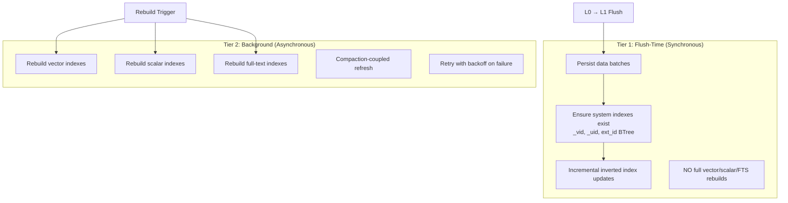

### Rebuild Triggers

| Trigger | Condition | When |
|---|---|---|
| **Growth** | Row count increased by 20-50% since last build | After flush |
| **Churn** | Update/delete ratio exceeds threshold | After compaction |
| **Bulk** | Always after bulk ingest commit | After BulkWriter.commit() |
| **Time** | Optional periodic maintenance window | Configurable |

## Index Types

### UID Index

Content-addressed O(1) lookup from UniId (SHA3-256) to VID.

| Field | Details |
|---|---|
| **URI** | `{base_uri}/indexes/uni_id_to_vid/{label}/index.lance` |
| **Schema** | `_uid: FixedSizeBinary(32)`, `_vid: UInt64`, `_uid_hex: Utf8` |
| **Index** | BTree on `_uid_hex` for O(log N) lookups |
| **Methods** | `get_vid(uid)`, `resolve_uids(&[UniId])` |

```cypher
// UID lookup is O(1) via BTree
MATCH (n:Person) WHERE n._uid = 'z3asjk42...' RETURN n
```

### Scalar Indexes (BTree, Hash, Bitmap)

Traditional database indexes on typed property columns:

| Type | Best For | Query Pattern |
|---|---|---|
| **BTree** | Range queries, ordering, prefix scans | `WHERE n.age > 25`, `STARTS WITH 'pre'` |
| **Hash** | Exact match lookups | `WHERE n.id = 123` |
| **Bitmap** | Low-cardinality columns | `WHERE n.status = 'active'` |

```cypher
// Create scalar indexes
CREATE INDEX idx_name ON Person (name)           // Default: BTree
CREATE INDEX idx_status ON Order (status)         // BTree
```

### Vector Indexes (HNSW, IVF-PQ, Flat)

For approximate nearest neighbor (ANN) search on embedding vectors:

| Type | Best For | Parameters |
|---|---|---|
| **HNSW** | < 1M vectors, high recall | `m` (connections), `ef_construction`, `ef_search` |
| **IVF-PQ** | > 1M vectors, memory-efficient | `num_partitions`, `num_sub_vectors`, `bits` |
| **Flat** | < 10k vectors, exact search | None (brute force) |

```cypher
// Create vector index with HNSW
CREATE VECTOR INDEX idx_embed ON Document (embedding)
  WITH { metric: 'cosine', type: 'hnsw' }

// Create vector index with IVF-PQ for large datasets
CREATE VECTOR INDEX idx_embed ON Document (embedding)
  WITH { metric: 'l2', type: 'ivf_pq', num_partitions: 256 }
```

**Distance Metrics:**

| Metric | Raw Distance | Score Conversion | Similarity Range | Best For |
|---|---|---|---|---|
| `Cosine` | `1.0 - cos(a,b)` (range [0, 2]) | `(2.0 - d) / 2.0` | [0, 1] | Normalized embeddings (most models) |
| `L2` | Squared Euclidean distance | `1.0 / (1.0 + d)` | (0, 1] | Raw embeddings, spatial data |
| `Dot` | Negative dot product | Pass-through | Unbounded | Maximum inner product search |

Score conversion is **metric-aware**: `uni.vector.query`, `uni.search`, and `similar_to()` all use the same `calculate_score(distance, metric)` function to normalize raw Lance distances into similarity scores, regardless of which metric the vector index was created with.

### Full-Text Indexes (BM25)

BM25-based full-text search on text properties:

```cypher
CREATE FULLTEXT INDEX idx_content ON Article (content)

// Query with BM25 scoring
CALL uni.fts.query('Article', 'content', 'graph database', 10)
YIELD node, score
```

### JSON FTS Indexes

Full-text search on nested JSON/JSONB properties:

```cypher
CREATE JSON_FULLTEXT INDEX idx_meta ON Data (metadata)
```

### Inverted Indexes

Term-to-VID mapping for `ANY(x IN list WHERE x IN allowed)` query patterns:

```rust
InvertedIndex {
    dataset: Option<Dataset>,           // Backing Lance dataset
    base_uri: String,                   // Storage URI
    label: String,                      // Vertex label
    property: String,                   // Indexed property
    config: InvertedIndexConfig,        // { label, property, normalize, max_terms_per_doc }
}
```

Postings (`term → VIDs`) are built transiently during index operations, not stored as a struct field.

**Memory guard**: `DEFAULT_MAX_POSTINGS_MEMORY = 256 MB`. Build uses temp segment flushing when memory limit is reached.

### VidLabelsIndex

In-memory bidirectional index for O(1) VID ↔ label lookups:

```rust
VidLabelsIndex {
    vid_to_labels: HashMap<Vid, Vec<String>>,
    label_to_vids: HashMap<String, HashSet<Vid>>,
}
```

Rebuilt from the main vertex table on database open. Updated incrementally on writes.

## Index Lifecycle

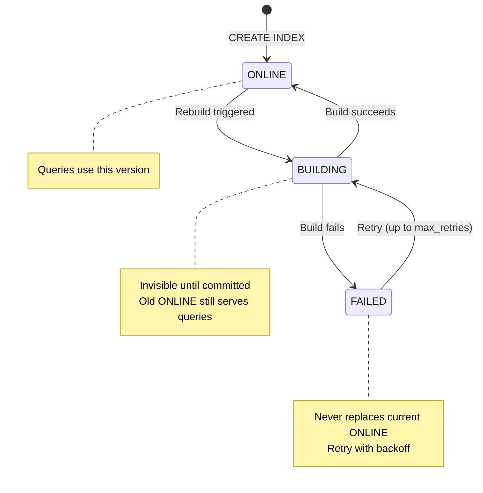

**Index Status Gating**: The query planner only uses indexes with `Online` status. Indexes in `Building`, `Stale`, or `Failed` states are invisible to queries — the old `Online` version continues serving until a rebuild succeeds. This means index rebuilds are zero-downtime: the new index is built in the background and atomically swapped in on success.

| Status | Query Visible | Writes Trigger Rebuild | Description |
|---|---|---|---|
| `Online` | Yes | No | Up-to-date and serving queries |
| `Building` | No (old Online serves) | Queued | Rebuild in progress |
| `Stale` | No (old Online serves) | Queued | Scheduled for rebuild after transient failure |
| `Failed` | No (old Online serves) | Retry if under max_retries | Exhausted retry attempts |

## Predicate Pushdown Priority

When executing a query, the planner pushes predicates down to the most efficient index:

```mermaid
graph TB
    PRED[WHERE Predicate] --> UID{UID Lookup?<br/>n._uid = '...'}
    UID -->|Yes| UIDX[UID Index<br/>O(1) hash lookup]
    UID -->|No| BT{Scalar Index?<br/>n.prop = value<br/>n.prop > value}
    BT -->|Yes| BTX[BTree/Hash/Bitmap<br/>O(log N) lookup]
    BT -->|No| FTS{Full-Text?<br/>CONTAINS 'term'}
    FTS -->|Yes| FTSX[BM25 Full-Text<br/>Scored results]
    FTS -->|No| LANCE{Lance Filter?<br/>Arrow predicate}
    LANCE -->|Yes| LX[Lance Scan<br/>Columnar pushdown]
    LANCE -->|No| RES[Residual Filter<br/>Post-scan evaluation]
```

## Choosing the Right Index

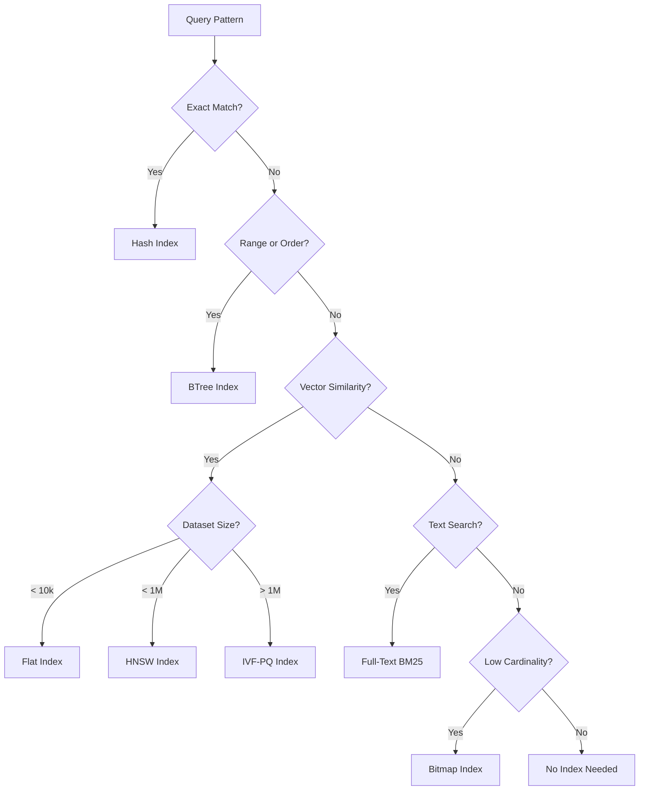

## Indexing Best Practices

| Practice | Details |
|---|---|
| **Index every WHERE property** | Properties used in WHERE clauses should have scalar indexes |
| **HNSW for < 1M vectors** | Best recall-latency trade-off for moderate datasets |
| **IVF-PQ for > 1M vectors** | Memory-efficient with acceptable recall |
| **Match metric to model** | Use Cosine for models with normalized output (most), L2 for raw |
| **BTree for range queries** | ORDER BY, >, <, >=, <=, STARTS WITH |

## Indexing Anti-Patterns

| Anti-Pattern | Problem | Solution |
|---|---|---|
| **Over-indexing** | Index maintenance cost on every write | Only index properties used in queries |
| **Wrong distance metric** | Cosine on unnormalized vectors gives poor results | Check your embedding model's documentation |
| **Missing scalar index on filters** | Full scan on high-cardinality columns | Add BTree index on filtered properties |
| **Vector index without enough data** | HNSW/IVF-PQ need minimum data to be effective | Use Flat for < 1000 rows |

---

# Part VII: Cypher Query Language

## Overview

Uni implements a substantial subset of the OpenCypher query language, extended with vector search, full-text search, DDL commands, time travel, and window functions. The parser is based on `pest` (PEG grammar) and produces an AST that the query planner converts to DataFusion physical plans.

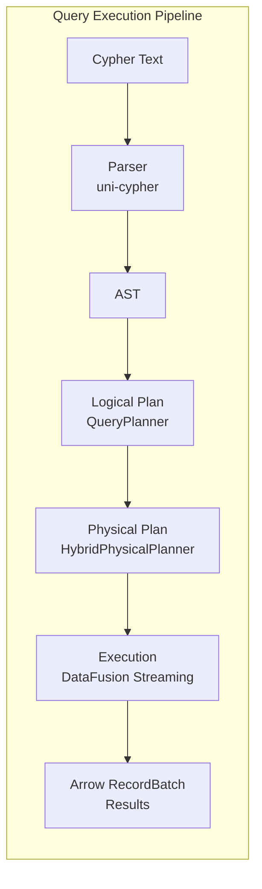

## Clauses

### MATCH

Pattern matching — the core of Cypher. Finds subgraphs matching a pattern.

```cypher
// Simple node match
MATCH (n:Person) RETURN n

// Node with properties
MATCH (n:Person {name: 'Alice'}) RETURN n

// Edge pattern
MATCH (a:Person)-[r:KNOWS]->(b:Person) RETURN a, r, b

// Multi-hop pattern
MATCH (a:Person)-[:KNOWS]->(b:Person)-[:WORKS_AT]->(c:Company)
RETURN a.name, c.name

// OPTIONAL MATCH (left outer join)
OPTIONAL MATCH (n:Person)-[r:MANAGES]->(m:Person) RETURN n, m
```

### Node Patterns

```cypher
(n)                    // Any node, bound to variable n
(n:Person)             // Node with label Person
(n:Person:Employee)    // Node with multiple labels
(n {name: 'Alice'})    // Node with property filter
(n:Person {age: 30})   // Label + property filter
()                     // Anonymous node
```

### Edge Patterns

```cypher
-[r]->                 // Outgoing edge
<-[r]-                 // Incoming edge
-[r]-                  // Undirected edge
-[r:KNOWS]->           // Typed edge
-[r:KNOWS|FRIEND_OF]-> // Multiple types (OR)
-[r:KNOWS {since: 2020}]-> // Edge with properties
-[r *1..3]->           // Variable-length path (1 to 3 hops)
-[r *]->               // Variable-length (any number of hops)
-[r *..5]->            // Variable-length (up to 5 hops)
```

### Path Patterns

```cypher
// Named path
p = (a)-[:KNOWS*]->(b)
RETURN nodes(p), relationships(p), length(p)

// Shortest path
MATCH p = shortestPath((a:Person)-[:KNOWS*]-(b:Person))
WHERE a.name = 'Alice' AND b.name = 'Bob'
RETURN p

// All shortest paths
MATCH p = allShortestPaths((a:Person)-[:KNOWS*]-(b:Person))
RETURN p
```

### Pattern Comprehension

```cypher
// Inline pattern with filtering and projection
RETURN [(a)-[:KNOWS]->(b) WHERE b.age > 25 | b.name] AS friends_over_25
```

### CREATE

```cypher
// Create nodes
CREATE (n:Person {name: 'Alice', age: 30})

// Create edges
MATCH (a:Person {name: 'Alice'}), (b:Person {name: 'Bob'})
CREATE (a)-[:KNOWS {since: 2023}]->(b)

// Create with RETURN
CREATE (n:Document {title: 'Hello'}) RETURN n
```

### MERGE

Upsert — create if not exists, update if exists:

```cypher
// Merge node
MERGE (n:Person {ext_id: 'user-123'})
ON CREATE SET n.created = datetime()
ON MATCH SET n.last_seen = datetime()
RETURN n

// Merge edge
MATCH (a:Person {name: 'Alice'}), (b:Person {name: 'Bob'})
MERGE (a)-[r:KNOWS]->(b)
ON CREATE SET r.since = date()
```

### WITH

Intermediate result projection — acts as a pipeline stage:

```cypher
MATCH (n:Person)
WITH n, n.age AS age
WHERE age > 25
RETURN n.name, age
ORDER BY age DESC
```

### WITH RECURSIVE

Recursive common table expressions:

```cypher
WITH RECURSIVE reachable(vid, depth) AS (
    MATCH (n:Person {name: 'Alice'}) RETURN id(n) AS vid, 0 AS depth
    UNION ALL
    MATCH (a)-[:KNOWS]->(b)
    WHERE id(a) IN reachable.vid AND reachable.depth < 5
    RETURN id(b) AS vid, reachable.depth + 1 AS depth
)
RETURN DISTINCT vid, min(depth) AS min_depth
```

### RETURN

Final result projection:

```cypher
RETURN n.name, n.age                    // Columns
RETURN n.name AS person_name            // Aliases
RETURN DISTINCT n.city                  // Deduplicate
RETURN n ORDER BY n.age DESC            // Ordering
RETURN n LIMIT 10                       // Limit results
RETURN n SKIP 20 LIMIT 10              // Pagination
RETURN count(*) AS total                // Aggregation
```

### WHERE

Filtering conditions (applies to MATCH, WITH, RETURN):

```cypher
WHERE n.age > 25
WHERE n.name = 'Alice' AND n.active = true
WHERE n.name STARTS WITH 'A'
WHERE n.name CONTAINS 'lic'
WHERE n.name ENDS WITH 'ce'
WHERE n.name =~ '.*lice.*'             // Regex
WHERE n.name IN ['Alice', 'Bob']
WHERE n.email IS NOT NULL
WHERE EXISTS { MATCH (n)-[:KNOWS]->() }
```

### UNWIND

Expand a list into rows:

```cypher
UNWIND [1, 2, 3] AS x RETURN x
UNWIND $names AS name MATCH (n:Person {name: name}) RETURN n
```

### DELETE

```cypher
// Delete node (must have no edges)
MATCH (n:Person {name: 'Alice'}) DELETE n

// Detach delete (removes all edges first)
MATCH (n:Person {name: 'Alice'}) DETACH DELETE n
```

### SET / REMOVE

```cypher
// Set properties
MATCH (n:Person {name: 'Alice'}) SET n.age = 31, n.updated = datetime()

// Set labels
MATCH (n:Person {name: 'Alice'}) SET n:Employee

// Remove properties
MATCH (n:Person {name: 'Alice'}) REMOVE n.temporary_field

// Remove labels
MATCH (n:Person {name: 'Alice'}) REMOVE n:Employee
```

### CALL

Invoke procedures with YIELD:

```cypher
CALL uni.vector.query('Document', 'embedding', $query_vector, 10)
YIELD node, score
RETURN node.title, score

CALL uni.schema.labels()
YIELD label, nodeCount
RETURN label, nodeCount
```

### UNION

Combine query results:

```cypher
MATCH (n:Person) RETURN n.name AS name
UNION
MATCH (n:Company) RETURN n.name AS name

// UNION ALL keeps duplicates
MATCH (n:Person) RETURN n.name UNION ALL MATCH (n:Company) RETURN n.name
```

## Expressions

### Operators

| Category | Operators |
|---|---|
| **Arithmetic** | `+`, `-`, `*`, `/`, `%`, `^` |
| **Comparison** | `=`, `<>`, `<`, `<=`, `>`, `>=` |
| **Logical** | `AND`, `OR`, `XOR`, `NOT` |
| **String** | `CONTAINS`, `STARTS WITH`, `ENDS WITH`, `=~` (regex) |
| **Membership** | `IN`, `~=` (approximate) |
| **Null** | `IS NULL`, `IS NOT NULL` |

### CASE Expression

```cypher
CASE n.status
    WHEN 'active' THEN 'Active'
    WHEN 'inactive' THEN 'Inactive'
    ELSE 'Unknown'
END

CASE
    WHEN n.age < 18 THEN 'Minor'
    WHEN n.age < 65 THEN 'Adult'
    ELSE 'Senior'
END
```

### Quantifiers

```cypher
ALL(x IN n.scores WHERE x > 50)       // All elements match
ANY(x IN n.tags WHERE x = 'important') // At least one matches
SINGLE(x IN n.refs WHERE x = target)   // Exactly one matches
NONE(x IN n.errors WHERE x IS NOT NULL) // No elements match
```

### REDUCE

```cypher
REDUCE(total = 0, x IN n.scores | total + x) AS sum
```

### List Comprehension

```cypher
[x IN range(1, 10) WHERE x % 2 = 0 | x * x] AS even_squares
```

### Map Projection

```cypher
MATCH (n:Person)
RETURN n{.name, .age, city: n.address.city} AS person_data
```

### Parameters

```cypher
MATCH (n:Person) WHERE n.name = $name RETURN n
MATCH (n:Person) WHERE n.age > $min_age RETURN n
```

Parameters prevent injection and enable query plan caching.

## Aggregation Functions

| Function | Description | Example |
|---|---|---|
| `count(expr)` | Count rows | `count(*)`, `count(DISTINCT n.city)` |
| `sum(expr)` | Sum values | `sum(n.amount)` |
| `avg(expr)` | Average | `avg(n.score)` |
| `min(expr)` | Minimum | `min(n.created_at)` |
| `max(expr)` | Maximum | `max(n.price)` |
| `collect(expr)` | Collect into list | `collect(n.name)`, `collect(DISTINCT n.tag)` |
| `percentileDisc(expr, p)` | Discrete percentile | `percentileDisc(n.latency, 0.99)` |
| `percentileCont(expr, p)` | Continuous percentile | `percentileCont(n.score, 0.5)` |

## Window Functions

```cypher
MATCH (n:Employee)
RETURN n.name, n.salary, n.department,
    ROW_NUMBER() OVER (PARTITION BY n.department ORDER BY n.salary DESC) AS rank,
    LAG(n.salary) OVER (ORDER BY n.salary) AS prev_salary,
    SUM(n.salary) OVER (PARTITION BY n.department) AS dept_total
```

| Function | Description |
|---|---|
| `ROW_NUMBER()` | Sequential row number |
| `RANK()` | Rank with gaps |
| `DENSE_RANK()` | Rank without gaps |
| `LAG(expr, offset)` | Previous row value |
| `LEAD(expr, offset)` | Next row value |
| `FIRST_VALUE(expr)` | First in window |
| `LAST_VALUE(expr)` | Last in window |
| `NTH_VALUE(expr, n)` | Nth value |
| `NTILE(n)` | Distribute into n buckets |

## Built-in Functions Reference

### Graph Introspection

| Function | Returns | Description |
|---|---|---|
| `id(node)` | UInt64 | Internal VID or EID |
| `type(rel)` | String | Edge type name |
| `labels(node)` | List | Node labels |
| `keys(map)` | List | Map keys or node property names |
| `properties(node)` | Map | All properties as a map |
| `nodes(path)` | List | Vertices in a path |
| `relationships(path)` | List | Edges in a path |
| `startNode(rel)` | Node | Source vertex of edge |
| `endNode(rel)` | Node | Destination vertex of edge |

### String Functions

| Function | Returns | Description |
|---|---|---|
| `toString(x)` | String | Convert to string |
| `toLower(s)` | String | Lowercase |
| `toUpper(s)` | String | Uppercase |
| `trim(s)` | String | Remove whitespace |
| `left(s, n)` | String | First n characters |
| `right(s, n)` | String | Last n characters |
| `substring(s, start, len)` | String | Substring |
| `replace(s, from, to)` | String | Replace occurrences |
| `split(s, delim)` | List | Split by delimiter |
| `size(s)` / `length(s)` | Integer | String length |

### Math Functions

| Function | Returns | Description |
|---|---|---|
| `abs(x)` | Numeric | Absolute value |
| `ceil(x)` | Numeric | Ceiling |
| `floor(x)` | Numeric | Floor |
| `round(x)` | Numeric | Round |
| `sqrt(x)` | Float | Square root |
| `exp(x)` | Float | e^x |
| `log(x)` | Float | Natural log |
| `log10(x)` | Float | Base-10 log |
| `pow(x, y)` | Numeric | x^y |
| `sign(x)` | Integer | -1, 0, or 1 |
| `rand()` | Float | Random [0, 1) |
| `sin(x)`, `cos(x)`, `tan(x)` | Float | Trigonometric |
| `asin(x)`, `acos(x)`, `atan(x)` | Float | Inverse trig |
| `atan2(y, x)` | Float | Two-argument arctangent |

### Type Conversion

| Function | Returns | Description |
|---|---|---|
| `toInteger(x)` | Integer | Convert to integer |
| `toFloat(x)` | Float | Convert to float |
| `toBoolean(x)` | Boolean | Convert to boolean |
| `toString(x)` | String | Convert to string |

### Collection Functions

| Function | Returns | Description |
|---|---|---|
| `size(list)` | Integer | List length |
| `head(list)` | Value | First element |
| `last(list)` | Value | Last element |
| `tail(list)` | List | All except first |
| `reverse(list)` | List | Reverse order |
| `range(start, end, step?)` | List | Integer range |
| `index(list, elem)` | Integer | Position of element |
| `coalesce(a, b, ...)` | Value | First non-null |

### Temporal Functions

**Constructors:**

| Function | Returns |
|---|---|
| `date(year, month, day)` / `date(string)` | Date |
| `time(hour, min, sec, tz?)` | Time |
| `localtime(hour, min, sec)` | LocalTime |
| `datetime(year, month, day, hour, min, sec, tz)` | DateTime |
| `localdatetime(year, month, day, hour, min, sec)` | LocalDateTime |
| `duration(months, days, seconds, nanos)` | Duration |

**Dotted functions:**

| Function | Returns |
|---|---|
| `duration.between(start, end)` | Duration |
| `duration.inMonths()` | Integer |
| `duration.inDays()` | Integer |
| `duration.inSeconds()` | Float |
| `datetime.fromepoch(seconds)` | DateTime |
| `datetime.fromepochmillis(millis)` | DateTime |

**Clock functions:**

| Function | Description |
|---|---|
| `datetime.transaction()` | Time at transaction start |
| `datetime.statement()` | Time at statement start |
| `datetime.realtime()` | Current wall clock |

**Property accessors:** `year`, `month`, `day`, `hour`, `minute`, `second`, `timezone`

### Bitwise Functions

| Function | Returns | Description |
|---|---|---|
| `bitwise_and(x, y)` | Integer | Bitwise AND |
| `bitwise_or(x, y)` | Integer | Bitwise OR |
| `bitwise_xor(x, y)` | Integer | Bitwise XOR |
| `bitwise_not(x)` | Integer | Bitwise NOT |
| `shift_left(x, n)` | Integer | Left shift |
| `shift_right(x, n)` | Integer | Right shift |

## Cypher Best Practices

| Practice | Details |
|---|---|
| **Use parameters** | `$param` syntax prevents injection and enables plan caching |
| **Filter early** | Put WHERE close to MATCH — enables predicate pushdown |
| **Use LIMIT with ORDER BY** | Enables top-K optimization |
| **Prefer MERGE** | Over manual CREATE + existence check |
| **Named paths** | Use `p = (a)-->(b)` when you need path functions |

## Cypher Anti-Patterns

| Anti-Pattern | Problem | Solution |
|---|---|---|
| **Cartesian products** | Unconnected patterns multiply results | Connect patterns or use WITH |
| **Unbounded VLP** | `[*]` without upper bound → exponential expansion | Always set upper bound: `[*..5]` |
| **COLLECT without DISTINCT** | Duplicate elements in collected list | Use `collect(DISTINCT x)` |
| **WITH \*** | Materializes everything in pipeline | Explicitly name needed variables |
| **String concatenation for filters** | Injection risk | Use `$param` parameters |

---

# Part VIII: Cypher Extensions & Procedures

Uni extends standard OpenCypher with procedures, DDL commands, time travel, and search capabilities, organized into hierarchical namespaces.

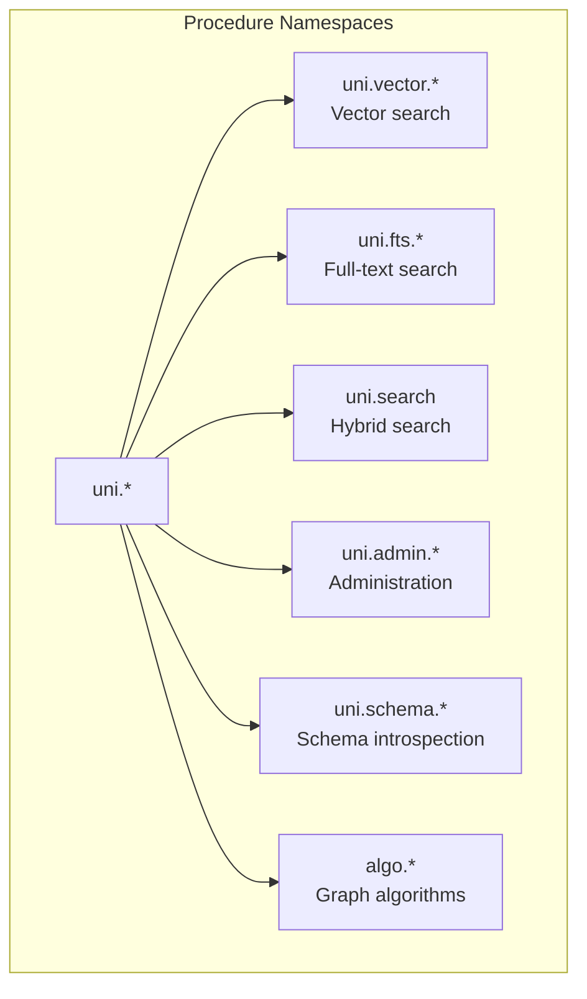

## Vector Search

```cypher
CALL uni.vector.query(label, property, query_vector, k [, filter] [, threshold])
YIELD node, score, distance, vector_score, vid
```

| Parameter | Type | Description |
|---|---|---|
| `label` | String | Vertex label to search |
| `property` | String | Vector property name |
| `query_vector` | List\<Float\> or String | Embedding vector or text (auto-embedded) |
| `k` | Integer | Number of results |
| `filter` | String (optional) | WHERE predicate string |
| `threshold` | Float (optional) | Minimum similarity score |

**Example — basic vector search:**

```cypher
CALL uni.vector.query('Document', 'embedding', $query_vector, 10)
YIELD node, score
RETURN node.title, score
ORDER BY score DESC
```

**Example — vector search with filtering:**

```cypher
CALL uni.vector.query('Document', 'embedding', $query_vector, 20, 'category = "tech"')
YIELD node, score
WHERE score > 0.7
RETURN node.title, score
```

**Example — auto-embedding (when embedding config exists):**

```cypher
CALL uni.vector.query('Document', 'embedding', 'graph databases for beginners', 5)
YIELD node, score
RETURN node.title, score
```

Score normalization: Returns a 0-1 similarity score regardless of distance metric. Uses metric-aware conversion: Cosine → `(2-d)/2`, L2 → `1/(1+d)`, Dot → pass-through.

## similar_to() Expression Function

`similar_to()` is a unified similarity scoring expression that can be used directly in `RETURN`, `WHERE`, and `ORDER BY` clauses — no `CALL`/`YIELD` boilerplate required.

```cypher
similar_to(source, query [, options]) → Float
```

Unlike the `uni.vector.query` / `uni.fts.query` / `uni.search` procedures which are standalone scan operators, `similar_to()` is a **per-row expression** evaluated inline within any `MATCH` query. It supports three scoring modes that are auto-detected from argument types:

### Scoring Modes

| Source Type | Query Type | Mode | Behavior |
|---|---|---|---|
| Vector property | Vector literal | **Cosine** | Cosine similarity per row |
| Vector property (with embedding config) | String literal | **AutoEmbed** | Auto-embeds query string once, cosine per row |
| String property (with FTS index) | String literal | **FTS** | BM25 full-text search, VID lookup per row |

### Single-Source Examples

```cypher
-- Vector-to-vector cosine similarity
MATCH (d:Doc)
RETURN d.title, similar_to(d.embedding, $query_vector) AS score
ORDER BY score DESC

-- Auto-embed: string query → embedded → cosine against stored vectors
MATCH (d:Doc)
RETURN d.title, similar_to(d.embedding, 'graph databases') AS score
ORDER BY score DESC

-- FTS: BM25 scoring (requires FULLTEXT INDEX on d.content)
MATCH (d:Doc)
RETURN d.title, similar_to(d.content, 'distributed systems') AS score
ORDER BY score DESC

-- In WHERE clause for filtering
MATCH (d:Doc)
WHERE similar_to(d.embedding, $query_vector) > 0.8
RETURN d.title
```

### Multi-Source Fusion

Combine multiple scoring sources into a single fused score:

```cypher
-- Multi-source: vector + FTS fusion (RRF by default)
MATCH (d:Doc)
RETURN d.title,
  similar_to([d.embedding, d.content], [$query_vector, 'search term']) AS score
ORDER BY score DESC

-- Multi-source with weighted fusion
MATCH (d:Doc)
RETURN d.title,
  similar_to(
    [d.embedding, d.content],
    [$query_vector, 'search term'],
    {method: 'weighted', weights: [0.7, 0.3]}
  ) AS score
ORDER BY score DESC
```

### Options Map

| Option | Type | Default | Description |
|---|---|---|---|
| `method` | String | `'rrf'` | Fusion method: `'rrf'` or `'weighted'` |
| `weights` | List\<Float\> | Equal | Per-source weights for weighted fusion (must sum to 1.0) |
| `k` | Integer | `60` | RRF constant (higher = less weight to rank position) |
| `fts_k` | Float | `1.0` | BM25 saturation constant: `score / (score + fts_k)` |

### Implementation

`similar_to()` is implemented as a custom DataFusion `PhysicalExpr` (`SimilarToExecExpr`) that carries an `Arc<GraphExecutionContext>` for storage and embedding model access. This means it runs **inside DataFusion's columnar engine** with full optimizer support (pushdown, projection pruning, parallel execution), unlike the fallback row-by-row executor previously used.

Key optimizations:
- **FTS pre-computed per-batch**: Calls `storage.fts_search()` once per RecordBatch, builds `HashMap<Vid, f32>` for O(1) per-row lookups
- **Auto-embed per-batch**: Embeds query string once per batch, then cosine per-row
- **Async-in-sync**: Uses `std::thread::scope` + `tokio::runtime::Builder::new_current_thread()` for async storage calls within sync `PhysicalExpr::evaluate()`

### Execution Paths

`similar_to()` has two execution paths depending on context:

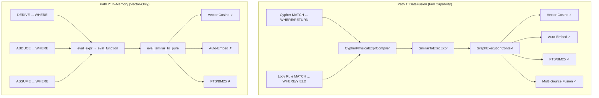

**Path 1 — DataFusion (Cypher queries and Locy rule evaluation):**
All `MATCH ... WHERE` and `YIELD` expressions — whether in standalone Cypher or inside Locy rules — are compiled to DataFusion `FilterExec` / projection plans via `CypherPhysicalExprCompiler`. This creates `SimilarToExecExpr` with full `GraphExecutionContext` access: auto-embedding, FTS search, multi-source fusion all work.

**Path 2 — In-memory (Locy command dispatch):**
`DERIVE`, `ABDUCE`, and `ASSUME` commands execute **after strata converge**. They operate on already-materialized `Vec<Row>` facts and use `eval_expr()` for WHERE filtering. This path calls `eval_similar_to_pure()`, which only supports vector-vector cosine similarity — no storage or schema access is available.

**Why two paths?** Locy execution is two-phase:

1. **Strata evaluation** (DataFusion): Plans and executes rules via `LocyProgramExec` → fixpoint iteration → converged facts stored in `DerivedStore` as `RecordBatch`es.
2. **Command dispatch** (row-level): Takes converged facts as `Vec<Row>` and applies commands — DERIVE generates mutations, ABDUCE does hypothetical reasoning with savepoints, ASSUME tests hypothetical mutations. These are not queries; they're fact-application operations that iterate over rows.

The `GraphExecutionContext` and `SessionContext` are available in `NativeExecutionAdapter` at command dispatch time but are not currently threaded through to `eval_function()`. This is a known limitation, not a fundamental constraint.

| Context | Execution Path | Vector | Auto-Embed | FTS | Multi-Source |
|---|---|---|---|---|---|
| Cypher `MATCH ... WHERE/RETURN` | DataFusion | Yes | Yes | Yes | Yes |
| Locy rule `MATCH ... WHERE/YIELD` | DataFusion | Yes | Yes | Yes | Yes |
| Locy rule `ALONG / FOLD` | DataFusion | Yes | Yes | Yes | Yes |
| `DERIVE ... WHERE` | In-memory | Yes | No | No | No |
| `ABDUCE ... WHERE` | In-memory | Yes | No | No | No |
| `ASSUME ... WHERE` | In-memory | Yes | No | No | No |

## Full-Text Search

```cypher
CALL uni.fts.query(label, property, search_term, k [, threshold])
YIELD node, score, fts_score, vid
```

BM25-based full-text search. Scores are normalized to 0-1 relative to the top match.

```cypher
CALL uni.fts.query('Article', 'content', 'distributed graph database', 10)
YIELD node, score
RETURN node.title, score
```

## Hybrid Search

```cypher
CALL uni.search(label, properties, query_text [, query_vector] [, k]
    [, filter] [, options])
YIELD node, score, vector_score, fts_score, vid
```

Combines vector and full-text search with score fusion:

| Option | Values | Description |
|---|---|---|
| `method` | `'rrf'` (default), `'weighted'` | Score fusion method |
| `alpha` | 0.0 - 1.0 | Weight for vector vs FTS (weighted mode) |
| `over_fetch` | Float (default: 2.0) | Over-fetch factor for pagination |

```cypher
CALL uni.search('Document', ['embedding', 'content'],
    'graph databases', $query_vector, 10,
    NULL, {fusion: 'rrf'})
YIELD node, score
RETURN node.title, score
```

## Host-Side Model Runtime (Uni-Xervo)

Applications can access configured embedding and generation aliases directly through the host API:

```rust
use uni_xervo::Message;

let xervo = db.xervo();  // Always succeeds; individual methods error if unconfigured

let vectors = xervo
    .embed("embed/default", &["graph databases for beginners"])
    .await?;

let answer = xervo
    .generate(
        "llm/default",
        &[
            Message::system("You summarize technical material."),
            Message::user("Explain what snapshot isolation means in Uni."),
        ],
        GenerationOptions::default(),
    )
    .await?;

// Convenience wrapper — each string is treated as a user message
let quick = xervo
    .generate_text(
        "llm/default",
        &["List three use cases for hybrid search."],
        GenerationOptions::default(),
    )
    .await?;
```

- `embed(alias, texts)` returns `Vec<Vec<f32>>`
- `generate(alias, messages, options)` accepts `&[Message]` with roles `system`, `user`, `assistant` and a `GenerationOptions` struct
- `generate_text(alias, messages, options)` is a convenience wrapper — each string becomes a user message
- `raw_runtime()` exposes the underlying `ModelRuntime` for advanced orchestration
- `GenerationOptions` supports `max_tokens`, `temperature`, `top_p` fields

This is the same runtime used by vector-index auto-embedding on writes and by text-query auto-embedding in `uni.vector.query(...)` / `similar_to(...)`.

## Admin Procedures

### Compaction

```cypher
// Trigger manual compaction
CALL uni.admin.compact()
YIELD success, files_compacted, bytes_before, bytes_after, duration_ms

// Check compaction status
CALL uni.admin.compactionStatus()
YIELD l1_runs, l1_size_bytes, in_progress, pending, total_compactions, total_bytes_compacted
```

### Snapshots

```cypher
// Create snapshot
CALL uni.admin.snapshot.create('release-v1.0')
YIELD snapshot_id

// List snapshots
CALL uni.admin.snapshot.list()
YIELD snapshot_id, name, created_at, version_hwm

// Restore snapshot
CALL uni.admin.snapshot.restore($snapshot_id)
YIELD status
```

## Schema Introspection

```cypher
// List all labels
CALL uni.schema.labels()
YIELD label, propertyCount, nodeCount, indexCount

// List edge types
CALL uni.schema.edgeTypes()
YIELD type, propertyCount, sourceLabels, targetLabels

// Label details
CALL uni.schema.labelInfo('Person')
YIELD property, dataType, nullable, indexed, unique

// List indexes
CALL uni.schema.indexes()
YIELD name, type, label, state, properties

// List constraints
CALL uni.schema.constraints()
YIELD name, type, enabled, properties, target
```

## DDL via Cypher

### Labels

```cypher
CREATE LABEL Person { name: STRING, age: INTEGER, email: STRING UNIQUE }
ALTER LABEL Person ADD PROPERTY phone: STRING
ALTER LABEL Person DROP PROPERTY age
ALTER LABEL Person RENAME PROPERTY name TO full_name
DROP LABEL IF EXISTS Person
```

### Edge Types

```cypher
CREATE EDGE TYPE KNOWS FROM [Person] TO [Person] { weight: FLOAT }
ALTER EDGE TYPE KNOWS ADD PROPERTY since: DATE
DROP EDGE TYPE IF EXISTS KNOWS
```

### Indexes

```cypher
CREATE INDEX idx_name ON Person (name)
CREATE VECTOR INDEX idx_embed ON Document (embedding) WITH { metric: 'cosine' }
CREATE FULLTEXT INDEX idx_content ON Article (content)
CREATE JSON_FULLTEXT INDEX idx_meta ON Data (metadata)
DROP INDEX idx_name
```

### Constraints

```cypher
CREATE CONSTRAINT UNIQUE ON Person (email)
CREATE CONSTRAINT PRIMARY KEY ON Product (sku)
DROP CONSTRAINT constraint_name
```

### SHOW Commands

```cypher
SHOW DATABASE       -- Database metadata
SHOW INDEXES        -- All indexes with status
SHOW CONSTRAINTS    -- All constraints
SHOW CONFIG         -- Current configuration
SHOW STATISTICS     -- Storage statistics
```

### Admin Commands

```cypher
VACUUM              -- Reclaim space
CHECKPOINT          -- Force flush
BACKUP '/path/to/backup'
COPY (Person) TO '/path/to/file' FORMAT csv
COPY (Person) FROM '/path/to/file' FORMAT parquet
```

## Time Travel

Query historical data using snapshots or timestamps:

```cypher
// By snapshot ID
MATCH (n:Person) VERSION AS OF 'snapshot-abc123'
RETURN n.name, n.age

// By timestamp
MATCH (n:Person) TIMESTAMP AS OF '2025-01-15T12:00:00Z'
RETURN n.name, n.age
```

## EXPLAIN and PROFILE

```cypher
// Show query plan without executing
EXPLAIN MATCH (n:Person)-[:KNOWS]->(m:Person) RETURN n, m

// Execute and show timing per operator
PROFILE MATCH (n:Person)-[:KNOWS]->(m:Person) RETURN n, m
```

---

# Part IX: Graph Algorithms

Uni includes **35 graph algorithms** organized by category, accessible as procedures via `CALL algo.*`.

## Algorithm Catalog

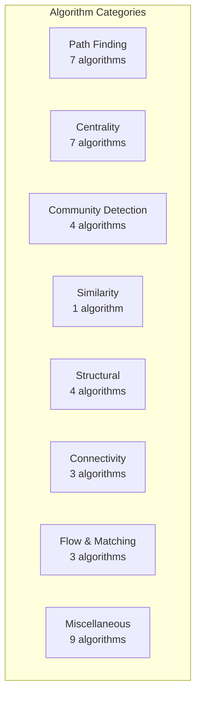

### Path Algorithms

| Procedure | Description | Use Case |
|---|---|---|
| `algo.dijkstra` | Single-source shortest path (weighted) | Navigation, routing |
| `algo.bidirectionalDijkstra` | Bidirectional shortest path | Faster point-to-point |
| `algo.bellmanFord` | Shortest path with negative weights | Financial arbitrage |
| `algo.astar` | A* with heuristic guidance | Spatial routing |
| `algo.kShortestPaths` | K distinct shortest paths | Alternative routes |
| `algo.allSimplePaths` | All simple paths between nodes | Dependency analysis |
| `algo.allPairsShortestPath` | Floyd-Warshall for all pairs | Network diameter |

### Centrality Algorithms

| Procedure | Description | Use Case |
|---|---|---|
| `algo.degreeCentrality` | Vertex degree (in/out/total) | Hub identification |
| `algo.betweenness` | Shortest-path betweenness | Bridge nodes, bottlenecks |
| `algo.closeness` | Average distance to all others | Information spread |
| `algo.harmonic` | Harmonic centrality | Disconnected graphs |
| `algo.eigenvector` | Eigenvector centrality (iterative) | Influence measurement |
| `algo.katz` | Katz centrality | Status in social networks |
| `algo.pagerank` | PageRank (iterative) | Web ranking, importance |

### Community Detection

| Procedure | Description | Use Case |
|---|---|---|
| `algo.wcc` | Weakly Connected Components (union-find) | Cluster identification |
| `algo.scc` | Strongly Connected Components (Tarjan) | Cycle groups |
| `algo.louvain` | Louvain modularity optimization | Community structure |
| `algo.labelPropagation` | Label propagation (semi-synchronous) | Fast community detection |

### Similarity

| Procedure | Description | Use Case |
|---|---|---|
| `algo.nodeSimilarity` | Jaccard neighborhood overlap | Similar users/items |

### Structural

| Procedure | Description | Use Case |
|---|---|---|
| `algo.triangleCount` | Count triangles | Clustering coefficient |
| `algo.topologicalSort` | DAG topological ordering | Build systems, dependencies |
| `algo.cycleDetection` | Detect cycles | Deadlock detection |
| `algo.bipartiteCheck` | Bipartite graph verification | Two-coloring |

### Connectivity

| Procedure | Description | Use Case |
|---|---|---|
| `algo.bridges` | Bridge edge detection | Network reliability |
| `algo.articulationPoints` | Cut vertex detection | Single points of failure |
| `algo.kcore` | K-core decomposition | Dense subgraph discovery |

### Flow & Matching

| Procedure | Description | Use Case |
|---|---|---|
| `algo.fordFulkerson` | Maximum flow | Network capacity |
| `algo.dinic` | Maximum flow (Dinic's) | Large flow networks |
| `algo.maxMatching` | Maximum cardinality matching | Assignment problems |

### Miscellaneous

| Procedure | Description | Use Case |
|---|---|---|
| `algo.mst` | Minimum spanning tree (Kruskal) | Network design |
| `algo.randomWalk` | Random walk sampling | Graph embedding, sampling |
| `algo.elementaryCircuits` | All elementary cycles | Circuit analysis |
| `algo.maximalCliques` | Maximal clique enumeration | Dense groups |
| `algo.graphColoring` | Graph coloring | Scheduling, register allocation |
| `algo.graphMetrics` | Global metrics (diameter, density, avg clustering) | Graph summary |

## Execution Modes

Algorithms run in one of two modes depending on their computational requirements:

```mermaid
graph TB
    Q[Algorithm Request] --> LIGHT{Light Algorithm?<br/>Single path, reachability}
    LIGHT -->|Yes| DT[DirectTraversal<br/>Zero-copy BFS<br/>AdjacencyManager + L0]
    LIGHT -->|No| HEAVY{Heavy Algorithm?<br/>PageRank, WCC, Louvain}
    HEAVY -->|Yes| GP[GraphProjection<br/>Materialized Dense CSR<br/>1 GB default, 100M vertex limit]

    DT --> FAST[Fast Startup<br/>Streaming Results]
    GP --> BULK[Full Materialization<br/>Iterative Computation]
```

### DirectTraversal

- **Zero-copy BFS** on `AdjacencyManager` + `L0Buffer`
- Used for: shortest path, reachability, single-source queries
- **Fast startup**: No materialization needed
- **Streaming results**: Results available as traversal progresses

### GraphProjection

- **Materialized dense CSR** graph in memory
- Used for: PageRank, WCC, Louvain, betweenness, eigenvector, etc.
- **Configuration**: `ProjectionBuilder` with `node_labels()`, `edge_types()`, `include_reverse()`, `build()`
- **Limits**: `max_projection_memory` (1 GB default), `max_vertices` (100M default)

## Running Algorithms

### Example: PageRank

```cypher
CALL algo.pagerank({
    nodeLabels: ['Person'],
    edgeTypes: ['KNOWS'],
    dampingFactor: 0.85,
    maxIterations: 20,
    tolerance: 0.0001
})
YIELD nodeId, score
RETURN nodeId, score
ORDER BY score DESC
LIMIT 10
```

### Example: Shortest Path

```cypher
CALL algo.dijkstra({
    startNode: $start_vid,
    endNode: $end_vid,
    edgeTypes: ['ROAD'],
    weightProperty: 'distance'
})
YIELD path, totalCost
RETURN path, totalCost
```

### Example: Community Detection

```cypher
CALL algo.louvain({
    nodeLabels: ['Person'],
    edgeTypes: ['KNOWS'],
    maxIterations: 10
})
YIELD nodeId, communityId
RETURN communityId, count(*) AS size
ORDER BY size DESC
```

### Example: Weakly Connected Components

```cypher
CALL algo.wcc({
    nodeLabels: ['Device'],
    edgeTypes: ['CONNECTED_TO']
})
YIELD nodeId, componentId
RETURN componentId, collect(nodeId) AS members
```

## Algorithm Best Practices

| Practice | Details |
|---|---|
| **Use DirectTraversal for single paths** | Much faster than GraphProjection for point queries |
| **Use GraphProjection for iterative algorithms** | PageRank, WCC, Louvain need full materialization |
| **Set iteration limits** | Prevent infinite loops in convergence algorithms |
| **Project only needed labels/types** | Smaller projection = faster execution + less memory |

## Algorithm Anti-Patterns

| Anti-Pattern | Problem | Solution |
|---|---|---|
| **Full graph for single path** | GraphProjection wastes memory | Use DirectTraversal |
| **Ignoring convergence params** | Algorithm may not converge | Set `maxIterations` and `tolerance` |
| **Running on unprojected graph** | Processing irrelevant vertices/edges | Use `nodeLabels` and `edgeTypes` filters |

---

# Part X: Locy Framework

## What Is Locy?

**Locy** (Logic + Cypher) is a Datalog-inspired logic programming language that extends OpenCypher with **recursive rules**, **path-carried values**, **aggregation**, **graph derivation**, **hypothetical reasoning**, and **abductive inference**. Every valid Cypher query is valid Locy — it's a strict superset.

Locy enables reasoning over graphs that would be impossible or extremely awkward in plain Cypher:

- **Transitive closure**: "Find all nodes reachable from X through any chain of Y relationships"
- **Risk propagation**: "Compute cumulative fraud risk along payment chains"
- **Permission resolution**: "Resolve effective RBAC permissions with priority and inheritance"
- **Provenance tracking**: "Trace the full supply chain lineage of a component"
- **What-if analysis**: "What would happen if we added/removed this edge?"

## Design Philosophy

From the Locy design document:

1. **Cypher superset** — Every valid Cypher query works unchanged
2. **Compiler, not engine** — Locy compiles rules into Cypher AST objects. The existing query planner/executor runs them.
3. **No string roundtripping** — The orchestrator builds AST objects programmatically, never serializes to text
4. **Single parse location** — All parsing (Cypher + Locy) happens in `uni-cypher`
5. **Decoupled** — `uni-locy` depends on `uni-cypher` (ASTs), not on `uni-query` or `uni-store`

## Compilation Pipeline

```mermaid
graph LR
    SRC[Locy Source] --> PARSE[Parse<br/>Pest Grammar]
    PARSE --> AST[LocyProgram AST]
    AST --> MOD[Module Resolution<br/>USE declarations]
    MOD --> DEP[Dependency Graph<br/>Rule-to-rule refs]
    DEP --> STRAT[Stratify<br/>SCC Detection]
    STRAT --> WARD[Wardedness Check<br/>Prevent unsafe negation]
    WARD --> TYPE[Typecheck<br/>Variable inference]
    TYPE --> COMP[CompiledProgram<br/>Topological strata order]
```

1. **Parse**: Pest grammar (`locy.pest` stacked on `cypher.pest`) produces `LocyProgram` AST with rules and commands
2. **Module Resolution**: Resolve `USE module { rule1, rule2 }` imports
3. **Dependency Graph**: Build rule-to-rule reference graph
4. **Stratify**: Detect strongly connected components (SCCs) — these are recursive rule groups
5. **Wardedness Check**: Ensure negation is stratified (no recursive negation)
6. **Typecheck**: Infer variable types across rules
7. **Assemble**: Topological ordering of strata into `CompiledProgram`

## Rule Syntax

```
MODULE namespace.path
USE other.module { rule1, rule2 }

CREATE RULE ruleName [PRIORITY n] AS
    MATCH pattern
    WHERE conditions
    [ALONG name = expr]
    [FOLD name = aggregate]
    [BEST BY expr [ASC|DESC], ...]
    [YIELD [KEY] expr [AS alias] [PROB], ...
    | DERIVE pattern, ... ]
```

### IS Reference (Rule Invocation)

Rules reference other rules using `IS`:

```cypher
// 1-arg form: single subject
WHERE x IS reachable

// 2-arg form: pair matching
WHERE x IS reachable TO y

// Tuple form: multi-arg
WHERE (x, y) IS reachable

// Negation
WHERE x IS NOT compromised
```

### ALONG (Path-Carried Values)

Accumulate values along traversal paths:

```cypher
CREATE RULE shortest_risk AS
    MATCH (a:Account)-[t:TRANSFER]->(b:Account)
    WHERE a IS flagged
    ALONG cumulative_risk = prev.risk + t.amount * 0.01
    YIELD KEY b, cumulative_risk
```

- `prev.fieldName` — access the accumulator from the previous hop
- Supports full Cypher arithmetic: `+`, `-`, `*`, `/`, `%`, `^`
- Supports logical operators: `AND`, `OR`, `XOR`

### FOLD (Aggregation)

Aggregate across paths:

```cypher
CREATE RULE total_exposure AS
    MATCH (a:Account)-[:TRANSFER*]->(b:Account)
    WHERE b IS suspicious
    FOLD total = SUM(t.amount)
    FOLD path_count = COUNT(*)
    YIELD KEY a, total, path_count
```

Supported aggregators: `COUNT`, `SUM`, `AVG`, `MIN`, `MAX`, `COLLECT`, `MSUM`, `MMAX`, `MMIN`, `MCOUNT`, `MNOR`, `MPROD`

### Probabilistic Aggregation (MNOR / MPROD)

Two monotonic aggregators for combining probabilities in recursive rules:

| Aggregator | Formula | Identity | Semantics |
|---|---|---|---|
| `MNOR` | `1 − ∏(1 − pᵢ)` | 0.0 | "Any one cause can produce the effect" (Noisy-OR) |
| `MPROD` | `∏ pᵢ` | 1.0 | "All conditions must hold simultaneously" |

Both are monotonic (safe in recursive strata), clamp inputs to [0, 1], skip nulls, and are commutative.

```cypher
-- Risk combination: any signal can flag the account
CREATE RULE risk_combined AS
    MATCH (a:Component)-[s:SIGNAL]->(b:Flag)
    FOLD risk = MNOR(s.probability)
    YIELD KEY a, risk

-- Joint reliability: all parts must work
CREATE RULE joint_reliability AS
    MATCH (asm:Part)-[r:REQUIRES]->(sub:Part)
    FOLD availability = MPROD(sub.reliability)
    YIELD KEY asm, availability
```

MPROD uses log-space computation when the product drops below 1e-15 to prevent underflow. MNOR and MPROD are incompatible with `BEST BY` (compiler error).

### PROB Columns and Probabilistic `IS NOT`

Locy can mark one output column per rule as the rule's probability channel:

```cypher
CREATE RULE supplier_risk AS
    MATCH (s:Supplier)-[:HAS_SIGNAL]->(sig:Signal)
    FOLD risk = MNOR(sig.risk)
    YIELD KEY s, risk AS PROB
```

Supported forms:

- `expr AS PROB` — infer the output name from the expression
- `expr AS alias PROB` — explicit alias
- `expr PROB` — shorthand for simple expressions

When `IS NOT` targets a rule with a `PROB` column, negation becomes probabilistic complement instead of Boolean anti-join:

```cypher
CREATE RULE usable_supplier AS
    MATCH (s:Supplier)
    WHERE s IS NOT supplier_risk
    YIELD KEY s, 1.0 AS confidence PROB
```

- If the referenced rule has a `PROB` column, `IS NOT` contributes `1 - p`
- If multiple probabilistic `IS` / `IS NOT` references appear in one clause, their probability terms multiply into the caller's `PROB` column
- If the referenced rule has no `PROB` column, `IS NOT` keeps normal Boolean semantics

### Shared-Proof Detection and Exact Probability Mode

MNOR and MPROD assume independent derivations. When multiple proof paths share the same underlying evidence, the runtime detects that overlap and emits `SharedProbabilisticDependency`.

With `LocyConfig::exact_probability = true`, Uni builds a per-group Boolean formula and uses a BDD-backed evaluator to compute exact probabilities for shared-proof MNOR/MPROD groups. Two fallbacks remain important:

- `BddLimitExceeded` — the group exceeded `max_bdd_variables`, so Uni falls back to the independence result for that key group
- `CrossGroupCorrelationNotExact` — shared evidence crosses separate aggregate groups; each group is exact internally, but cross-group correlation is still approximate

Derived rows from approximate groups are annotated with `_approximate = true`, and `LocyResult.approximate_groups` records the affected rule/key groups.

### BEST BY (Ranked Selection)

Select optimal results:

```cypher
CREATE RULE best_route AS
    MATCH (a:City)-[r:ROAD]->(b:City)
    ALONG distance = prev.distance + r.length
    BEST BY distance ASC
    YIELD KEY b, distance
```

Enables `LIMIT 1` optimization — the engine can prune suboptimal paths early during semi-naive evaluation.

### YIELD KEY (Grouping)

Control result grouping:

```cypher
CREATE RULE risk_summary AS
    MATCH (a:Account)-[:TRANSFER]->(b:Account)
    WHERE b IS flagged
    YIELD KEY a,       -- Group by source account
          count(*) AS exposure_count,
          sum(t.amount) AS total_exposure
```

`KEY` marks grouping dimensions (implicit GROUP BY). Unmarked outputs are regular value columns. `PROB` marks the clause's probability column when probabilistic semantics are required.

### PRIORITY (Execution Ordering)

Control evaluation order within a stratum:

```cypher
CREATE RULE high_priority_rule [PRIORITY 100] AS ...
CREATE RULE normal_rule AS ...  -- Default priority: 0
CREATE RULE low_priority_rule [PRIORITY -10] AS ...
```

Higher priority values execute first.

### DERIVE (Graph Mutation)

Create new graph elements from reasoning results:

```cypher
CREATE RULE infer_risk AS
    MATCH (a:Account)-[:TRANSFER]->(b:Account)
    WHERE a IS flagged
    DERIVE (b)-[:RISK_FROM]->(a)
    DERIVE (b:FlaggedAccount)

// MERGE combines paths
CREATE RULE merge_paths AS
    MATCH (a)-[r]->(b)
    DERIVE MERGE a, b
```

### PREV (Previous Iteration Access)

Access values from the previous fixpoint iteration:

```cypher
CREATE RULE converging_score AS
    MATCH (n:Node)
    ALONG score = (prev.score + neighbor_avg) / 2.0
```

## Execution Model

### Two-Phase Execution Architecture

Locy programs execute in two distinct phases with different execution engines:

```mermaid
graph TB
    subgraph "Phase 1: Strata Evaluation (DataFusion)"
        LP[LocyProgramExec<br/>DataFusion ExecutionPlan]
        LP --> S0[Stratum 0: Base rules]
        S0 --> S1[Stratum 1: Recursive fixpoint]
        S1 --> S2[Stratum 2+: Dependent strata]
        S2 --> DS[DerivedStore<br/>RecordBatch facts]

        LP -.- GEC2[GraphExecutionContext<br/>storage + schema + xervo]
        LP -.- SC[SessionContext<br/>DataFusion session]
    end

    subgraph "Phase 2: Command Dispatch (Row-Level)"
        DS --> CONV[Convert to Vec Row]
        CONV --> CMD{Command Type}
        CMD --> DER[DERIVE<br/>Generate mutations]
        CMD --> ABD[ABDUCE<br/>Hypothetical reasoning]
        CMD --> ASM[ASSUME<br/>What-if analysis]
        CMD --> QRY[QUERY<br/>Goal resolution]
        CMD --> EXP[EXPLAIN RULE<br/>Derivation trace]

        DER --> MUT[execute_mutation]
        ABD --> SP[Savepoint → Mutate → Re-evaluate → Rollback]
        ASM --> SP
    end
```

**Phase 1** runs entirely within DataFusion. Locy rules compile to `LogicalPlan` nodes (Scan → Filter → Projection), physical planning uses `CypherPhysicalExprCompiler` (which creates `SimilarToExecExpr`, `ExistsExecExpr`, etc.), and fixpoint iteration runs via `FixpointExec`. All expression functions have full access to `GraphExecutionContext` — storage, schema, xervo runtime.

**Phase 2** operates on converged facts materialized as `Vec<Row>`. Commands are not queries — DERIVE iterates rows and generates CREATE/MERGE mutations; ABDUCE uses savepoint-rollback loops for counterfactual reasoning; ASSUME tests hypothetical mutations. WHERE filters on commands use `eval_expr()`, a lightweight row-level evaluator. Expression functions in this path (e.g., `similar_to`) are limited to pure computation (vector cosine) without storage access.

The `NativeExecutionAdapter` that dispatches commands does hold `GraphExecutionContext` and `SessionContext` — they're used for `execute_mutation()`, `re_evaluate_strata()`, and `execute_cypher_read()`. They are not currently threaded through to `eval_expr()` / `eval_function()`, which is why command WHERE clauses have limited expression support.

### Stratified Fixpoint

```mermaid
graph TB
    subgraph "Stratified Evaluation"
        S0[Stratum 0<br/>Non-recursive base rules]
        S1[Stratum 1<br/>Recursive group A]
        S2[Stratum 2<br/>Recursive group B<br/>depends on A]
        S3[Stratum 3<br/>Non-recursive final rules<br/>depends on A, B]
    end

    S0 -->|"Facts"| S1
    S1 -->|"Fixpoint reached"| S2
    S2 -->|"Fixpoint reached"| S3

    subgraph "Fixpoint Loop (per stratum)"
        INIT[Initialize delta = base facts]
        EVAL[Evaluate rules using delta]
        NEW[Compute new facts]
        CHECK{Delta empty?}
        CHECK -->|No| EVAL
        CHECK -->|Yes| DONE[Fixpoint reached]
        NEW --> CHECK
        EVAL --> NEW
        INIT --> EVAL
    end
```

1. Compute stratum 0 (non-recursive, base rules) — single pass
2. For each recursive stratum:
   - **Semi-naive evaluation**: Only re-evaluate rules using newly-derived facts (delta)
   - Each iteration produces a delta of new facts
   - **Fixpoint**: When delta is empty, the stratum is complete
3. Final non-recursive strata consume all previously-derived facts

### Semi-Naive Evaluation

The key optimization: instead of re-evaluating all rules against all facts each iteration, only consider **new** facts from the previous iteration. This provides exponential speedup for transitive closures.

```
Iteration 0: delta₀ = base facts from MATCH
Iteration 1: delta₁ = evaluate(rules, delta₀) - known_facts
Iteration 2: delta₂ = evaluate(rules, delta₁) - known_facts
...
Iteration n: deltaₙ = ∅ → fixpoint reached
```

## Locy Commands

Commands execute in **Phase 2** (row-level dispatch) after strata have converged. They receive facts as `Vec<Row>` and perform operations that go beyond query evaluation — mutations, hypothetical reasoning, and derivation tracing.

> **Expression limitation:** WHERE filters in commands use `eval_expr()` (row-level evaluator), not DataFusion. Expression functions like `similar_to()` are limited to pure vector cosine — no auto-embed, FTS, or multi-source fusion. Rule WHERE clauses (Phase 1) have full DataFusion expression support.

### QUERY (Goal Query)

```cypher
QUERY reachable WHERE start.name = 'Alice' RETURN node, distance
```

Evaluates rules using SLG (Selective Linear Definite clause) resolution.

### DERIVE (Fact Derivation)

```cypher
DERIVE risk_propagation WHERE threshold > 0.5 RETURN flagged_nodes
```

Iterates over converged facts from the named rule, applies the WHERE filter, and generates Cypher CREATE/MERGE mutations for each matching row. The mutations are executed via `NativeExecutionAdapter::execute_mutation()`.

### ABDUCE (Abductive Reasoning)

"What facts would need to be true for this conclusion to hold?"

```cypher
ABDUCE compromised WHERE target.name = 'ServerA' RETURN assumptions
ABDUCE NOT safe WHERE node.name = 'Gateway' RETURN required_conditions
```

Three-phase pipeline: (1) build derivation tree via EXPLAIN, (2) extract candidate modifications (edge removals, property changes, edge additions), (3) validate each candidate by savepoint → mutate → re-evaluate all strata → check if conclusion holds → rollback. Returns the minimal set of changes that achieve (or prevent) the goal.

### EXPLAIN RULE

Show the inference chain:

```cypher
EXPLAIN RULE risk_score WHERE account.id = 'ACC-001' RETURN derivation
```

### ASSUME (Hypothetical Reasoning)

"What if we made these changes?"

```cypher
ASSUME {
    CREATE (x:Account {name: 'Suspicious'})-[:TRANSFER]->(existing:Account)
}
THEN {
    QUERY risk_propagation RETURN affected_nodes
}
```

Executes within a savepoint: applies mutations, re-evaluates all strata in the mutated state, dispatches body commands (which can be nested DERIVE/ABDUCE/ASSUME), collects results, then rolls back. The database is never permanently modified.

## Module System

Locy programs can be organized into modules:

```cypher
MODULE acme.compliance
USE acme.common { reach, control }
USE acme.security { threat_model }

CREATE RULE compliance_check AS
    MATCH (system:System)-[:HOSTS]->(service:Service)
    WHERE system IS reach TO service
    AND service IS NOT threat_model
    YIELD KEY system, 'compliant' AS status
```

## Configuration

```rust
LocyConfig {
    max_iterations: usize,          // Max fixpoint iterations per recursive stratum
    timeout: Duration,              // Overall evaluation timeout
    max_explain_depth: usize,       // Max derivation tree depth
    max_slg_depth: usize,           // Max SLG resolution depth
    max_abduce_candidates: usize,   // Candidate modifications to explore
    max_abduce_results: usize,      // Validated ABDUCE results to return
    max_derived_bytes: usize,       // Memory bound per derived relation
    deterministic_best_by: bool,    // Stable tie-breaking for BEST BY
    strict_probability_domain: bool, // Error instead of clamp for values outside [0,1]
    probability_epsilon: f64,       // MPROD log-space threshold (default: 1e-15)
    top_k_proofs: usize,           // Top-k proof filtering (0 = unlimited)
    top_k_proofs_training: Option<usize>, // Override top_k_proofs during training
    params: HashMap<String, Value>, // Parameters bound to $name references in rules/queries
    exact_probability: bool,        // Enable BDD-based exact evaluation for shared proofs
    max_bdd_variables: usize,       // Per-group BDD variable cap before fallback
}
```

### Runtime Diagnostics

`LocyResult` carries probability-specific runtime diagnostics:

- `warnings: Vec<RuntimeWarning>` — includes `SharedProbabilisticDependency`, `BddLimitExceeded`, and `CrossGroupCorrelationNotExact`
- `approximate_groups: HashMap<String, Vec<String>>` — human-readable rule/key groups that fell back to approximate mode
- `warnings()` / `has_warning()` — convenience helpers for runtime inspection

## Real-World Examples

### Fraud Risk Propagation

```cypher
MODULE fraud.detection

CREATE RULE flagged AS
    MATCH (a:Account)
    WHERE a.fraud_score > 0.8
    YIELD KEY a

CREATE RULE risk_chain [PRIORITY 10] AS
    MATCH (a:Account)-[t:TRANSFER]->(b:Account)
    WHERE a IS flagged
    ALONG risk = prev.risk + t.amount * 0.01
    BEST BY risk DESC
    YIELD KEY b, risk AS propagated_risk

QUERY risk_chain
WHERE propagated_risk > 100
RETURN b.name, propagated_risk
ORDER BY propagated_risk DESC
```

### RBAC Permission Resolution

```cypher
MODULE rbac.resolver

CREATE RULE effective_permission [PRIORITY 100] AS
    MATCH (u:User)-[:HAS_ROLE]->(r:Role)-[:GRANTS]->(p:Permission)
    YIELD KEY u, KEY p, r.priority AS grant_priority

CREATE RULE inherited_permission AS
    MATCH (r:Role)-[:INHERITS]->(parent:Role)-[:GRANTS]->(p:Permission)
    WHERE (u:User)-[:HAS_ROLE]->(r)
    BEST BY grant_priority DESC
    YIELD KEY u, KEY p

QUERY effective_permission
WHERE u.name = 'alice'
RETURN p.resource, p.action, grant_priority
```

### Supply Chain Provenance

```cypher
MODULE supply.chain

CREATE RULE provenance AS
    MATCH (part:Part)-[:MADE_FROM]->(material:Material)
    ALONG chain = COLLECT(part.name)
    YIELD KEY material, chain AS supply_path

CREATE RULE risk_assessment AS
    MATCH (supplier:Supplier)-[:SUPPLIES]->(part:Part)
    WHERE supplier IS sanctioned
    DERIVE (part)-[:SUPPLY_RISK]->(supplier)
```

---

# Part XI: Transactions, Sessions & Concurrency

## Concurrency Model

Uni uses a **single-writer, multi-reader** concurrency model with **snapshot isolation**:

```mermaid
stateDiagram-v2
    [*] --> Idle
    Idle --> Writing: begin() [single writer]
    Writing --> Committing: commit()
    Writing --> RollingBack: rollback()
    Committing --> Idle: success
    RollingBack --> Idle: success
    Writing --> Idle: drop (auto-rollback)

    state "Concurrent Reads" as CR {
        [*] --> Reading1
        [*] --> Reading2
        [*] --> ReadingN
    }

    note right of CR
        Multiple readers run
        concurrently against
        snapshot-isolated views
    end note
```

- **One writer at a time**: Prevents write-write conflicts entirely
- **Many concurrent readers**: Each reader sees a consistent snapshot
- **No read locks**: Readers never block writers; writers never block readers
- **Auto-rollback on drop**: If a transaction is dropped without commit/rollback, it auto-rolls back with a warning

## Three-Scope Model

All data access flows through three scopes with strict separation of concerns:

```
Uni (database handle)
  ├─ Lifecycle: open, shutdown, schema, snapshots
  ├─ Facades: rules(), compaction(), indexes(), functions(), xervo()
  └─ Factory: session() → Session

Session (read scope)
  ├─ Parameters: params().set(), params().get()
  ├─ Reads: query(), query_with() → QueryBuilder
  ├─ Locy: locy(), locy_with() → LocyBuilder
  ├─ Analysis: query_with().explain(), query_with().profile()
  └─ Factory: tx() → Transaction

Transaction (write scope)
  ├─ Reads: query() (sees uncommitted writes)
  ├─ Writes: execute(), bulk_insert_*(), bulk_writer()
  ├─ Locy: locy() (DERIVE auto-applies to tx L0)
  ├─ Apply: apply(derived_fact_set)
  └─ Lifecycle: commit(), rollback(), drop (auto-rollback)
```

- **Uni** does not execute queries or mutations — it only provides factories and admin.
- **Session** is a long-lived, cheap read context. It holds scoped parameters, a private Locy rule registry, and a plan cache. Sessions are the factory for Transactions.
- **Transaction** is a short-lived write context with a private L0 buffer. No lock is held until `commit()`.

## Transaction API

### Rust

```rust
// Create a session (sync, infallible, cheap)
let session = db.session();

// Start a transaction from the session
let tx = session.tx().await?;

// Execute mutations within the transaction
tx.execute("CREATE (n:Person {name: 'Alice', age: 30})").await?;
tx.execute("CREATE (n:Person {name: 'Bob', age: 25})").await?;

// Parameterized mutations via builder
tx.execute_with("CREATE (n:Person {name: $name})")
    .param("name", "Charlie")
    .run()
    .await?;

// Read within transaction (sees uncommitted writes)
let result = tx.query("MATCH (n:Person) RETURN count(*) AS cnt").await?;

// Commit or rollback
let commit_result = tx.commit().await?;
println!("Version: {}, mutations: {}", commit_result.version, commit_result.mutations_committed);
// OR: tx.rollback();
// OR: drop tx (auto-rollback with warning if dirty)
```

### DerivedFactSet Workflow

Locy DERIVE can produce facts at the session level (read-only), then apply them in a transaction:

```rust
// Session-level DERIVE (does not mutate)
let result = session.locy("DERIVE similar_to(x, y) :- ...").await?;
let derived = result.derived().unwrap().clone();

// Apply in a transaction
let tx = session.tx().await?;
tx.apply(derived).await?;
tx.commit().await?;

// OR: DERIVE within transaction (auto-applies to tx's private L0)
let tx = session.tx().await?;
tx.locy("DERIVE similar_to(x, y) :- ...").await?;
tx.commit().await?;
```

## Session API

Sessions are the primary read scope. Create via `db.session()` (sync, infallible).

```rust
// Create a session
let session = db.session();

// Set scoped parameters (injected into every query as $key)
session.params().set("user_id", "alice-123");
session.params().set("role", "admin");

// Query using session parameters
let result = session.query("MATCH (u:User {id: $user_id}) RETURN u").await?;

// Query builder with parameters, timeout, and terminal methods
let result = session.query_with("MATCH (n:Person) WHERE n.age > $min_age RETURN n")
    .param("min_age", 25)
    .timeout(Duration::from_secs(5))
    .fetch_all()
    .await?;

// Explain and profile are builder terminals
let plan = session.query_with("MATCH (n:Person) RETURN n").explain().await?;
let (result, profile) = session.query_with("MATCH (n) RETURN n").profile().await?;

// Get a parameter value
let user_id = session.params().get("user_id");
```

Session parameters are merged with explicit query parameters. Explicit parameters take precedence.

## Facade Accessors

Sub-APIs are accessed via accessor methods on `Uni`, `Session`, or `Transaction`:

```rust
// Locy rule management (available at all three scopes)
db.rules().register("risk(x) :- ...")?;
session.rules().list();
tx.rules().register("local_rule(x) :- ...")?;

// Database administration (on Uni only)
db.compaction().compact("Person").await?;
db.indexes().rebuild("Person", true).await?;
db.functions().register("my_fn", |args| Ok(args[0].clone()))?;
let xervo = db.xervo();
```

## L0 Visibility and QueryContext

When a transaction is active, it gets its own L0 buffer. The QueryContext determines which L0 buffers are visible to a query:

```mermaid
graph TB
    subgraph "QueryContext Layers"
        TXN["Transaction L0<br/>Uncommitted writes<br/>Highest priority"]
        MAIN["Current Main L0<br/>Active write buffer"]
        PF1["Pending Flush L0₁<br/>Being flushed to L1"]
        PF2["Pending Flush L0₂<br/>Being flushed to L1"]
        L1["L1 Storage<br/>Flushed Lance tables<br/>Lowest priority"]
    end

    TXN --> MAIN --> PF1 --> PF2 --> L1
```

- **Within a transaction**: Sees its own uncommitted writes (Transaction L0) + all other visible data
- **Outside a transaction**: Sees Current Main L0 + Pending Flush L0s + L1 Storage
- **Snapshot reads**: See only the data as of a specific snapshot version

## Write Throttling

When L1 runs accumulate (compaction falling behind), write throttling kicks in to prevent unbounded growth:

```mermaid
graph LR
    subgraph "Write Throttle Pressure"
        NORMAL["Normal<br/>L1 runs < 8<br/>No delay"]
        SOFT["Soft Throttle<br/>8 ≤ L1 runs < 16<br/>Exponential backoff<br/>from 10ms base"]
        HARD["Hard Block<br/>L1 runs ≥ 16<br/>Writes blocked<br/>until compaction"]
    end

    NORMAL -->|"L1 runs ≥ soft_limit"| SOFT
    SOFT -->|"L1 runs ≥ hard_limit"| HARD
    HARD -->|"Compaction reduces L1"| SOFT
    SOFT -->|"Compaction reduces L1"| NORMAL
```

Configuration:

```rust
WriteThrottleConfig {
    soft_limit: 8,          // L1 runs: throttle starts
    hard_limit: 16,         // L1 runs: writes blocked
    base_delay: Duration::from_millis(10),  // Backoff base
}
```

## Transaction Best Practices

| Practice | Details |
|---|---|
| **Keep transactions short** | Long transactions accumulate large L0 buffers; the writer lock is only held at commit time |
| **Use context managers** | `with session.tx() as tx:` ensures auto-rollback on error |
| **Monitor write throttle** | Alert on `l1_runs` approaching `soft_limit` |
| **Break bulk operations** | Split large imports into batches of 10-50k |
| **Session for reads, Transaction for writes** | Never try to write outside a transaction |

## Transaction Anti-Patterns

| Anti-Pattern | Problem | Solution |
|---|---|---|
| **Long-running write txns** | Large L0 buffers; commit serialization delays | Keep under a few seconds |
| **Reading without snapshots** | May see inconsistent data during compaction | Use snapshot isolation |
| **Ignoring auto-rollback warning** | Resource leak indication | Always explicitly commit or rollback |
| **Writing on Session** | Session is read-only | Use `session.tx()` to create a Transaction |

---

# Part XII: Snapshots & Time Travel

## Snapshot Architecture

Snapshots capture a **consistent point-in-time view** of the entire database. They record the versions of all datasets, enabling time travel queries and crash recovery.

```mermaid
graph TB
    subgraph "Snapshot Manifest"
        SM[SnapshotManifest]
        SM --> SID[snapshot_id: UUID]
        SM --> NAME[name: Optional String]
        SM --> CAT[created_at: DateTime]
        SM --> PSN[parent_snapshot: Optional]
        SM --> SV[schema_version: u32]
        SM --> VHW[version_high_water_mark: u64]
        SM --> WHW[wal_high_water_mark: u64]
        SM --> VTX[vertices: HashMap<br/>label → LabelSnapshot]
        SM --> EDG[edges: HashMap<br/>type → EdgeSnapshot]
    end

    subgraph "LabelSnapshot"
        LS[version: u32<br/>count: u64<br/>lance_version: u64]
    end

    subgraph "EdgeSnapshot"
        ES[version: u32<br/>count: u64<br/>lance_version: u64]
    end

    VTX --> LS
    EDG --> ES
```

### Manifest Fields

```rust
SnapshotManifest {
    snapshot_id: String,                         // UUID
    name: Option<String>,                        // Human-readable name
    created_at: DateTime<Utc>,
    parent_snapshot: Option<String>,              // For incremental snapshots
    schema_version: u32,
    version_high_water_mark: u64,                // Max MVCC version in snapshot
    wal_high_water_mark: u64,                    // Max WAL LSN in snapshot
    vertices: HashMap<String, LabelSnapshot>,    // Per-label metadata
    edges: HashMap<String, EdgeSnapshot>,        // Per-type metadata
}
```

## Snapshot Storage

```
catalog/
├── manifests/
│   ├── {snapshot_id_1}.json
│   ├── {snapshot_id_2}.json
│   └── ...
├── latest                          // File containing latest snapshot_id
└── named_snapshots.json            // { "name" → "snapshot_id" } map
```

## Snapshot Operations

### Creating Snapshots

```cypher
// Auto-named snapshot
CALL uni.admin.snapshot.create()
YIELD snapshot_id

// Named snapshot
CALL uni.admin.snapshot.create('release-v2.0')
YIELD snapshot_id
```

### Listing Snapshots

```cypher
CALL uni.admin.snapshot.list()
YIELD snapshot_id, name, created_at, version_hwm
```

### Restoring Snapshots

```cypher
CALL uni.admin.snapshot.restore($snapshot_id)
YIELD status
```

## Time Travel Queries

Query historical data without restoring a snapshot:

### By Snapshot ID

```cypher
MATCH (n:Person) VERSION AS OF 'abc-123-snapshot-id'
WHERE n.age > 25
RETURN n.name, n.age
```

### By Timestamp

```cypher
MATCH (n:Person) TIMESTAMP AS OF '2025-01-15T12:00:00Z'
RETURN n.name, n.age
```

```mermaid
sequenceDiagram
    participant App as Application
    participant Exec as Query Executor
    participant SM as SnapshotManager
    participant Lance as Lance Tables

    App->>Exec: MATCH (n) TIMESTAMP AS OF '2025-01-15T12:00:00Z'
    Exec->>SM: find_snapshot_at_time('2025-01-15T12:00:00Z')
    SM->>SM: Binary search through manifests
    SM->>Exec: SnapshotManifest { version_hwm: 42, ... }
    Exec->>Lance: Read vertices_Person at lance_version
    Exec->>Exec: Filter: _version ≤ 42
    Exec->>App: Historical results
```

## Snapshot Best Practices

| Practice | Details |
|---|---|
| **Snapshot before bulk ops** | Create a named snapshot before large imports or schema changes |
| **Named snapshots for milestones** | Use descriptive names: `'pre-migration'`, `'release-v2.0'` |
| **Regular automated snapshots** | Set up periodic snapshot creation for disaster recovery |
| **Clean up old snapshots** | Snapshots consume storage; remove unneeded historical snapshots |

---

# Part XIII: Auto-Compaction

> For the complete auto-compaction reference, see [`docs/AUTO_COMPACTION.md`](AUTO_COMPACTION.md).

## Overview

Uni uses a **three-tier compaction** system that runs automatically in the background:

```mermaid
graph TB
    subgraph "Tier 1: CSR Overlay (In-Memory)"
        T1[Merge frozen L0 CSR segments<br/>into main adjacency index]
        T1T[Trigger: frozen_segments ≥ 4]
    end

    subgraph "Tier 2: Semantic Compaction (Application-Level)"
        T2[Merge L1 sorted runs → L2 base tables<br/>CRDT merge, tombstone filtering]
        T2T[Trigger: ByRunCount OR<br/>BySize OR ByAge]
    end

    subgraph "Tier 3: Lance Storage"
        T3[Fragment consolidation<br/>Index rebuilds<br/>Internal tombstone removal]
        T3T[Runs after Tier 2]
    end

    T1T --> T1
    T2T --> T2
    T2 --> T3T --> T3
```

## Automatic Semantic Compaction

Tier 2 compaction now runs **automatically** in the background loop. The background task polls at `check_interval`, updates compaction status (L1 run count, total size, oldest age), and evaluates three trigger types in priority order:

| Trigger | Condition | Priority | Description |
|---|---|---|---|
| `ByRunCount` | `l1_runs >= max_l1_runs` | 1 (highest) | Too many sorted runs degrade read performance |
| `BySize` | `l1_size_bytes >= max_l1_size_bytes` | 2 | Total L1 data exceeds size threshold |
| `ByAge` | `oldest_l1_age >= max_l1_age` | 3 | Oldest L1 run exceeds age threshold |

The first matching trigger fires a compaction task. After semantic compaction completes, Lance storage optimization runs automatically (fragment consolidation + index rebuilds).

## Quick Configuration Reference

| Parameter | Default | Description |
|---|---|---|
| `compaction.enabled` | `true` | Enable background compaction |
| `compaction.max_l1_runs` | `4` | L1 run count trigger (ByRunCount) |
| `compaction.max_l1_size_bytes` | `256 MB` | L1 size trigger (BySize) |
| `compaction.max_l1_age` | `1 hour` | L1 age trigger (ByAge) |
| `compaction.check_interval` | `30s` | Background check frequency |
| `compaction.worker_threads` | `1` | Compaction parallelism |
| `max_compaction_rows` | `5,000,000` | OOM guard: max rows in memory |

## Concurrency

- **CompactionGuard** (RAII): Only one compaction task at a time
- Frozen L0 segments remain readable during CSR rebuild until atomic swap
- Snapshot-based reads are completely unaffected by compaction
- OOM guard prevents loading more than `max_compaction_rows` into memory

---

# Part XIV: Python Bindings

## Architecture

Uni provides two Python packages:

```mermaid
graph TB
    subgraph "Python API Layers"
        APP[Application Code]
        OGM[uni-pydantic<br/>Pydantic OGM Layer<br/>Type-safe models, lifecycle hooks]
        CORE[uni-db<br/>PyO3 Bindings<br/>Direct Rust FFI]
        RUST[Uni Core<br/>Rust Library]
    end

    APP --> OGM
    APP --> CORE
    OGM --> CORE
    CORE --> RUST
```

Both packages provide **synchronous** and **asynchronous** APIs. The sync API uses `Uni`/`Session`/`Transaction`; the async API uses `AsyncUni`/`AsyncSession`/`AsyncTransaction`.

## uni-db (PyO3 Core Bindings)

### Database Connection

```python
from uni_db import Uni, UniBuilder

# Simple open (creates if missing)
db = Uni.open("./my-graph")

# Builder pattern for advanced config
db = UniBuilder.open("./my-graph") \
    .cache_size(2 * 1024**3) \
    .parallelism(8) \
    .build()

# Open existing (fails if missing)
db = Uni.open_existing("./my-graph")

# Create new (fails if exists)
db = Uni.create("./my-graph")

# Temporary / in-memory
db = Uni.temporary()
db = Uni.in_memory()

# Fluent config via builder
db = UniBuilder.temporary() \
    .config({"query_timeout": 30.0, "parallelism": 8}) \
    .cache_size(4 * 1024**3) \
    .wal_enabled(True) \
    .build()

# Cloud credentials (all fields optional; uses env vars if omitted)
db = UniBuilder.open("s3://my-bucket/graph") \
    .cloud_config({
        "provider": "s3",
        "bucket": "my-bucket",
        "region": "us-east-1",
    }) \
    .build()
```

### Querying

All reads go through **Session**, all writes through **Transaction**:

```python
# Create a session (sync, cheap, no I/O)
session = db.session()

# Simple query
result = session.query("MATCH (n:Person) RETURN n.name, n.age")
for row in result:
    print(row["n.name"], row["n.age"])

# Parameterized query
result = session.query(
    "MATCH (n:Person) WHERE n.age > $min_age RETURN n",
    params={"min_age": 25}
)

# Query builder with timeout and memory limit
result = session.query_with("MATCH (n:Person) RETURN n") \
    .param("limit", 100) \
    .timeout(5.0) \
    .max_memory(512 * 1024**2) \
    .fetch_all()

# Mutations via Transaction
with session.tx() as tx:
    tx.execute("CREATE (n:Person {name: 'Alice', age: 30})")
    tx.execute("CREATE (n:Person {name: $name})", params={"name": "Bob"})
    tx.commit()
```

### Query Analysis

```python
# EXPLAIN (plan without execution)
plan = session.query_with("MATCH (n:Person)-[:KNOWS]->(m) RETURN n, m").explain()
print(plan.plan_text)
print(plan.index_usage)

# PROFILE (execute + timing)
result, stats = session.query_with("MATCH (n:Person) RETURN n").profile()
```

### Schema Management

```python
from uni_db import DataType

# Fluent schema builder via db.schema()
db.schema() \
    .label("Person") \
        .property("name", DataType.STRING()) \
        .property("age", DataType.INT64()) \
        .property_nullable("email", DataType.STRING()) \
        .vector("embedding", 384) \
    .done() \
    .edge_type("KNOWS", ["Person"], ["Person"]) \
        .property("since", DataType.DATE()) \
        .property("weight", DataType.FLOAT64()) \
    .apply()

# Introspection
labels = db.list_labels()                    # ["Person"]
info = db.get_label_info("Person")           # LabelInfo with properties, indexes, constraints
edge_info = db.get_edge_type_info("KNOWS")   # EdgeTypeInfo
```

### Sessions

```python
# Create a session and set scoped parameters
session = db.session()
session.params().set("user_id", "alice-123")
session.params().set("role", "admin")

# Query with session parameters (injected as $user_id, $role)
result = session.query("MATCH (u:User {id: $user_id}) RETURN u")

# Get a parameter
user_id = session.params().get("user_id")
```

### Transactions

```python
# Context manager (auto-rollback on exception)
with session.tx() as tx:
    tx.execute("CREATE (n:Person {name: 'Alice'})")
    tx.execute("CREATE (n:Person {name: 'Bob'})")
    result = tx.query("MATCH (n:Person) RETURN count(*)")
    tx.commit()

# Flush uncommitted changes to durable storage
db.flush()
```

### Bulk Loading

Bulk operations are accessed through **Transaction**:

```python
with session.tx() as tx:
    writer = tx.bulk_writer() \
        .batch_size(50000) \
        .defer_vector_indexes(True) \
        .defer_scalar_indexes(True) \
        .build()

    # Insert vertices
    vids = writer.insert_vertices("Person", [
        {"name": "Alice", "age": 30},
        {"name": "Bob", "age": 25},
        {"name": "Charlie", "age": 35},
    ])

    # Insert edges
    writer.insert_edges("KNOWS", [
        (vids[0], vids[1], {"since": "2023-01-01"}),
        (vids[1], vids[2], {"since": "2023-06-15"}),
    ])

    stats = writer.commit()
    tx.commit()

print(f"Inserted {stats.vertices_inserted} vertices, {stats.edges_inserted} edges")
```

### Indexes

```python
# Manage indexes via the indexes() facade
indexes = db.indexes()
all_indexes = indexes.list()                    # All indexes
person_indexes = indexes.list("Person")         # Indexes for a label
task_id = indexes.rebuild("Person", background=True)  # Background rebuild
```

### Locy

```python
# Evaluate a Locy program via session
result = session.locy("""
    MODULE fraud
    CREATE RULE flagged AS
        MATCH (a:Account) WHERE a.fraud_score > 0.8
        YIELD KEY a
""")
print(result.stats)       # LocyStats
print(result.warnings)    # Runtime warnings
```

### Xervo (Embedding & Generation)

`db.xervo()` returns a `Xervo` proxy that routes calls to the model catalog configured on the builder via `.xervo_catalog_from_str()` or `.xervo_catalog_from_file()`.

```python
from uni_db import Message

xervo = db.xervo()

# Embed text
vectors = xervo.embed("embed/default", ["graph databases", "neural search"])
# → list[list[float]], one vector per input string

# Generate with Message objects
result = xervo.generate(
    "llm/default",
    [
        Message.system("You are a concise technical assistant."),
        Message.user("What is snapshot isolation?"),
    ],
    max_tokens=256,
    temperature=0.7,
)
print(result.text)          # Generated string
print(result.usage)         # TokenUsage | None

# Generate with plain dicts (equivalent to Message objects)
result = xervo.generate(
    "llm/default",
    [
        {"role": "system", "content": "You are helpful."},
        {"role": "user", "content": "Summarise Locy in one sentence."},
    ],
)

# Convenience wrapper — single prompt string
result = xervo.generate_text(
    "llm/default",
    "List three graph database use cases.",
    max_tokens=128,
)
```

#### Message

```python
msg = Message("user", "hello")        # positional role + content
msg = Message.user("hello")           # role = "user"
msg = Message.assistant("response")   # role = "assistant"
msg = Message.system("Be helpful.")   # role = "system"
```

`generate()` accepts a mixed list of `Message` objects and/or dicts — dicts must have `"role"` and `"content"` keys.

#### TokenUsage / GenerationResult

```python
result.text                        # str — the generated output
result.usage                       # TokenUsage | None
result.usage.prompt_tokens         # int
result.usage.completion_tokens     # int
result.usage.total_tokens          # int
```

### Async API

```python
import asyncio
from uni_db import AsyncUni

async def main():
    db = await AsyncUni.open("./my-graph")
    session = db.session()

    result = await session.query("MATCH (n:Person) RETURN n.name")

    async with await session.tx() as tx:
        await tx.execute("CREATE (n:Person {name: 'Async Alice'})")
        await tx.commit()

    await db.shutdown()

asyncio.run(main())
```

### Facades

```python
# Rule management
db.rules().register("risk(x) :- ...")
db.rules().list()

# Compaction
db.compaction().compact("Person")
db.compaction().wait()

# Index management
db.indexes().list()
db.indexes().rebuild("Person", background=True)
```

### Data Classes

```python
# Returned by db.get_label_info()
LabelInfo:
    name: str
    count: int
    properties: list[PropertyInfo]
    indexes: list[IndexInfo]
    constraints: list[ConstraintInfo]

PropertyInfo:
    name: str
    data_type: str
    nullable: bool
    is_indexed: bool

IndexInfo:
    name: str
    index_type: str
    properties: list[str]
    status: str

BulkStats:
    vertices_inserted: int
    edges_inserted: int
    indexes_rebuilt: int
    duration_secs: float
    index_build_duration_secs: float
    indexes_pending: bool
```

## uni-pydantic (OGM Layer)

The Pydantic OGM provides **type-safe domain models** with automatic schema generation, lifecycle hooks, and a fluent query builder.

### Defining Models

```python
from uni_pydantic import UniNode, UniEdge, Field, Relationship, Vector

class Person(UniNode):
    __label__ = "Person"

    name: str = Field(index="btree")
    age: int
    email: str | None = Field(default=None, unique=True)
    embedding: Vector[384] | None = Field(default=None, metric="cosine")

    friends: list["Person"] = Relationship("FRIEND_OF", direction="outgoing")
    employer: "Company | None" = Relationship("WORKS_AT", direction="outgoing")

class Company(UniNode):
    __label__ = "Company"

    name: str = Field(index="btree")
    founded: int | None = None

class WorksAt(UniEdge):
    __edge_type__ = "WORKS_AT"
    __from__ = Person
    __to__ = Company

    since: str | None = None
    role: str | None = None
```

### Entity Lifecycle

```mermaid
stateDiagram-v2
    [*] --> New: Person(name='Alice')
    New --> Staged: session.add(person)
    Staged --> Persisted: session.commit()
    Persisted --> Modified: person.age = 31
    Modified --> Flushed: session.commit()
    Persisted --> Deleted: session.delete(person)
    Deleted --> [*]: session.commit()
```

### Session Operations

```python
from uni_db import Uni
from uni_pydantic import UniSession

db = Uni.temporary()
session = UniSession(db)

# Register models (generates schema)
session.register(Person, Company, WorksAt)
session.sync_schema()  # Apply to database

# Create entities
alice = Person(name="Alice", age=30, email="alice@example.com")
session.add(alice)
session.commit()

print(alice.vid)  # VID assigned after commit

# Update (dirty tracking is automatic — just mutate and commit)
alice.age = 31
session.commit()

# Query
people = session.query(Person).filter(Person.age >= 25).all()

# Delete
session.delete(alice)
session.commit()
```

### Query Builder

```python
# Filter expressions using PropertyProxy (one filter per call, chain for multiple)
people = session.query(Person) \
    .filter(Person.age >= 25) \
    .filter(Person.name.starts_with("A")) \
    .order_by(Person.age, descending=True) \
    .limit(10) \
    .skip(0) \
    .distinct() \
    .all()

# Single result
alice = session.query(Person) \
    .filter(Person.email == "alice@example.com") \
    .one()

# Count
total = session.query(Person).count()

# Vector search (k for result count, metric set at schema level)
similar = session.query(Person) \
    .vector_search("embedding", query_vector, k=10) \
    .all()

# Eager load relationships
people = session.query(Person) \
    .eager_load("friends", "employer") \
    .all()
```

### Filter Operators

```python
Person.age == 30                     # Equality
Person.age != 30                     # Inequality
Person.age > 25                      # Greater than
Person.age >= 25                     # Greater or equal
Person.age < 65                      # Less than
Person.name.in_(["Alice", "Bob"])    # IN list
Person.name.not_in(["Charlie"])      # NOT IN list
Person.name.starts_with("A")        # Prefix match
Person.name.ends_with("ce")         # Suffix match
Person.name.contains("li")          # Substring
Person.name.like("A.*ce")           # Regex
Person.email.is_null()              # NULL check
Person.email.is_not_null()          # NOT NULL check
```

### Transactions

```python
with session.transaction() as txn:
    alice = Person(name="Alice", age=30)
    bob = Person(name="Bob", age=25)
    txn.add(alice)
    txn.add(bob)
    txn.create_edge(alice, "KNOWS", bob, {"since": "2023"})
    txn.commit()
    # Auto-rollback if exception
```

### Lifecycle Hooks

```python
from uni_pydantic import before_create, after_create, before_update, after_load

class AuditedNode(UniNode):
    __label__ = "AuditedNode"
    name: str
    created_by: str | None = None
    updated_at: str | None = None

    @before_create
    def set_audit_fields(self):
        self.created_by = "system"

    @after_create
    def log_creation(self):
        print(f"Created {self.name} with VID {self.vid}")

    @before_update
    def update_timestamp(self):
        from datetime import datetime
        self.updated_at = datetime.utcnow().isoformat()

    @after_load
    def post_load_hook(self):
        print(f"Loaded {self.name}")
```

Available hooks: `@before_create`, `@after_create`, `@before_update`, `@after_update`, `@before_delete`, `@after_delete`, `@before_load` (class method), `@after_load`

### Schema Generation

```python
from uni_pydantic import SchemaGenerator, generate_schema

# Generate schema from models
gen = SchemaGenerator()
gen.register(Person, Company, WorksAt)
schema = gen.generate()

print(schema.labels)      # {"Person": LabelSchema, "Company": LabelSchema}
print(schema.edge_types)  # {"WORKS_AT": EdgeTypeSchema}

# Convenience function
schema = generate_schema(Person, Company, WorksAt)
```

### Type Mapping (Python ↔ Uni)

| Python Type | Uni DataType |
|---|---|
| `str` | `String` |
| `int` | `Int64` |
| `float` | `Float64` |
| `bool` | `Bool` |
| `datetime` | `Timestamp` |
| `date` | `Date` |
| `list[str]` | `List(String)` |
| `dict[str, float]` | `Map(String, Float64)` |
| `Vector[384]` | `Vector{384}` |
| `Optional[str]` | `String` (nullable) |

### Exception Hierarchy

```
UniPydanticError (base)
├── SchemaError
│   └── TypeMappingError
├── ValidationError
├── SessionError
│   ├── NotRegisteredError
│   ├── NotPersisted
│   ├── NotTrackedError
│   └── TransactionError
├── QueryError
│   └── CypherInjectionError
├── RelationshipError
│   └── LazyLoadError
└── BulkLoadError
```

### Async OGM

```python
from uni_db import AsyncUni
from uni_pydantic import AsyncUniSession

async def main():
    db = await AsyncUni.open("./my-graph")
    session = AsyncUniSession(db)
    session.register(Person, Company)
    await session.sync_schema()

    alice = Person(name="Alice", age=30)
    await session.add(alice)
    await session.commit()

    people = await session.query(Person).filter(Person.age > 25).all()
```

## Python Best Practices

| Practice | Details |
|---|---|
| **Use Pydantic OGM for domain models** | Type safety, validation, lifecycle hooks |
| **Use raw uni-db for perf-critical paths** | Less overhead, direct Cypher execution |
| **Use BulkWriter for initial loads** | 10-100x faster than individual CREATEs |
| **Use async for I/O-bound workloads** | Non-blocking for web servers |
| **Register all models before sync_schema** | Schema generated from model definitions |

---

# Part XV: Configuration Reference

## UniConfig

The main database configuration struct with all tunable parameters:

```mermaid
graph TB
    subgraph "Configuration Hierarchy"
        UC[UniConfig] --> CC[CompactionConfig]
        UC --> WTC[WriteThrottleConfig]
        UC --> OSC[ObjectStoreConfig]
        UC --> FSC[FileSandboxConfig]
        UC --> IRC[IndexRebuildConfig]
        UC --> CSC[CloudStorageConfig<br/>Optional]
    end
```

### Core Settings

| Parameter | Type | Default | Description |
|---|---|---|---|
| `cache_size` | `usize` | 1 GB | Adjacency cache size in bytes |
| `parallelism` | `usize` | CPU count | Worker threads for query execution |
| `batch_size` | `usize` | 1,024 | Morsel size for DataFusion streaming |
| `max_frontier_size` | `usize` | 1,000,000 | Max vertices in traversal frontier |
| `query_timeout` | `Duration` | 30s | Per-query timeout |
| `max_query_memory` | `usize` | 1 GB | Per-query memory limit |
| `max_transaction_memory` | `usize` | 1 GB | Transaction buffer limit |
| `max_compaction_rows` | `usize` | 5,000,000 | OOM guard for in-memory compaction |
| `enable_vid_labels_index` | `bool` | `true` | O(1) VID→labels lookups |
| `max_recursive_cte_iterations` | `usize` | 1,000 | Maximum iterations for recursive CTE evaluation |

### Flush Settings

| Parameter | Type | Default | Description |
|---|---|---|---|
| `auto_flush_threshold` | `usize` | 10,000 | L0 mutation count trigger |
| `auto_flush_interval` | `Option<Duration>` | 5s | Time-based flush interval |
| `auto_flush_min_mutations` | `usize` | 1 | Min mutations before time-based flush |
| `wal_enabled` | `bool` | `true` | Write-ahead logging |

### CompactionConfig

| Parameter | Type | Default | Description |
|---|---|---|---|
| `enabled` | `bool` | `true` | Enable background compaction |
| `max_l1_runs` | `usize` | 4 | L1 run count compaction trigger |
| `max_l1_size_bytes` | `u64` | 256 MB | L1 aggregate size trigger |
| `max_l1_age` | `Duration` | 1 hour | L1 age trigger (planned) |
| `check_interval` | `Duration` | 30s | Background check frequency |
| `worker_threads` | `usize` | 1 | Compaction worker threads |

### WriteThrottleConfig

| Parameter | Type | Default | Description |
|---|---|---|---|
| `soft_limit` | `usize` | 8 | L1 runs: throttle starts (exponential backoff) |
| `hard_limit` | `usize` | 16 | L1 runs: writes blocked |
| `base_delay` | `Duration` | 10ms | Throttle backoff base |

### ObjectStoreConfig

| Parameter | Type | Default | Description |
|---|---|---|---|
| `connect_timeout` | `Duration` | 10s | Connection timeout |
| `read_timeout` | `Duration` | 30s | Read operation timeout |
| `write_timeout` | `Duration` | 60s | Write operation timeout |
| `max_retries` | `u32` | 3 | Retry count |
| `retry_backoff_base` | `Duration` | 100ms | Exponential backoff base |
| `retry_backoff_max` | `Duration` | 10s | Max backoff delay |

### CloudStorageConfig

Configure cloud backends via environment variables or explicit config:

#### Amazon S3

```rust
CloudStorageConfig::S3 {
    bucket: String,
    region: Option<String>,
    endpoint: Option<String>,           // Custom endpoint (MinIO, etc.)
    access_key_id: Option<String>,
    secret_access_key: Option<String>,
    session_token: Option<String>,
    virtual_hosted_style: bool,
}
```

Environment: `AWS_ACCESS_KEY_ID`, `AWS_SECRET_ACCESS_KEY`, `AWS_DEFAULT_REGION`, `AWS_SESSION_TOKEN`

```python
# Python
db = UniBuilder.open("s3://my-bucket/graph-data").build()
# Or with explicit cloud config
db = UniBuilder.open("s3://my-bucket/graph-data") \
    .cloud_config({"provider": "s3", "bucket": "my-bucket", "region": "us-east-1"}) \
    .build()
```

#### Google Cloud Storage

```rust
CloudStorageConfig::Gcs {
    bucket: String,
    service_account_path: Option<String>,
    service_account_key: Option<String>,
}
```

Environment: `GOOGLE_APPLICATION_CREDENTIALS`

```python
db = UniBuilder.open("gs://my-bucket/graph-data").build()
```

#### Azure Blob Storage

```rust
CloudStorageConfig::Azure {
    container: String,
    account: String,
    access_key: Option<String>,
    sas_token: Option<String>,
}
```

Environment: `AZURE_STORAGE_ACCOUNT`, `AZURE_STORAGE_ACCESS_KEY`

```python
db = UniBuilder.open("az://account/container/graph-data").build()
```

### FileSandboxConfig

Security configuration for file I/O operations (BACKUP, COPY, EXPORT):

| Parameter | Type | Default | Description |
|---|---|---|---|
| `enabled` | `bool` | `false` (embedded), `true` (server) | Enable path restriction |
| `allowed_paths` | `Vec<PathBuf>` | `[]` | Allowed directories for file operations |

Prevents CWE-22 (path traversal) attacks in server mode.

### IndexRebuildConfig

| Parameter | Type | Default | Description |
|---|---|---|---|
| `max_retries` | `u32` | 3 | Rebuild retry count |
| `retry_delay` | `Duration` | 60s | Delay between retries |
| `worker_check_interval` | `Duration` | 5s | Background worker check frequency |
| `growth_trigger_ratio` | `f64` | 0.5 | Rebuild when row count grows by this ratio (`0.0` disables) |
| `max_index_age` | `Option<Duration>` | `None` | Optional time-based rebuild trigger |
| `auto_rebuild_enabled` | `bool` | `false` | Enable post-flush automatic rebuild scheduling |

### Stack Size

The `.cargo/config.toml` sets `RUST_MIN_STACK=8388608` (8 MB) to prevent stack overflows in debug builds. The algorithm execution path creates deeply nested async state machines that exceed the default 2 MB stack.

## Deployment Scenarios

### Local Development

```rust
let db = Uni::open("./dev-graph")
    .config(UniConfig {
        cache_size: 256 * 1024 * 1024,  // 256 MB
        auto_flush_threshold: 5000,
        ..Default::default()
    })
    .build()
    .await?;
```

### S3 Production

```rust
// Uses env vars: AWS_ACCESS_KEY_ID, AWS_SECRET_ACCESS_KEY, AWS_DEFAULT_REGION
let db = Uni::open("s3://prod-bucket/graph")
    .config(UniConfig {
        cache_size: 4 * 1024 * 1024 * 1024,  // 4 GB
        parallelism: 16,
        auto_flush_threshold: 50000,
        compaction: CompactionConfig {
            max_l1_runs: 8,
            worker_threads: 2,
            ..Default::default()
        },
        object_store: ObjectStoreConfig {
            read_timeout: Duration::from_secs(60),
            max_retries: 5,
            ..Default::default()
        },
        ..Default::default()
    })
    .build()
    .await?;
```

### Hybrid Mode (Local WAL + Cloud Data)

```rust
let db = Uni::open("./local-wal")
    .remote_storage("s3://prod-bucket/graph", CloudStorageConfig::s3_from_env("prod-bucket"))
    .build()
    .await?;
```

---

# Appendices

## Appendix A: CLI Reference

The `uni` CLI provides command-line access to Uni databases.

### Commands

| Command | Description | Example |
|---|---|---|
| `repl` | Interactive REPL (default) | `uni repl --path ./db` |
| `query` | Execute single Cypher query | `uni query "MATCH (n) RETURN n LIMIT 10" --path ./db` |
| `import` | Bulk load from JSONL files | `uni import semantic-scholar --papers data.jsonl --output ./db` |
| `snapshot list` | List all snapshots | `uni snapshot list --path ./db` |
| `snapshot create` | Create a snapshot | `uni snapshot create release-v1 --path ./db` |
| `snapshot restore` | Restore to a snapshot | `uni snapshot restore abc-123 --path ./db` |

### REPL Features

- Interactive Cypher query execution with pretty-printed table output
- Query history management
- `EXPLAIN` and `PROFILE` support
- Multi-line query input

### Import Command

```bash
uni import semantic-scholar \
    --papers papers.jsonl \
    --citations citations.jsonl \
    --output ./semantic-scholar-db
```

## Appendix B: Testing Infrastructure

### Rust Tests

```bash
# Run all tests (parallel, preferred)
cargo nextest run

# Run specific test by name
cargo nextest run -E 'test(test_name)'

# Include slow performance tests
cargo nextest run --run-ignored all

# Run benchmarks
cargo bench

# Format and lint
cargo fmt
cargo clippy
```

**Always use `cargo nextest`** over `cargo test` — it runs test binaries in parallel with better output.

### TCK (Technology Compatibility Kit)

```bash
# Run full TCK with comparative report
scripts/run_tck_with_report.sh

# Run filtered subset
scripts/run_tck_with_report.sh "~Match1"

# Results location
target/cucumber/results_<timestamp>.json
target/cucumber/report.md
```

### Python Tests

```bash
# uni-db (PyO3 bindings)
cd bindings/uni-db
uv sync --group dev
uv run maturin develop
uv run pytest
uv run ruff check .
uv run ruff format .

# uni-pydantic (Pydantic OGM)
cd bindings/uni-pydantic
uv sync --group dev
uv run pytest
uv run ruff check .
uv run ruff format .
```

### Test Output Policy

- **Always write test output to a file**: `cargo nextest run 2>&1 | tee /tmp/test_results.txt`
- **Only re-run after code changes** that affect the tests
- **Save baselines separately**: `/tmp/test_baseline.txt` and `/tmp/test_after_fix.txt` for comparison

## Appendix C: Anti-Pattern Summary

Quick reference of all anti-patterns from every chapter:

### Schema Anti-Patterns

| Anti-Pattern | Problem | Solution |
|---|---|---|
| Over-labeling | Data duplication across tables | Max 2-3 labels per vertex |
| Mega-nodes | Millions of edges per vertex | Intermediate nodes or bucketing |
| Missing indexes | Full table scans | Index WHERE-clause properties |
| Strings for numbers | No range queries/aggregation | Use Int64/Float64 |
| Large blob properties | Slow scans | External storage + references |
| Schemaless everything | Lost columnar benefits | Define frequent properties |

### Storage Anti-Patterns

| Anti-Pattern | Problem | Solution |
|---|---|---|
| WAL disabled in production | Data loss on crash | Keep `wal_enabled: true` |
| Flush threshold too high | Memory pressure | Keep ≤ 100k mutations |
| Not monitoring L1 runs | Unbounded growth | Alert on L1 run count |
| Single huge transaction | Unbounded L0 growth | Break into batches |

### Indexing Anti-Patterns

| Anti-Pattern | Problem | Solution |
|---|---|---|
| Over-indexing | Write performance cost | Only index queried properties |
| Wrong distance metric | Poor search results | Match metric to model |
| Missing scalar index | Full column scans | BTree on filtered columns |
| Vector index on tiny data | Index overhead > benefit | Use Flat for < 1000 rows |

### Query Anti-Patterns

| Anti-Pattern | Problem | Solution |
|---|---|---|
| Cartesian products | Exponential result sets | Connect patterns |
| Unbounded VLP | Exponential expansion | Set upper bound: `[*..5]` |
| COLLECT without DISTINCT | Duplicate elements | Use `collect(DISTINCT x)` |
| WITH * | Over-materialization | Name needed variables |
| String concatenation | Injection risk | Use `$param` parameters |

### Algorithm Anti-Patterns

| Anti-Pattern | Problem | Solution |
|---|---|---|
| Full graph for single path | Wasted memory/time | Use DirectTraversal |
| Ignoring convergence | Non-termination | Set maxIterations + tolerance |
| Unprojected graph | Processing irrelevant data | Filter nodeLabels/edgeTypes |

### Transaction Anti-Patterns

| Anti-Pattern | Problem | Solution |
|---|---|---|
| Long write transactions | Large L0 buffers; commit serialization delays | Keep under a few seconds |
| No snapshot isolation | Inconsistent reads | Use snapshot-based reads |
| Ignoring auto-rollback | Resource leaks | Explicit commit/rollback |

## Appendix D: Glossary

| Term | Definition |
|---|---|
| **AdjacencyDataset** | Persistent chunked CSR format stored as LanceDB tables for fast graph traversal |
| **Arrow** | Apache Arrow columnar memory format used for in-memory data representation |
| **BM25** | Best Matching 25 — probabilistic text relevance scoring algorithm used in full-text search |
| **BulkWriter** | High-throughput write path bypassing WAL for initial data loading |
| **Candle** | Native Rust ML inference library used for auto-embedding generation |
| **CRDT** | Conflict-free Replicated Data Type — data structures that merge deterministically without coordination |
| **CSR** | Compressed Sparse Row — graph adjacency format providing O(1) neighbor lookups |
| **Cypher** | OpenCypher graph query language (pattern matching, traversal, mutations) |
| **DataFusion** | Apache DataFusion query engine used for physical plan execution |
| **DeltaDataset** | L1 sorted runs storing edge mutations (inserts/deletes) with MVCC versions |
| **DenseIdx** | 32-bit index for O(1) array access in graph algorithms (remapped from sparse VIDs) |
| **EdgeDataset** | Per-type LanceDB tables storing edge data with properties |
| **EID** | Edge ID — 64-bit auto-increment identifier for edges |
| **ext_id** | External ID — user-provided string primary key, unique per label |
| **GCounter** | Grow-only Counter CRDT — monotonically increasing counter with per-actor tracking |
| **GSet** | Grow-only Set CRDT — set that only supports add operations |
| **GraphProjection** | Materialized dense CSR graph in memory for iterative algorithms |
| **HNSW** | Hierarchical Navigable Small World — approximate nearest neighbor index for vectors |
| **IVF-PQ** | Inverted File with Product Quantization — memory-efficient vector index for large datasets |
| **L0** | Level 0 — in-memory write buffer (L0Buffer) backed by SimpleGraph |
| **L1** | Level 1 — LanceDB sorted runs (delta tables) produced by L0 flushes |
| **L2** | Level 2 — compacted base tables produced by background compaction |
| **LanceDB** | Arrow-native columnar database used as Uni's storage engine |
| **Locy** | Logic + Cypher — Datalog-inspired logic programming language extending Cypher |
| **LSM** | Log-Structured Merge tree — write-optimized storage design pattern |
| **LSN** | Log Sequence Number — monotonically increasing WAL entry identifier |
| **LWW** | Last-Write-Wins — conflict resolution strategy using timestamps |
| **LWWMap** | Last-Write-Wins Map CRDT — per-key timestamp-based conflict resolution |
| **LWWRegister** | Last-Write-Wins Register CRDT — single-value timestamp-based conflict resolution |
| **MainCsr** | Versioned CSR with per-edge MVCC metadata for snapshot queries |
| **MVCC** | Multi-Version Concurrency Control — each mutation creates a new version |
| **ORSet** | Observed-Remove Set CRDT — set supporting add/remove with add-wins semantics |
| **PropertyManager** | Component handling lazy property loading with LRU cache and L0 overlay |
| **Rga** | Replicated Growable Array CRDT — ordered sequence for collaborative editing |
| **RRF** | Reciprocal Rank Fusion — score fusion method for hybrid search |
| **SimpleGraph** | Custom in-memory graph data structure (in `uni-common`) used for L0 buffer and algorithms |
| **Snapshot** | JSON manifest capturing a consistent point-in-time view of all datasets |
| **Stratum** | Group of mutually-recursive Locy rules evaluated together in fixpoint |
| **UniId** | Content-addressed identifier — SHA3-256 hash of (label, ext_id, properties) |
| **VCRegister** | Vector-Clock Register CRDT — causally consistent register |
| **VectorClock** | Vector Clock CRDT — logical clocks for causal ordering |
| **VertexDataset** | Per-label LanceDB tables storing vertex data with typed property columns |
| **VID** | Vertex ID — 64-bit auto-increment identifier for vertices |
| **VidLabelsIndex** | In-memory bidirectional index mapping VIDs to labels and labels to VIDs |
| **WAL** | Write-Ahead Log — durability mechanism recording mutations before they're flushed |
| **WorkingGraph** | Materialized subgraph loaded from storage for query execution |

---

*The Uni Black Book — Version 1.0*
*Generated from Uni DB codebase analysis*
