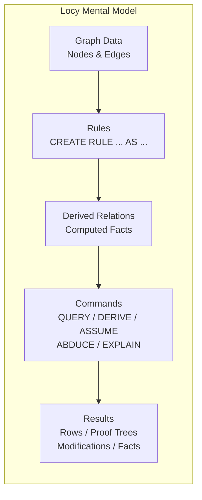
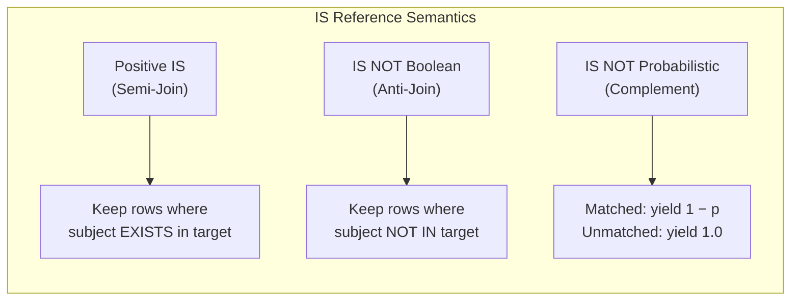
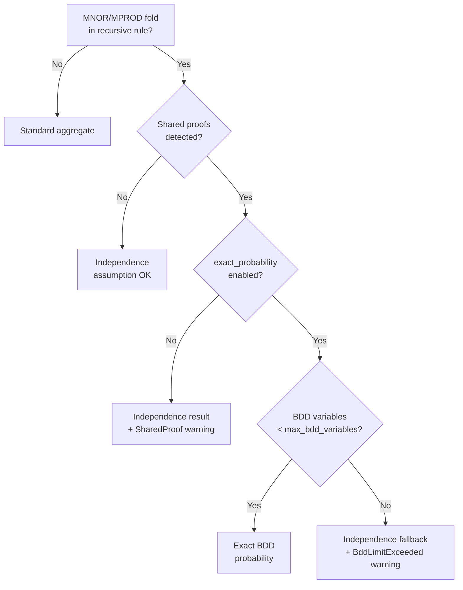
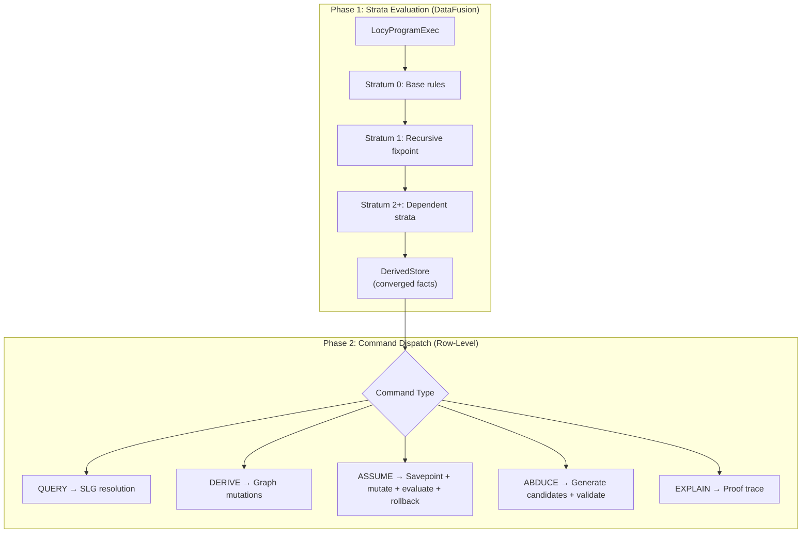
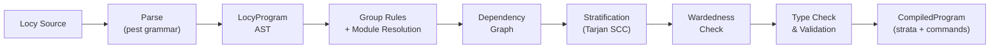
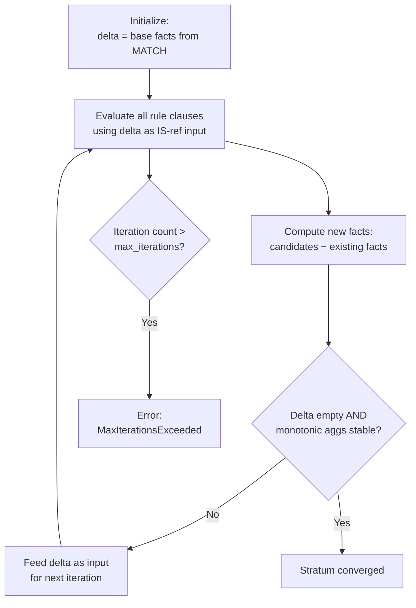

# Locy: The Complete Reference

> **Datalog-Inspired Logic Programming for the Uni Graph Database**
>
> The definitive reference for Locy — recursive rules, path accumulation, aggregation, probabilistic reasoning, hypothetical analysis, abductive inference, and graph materialization over Uni's property graph.

---

## Table of Contents

- [Part I: Foundations](#part-i-foundations)
  - [1. Introduction](#1-introduction)
  - [2. Quick Start](#2-quick-start)
- [Part II: Language Reference](#part-ii-language-reference)
  - [3. Program Structure](#3-program-structure)
  - [4. Rule Definition (CREATE RULE)](#4-rule-definition-create-rule)
  - [5. IS References (Rule Composition)](#5-is-references-rule-composition)
  - [6. YIELD Clause (Output Schema)](#6-yield-clause-output-schema)
  - [7. ALONG (Path-Carried Values)](#7-along-path-carried-values)
  - [8. FOLD (Aggregation)](#8-fold-aggregation)
  - [9. BEST BY (Witness Selection)](#9-best-by-witness-selection)
  - [10. DERIVE (Graph Materialization)](#10-derive-graph-materialization)
  - [11. PRIORITY (Default/Exception Reasoning)](#11-priority-defaultexception-reasoning)
  - [12. Probabilistic Reasoning](#12-probabilistic-reasoning)
- [Part III: Commands](#part-iii-commands)
  - [13. Commands](#13-commands)
- [Part IV: Under the Hood](#part-iv-under-the-hood)
  - [14. Compilation Pipeline](#14-compilation-pipeline)
  - [15. Execution Model](#15-execution-model)
- [Part V: Using Locy](#part-v-using-locy)
  - [16. API Reference](#16-api-reference)
  - [17. Configuration Reference](#17-configuration-reference)
- [Part VI: Reference](#part-vi-reference)
  - [18. Error Reference](#18-error-reference)
  - [19. Best Practices & Anti-Patterns](#19-best-practices--anti-patterns)
  - [20. Complete Examples](#20-complete-examples)
- [Appendices](#appendices)
  - [Appendix A: Grammar Reference](#appendix-a-grammar-reference)
  - [Appendix B: AST Type Hierarchy](#appendix-b-ast-type-hierarchy)
  - [Appendix C: Crate Map](#appendix-c-crate-map)
  - [Appendix D: TCK Coverage Map](#appendix-d-tck-coverage-map)

---

# Part I: Foundations

# 1. Introduction

## 1.1 What Locy Is

**Locy** (Logic + Cypher) is a Datalog-inspired logic programming language that extends OpenCypher with **recursive rules**, **path-carried values**, **aggregation**, **probabilistic inference**, **hypothetical reasoning**, **abductive inference**, and **graph materialization**. Every valid Cypher query is a valid Locy program — Locy is a strict superset.

Locy compiles rules into execution plans that run inside Uni's DataFusion-based query engine. It is not a separate engine — it reuses the same physical operators, Arrow columnar format, and storage layer as regular Cypher queries.

**Positioning relative to other languages:**

| Language | Locy's Relationship |
|----------|-------------------|
| **Datalog** | Locy adopts Datalog's recursive rules, stratified negation, and semi-naive fixpoint evaluation. Unlike pure Datalog, Locy operates over a typed property graph (not flat relations) and supports path accumulation, witness selection, and graph mutation. |
| **ProbLog** | Locy's MNOR/MPROD with PROB annotations provide probabilistic reasoning similar to ProbLog's probabilistic facts, including BDD-based exact inference for shared proofs. |
| **SQL Recursive CTEs** | Locy rules are like named recursive CTEs with stratified negation, priority-based overriding, and probabilistic aggregation — features absent from SQL. |
| **Prolog** | Locy's QUERY command uses SLG resolution (tabled, top-down) similar to XSB Prolog. ABDUCE provides abductive reasoning. |
| **OpenCypher** | Locy is a superset. All Cypher MATCH/CREATE/MERGE/RETURN queries work unchanged inside a Locy program. |

## 1.2 When to Use Locy vs Plain Cypher

| Task | Use Cypher | Use Locy |
|------|-----------|----------|
| Simple CRUD (create, read, update, delete) | Yes | Overkill |
| One-shot pattern matching | Yes | Overkill |
| Schema DDL | Yes | Not supported in rules |
| Transitive closure / reachability | Awkward (`[*]` paths) | Natural (recursive rules) |
| Weighted shortest path | Not expressible | ALONG + BEST BY |
| Risk/score propagation | Not expressible | Recursive FOLD |
| Probabilistic inference | Not expressible | MNOR/MPROD + PROB |
| What-if analysis | Not expressible | ASSUME |
| Root cause analysis | Not expressible | ABDUCE |
| Proof/explanation traces | Not expressible | EXPLAIN RULE |
| Graph materialization from reasoning | Manual CREATE | DERIVE |
| Permission resolution with priorities | Complex workarounds | PRIORITY rules |

## 1.3 Core Concepts in 60 Seconds

- **Rules** define named derived relations — like database views that can be recursive. `CREATE RULE reachable AS MATCH ... YIELD ...`
- **Multi-clause rules** (same name, different bodies) provide union semantics — the base case and recursive case.
- **IS references** compose rules: `WHERE x IS reachable` joins against the `reachable` relation. `IS NOT` provides stratified negation.
- **YIELD** defines the output schema. `KEY` marks grouping columns (identity of a fact). `PROB` marks probability columns.
- **FOLD** aggregates across rows per KEY group: `FOLD total = SUM(amount)`. Monotonic variants (MSUM, MNOR, MPROD) are safe in recursion.
- **ALONG** accumulates values along recursive paths: `ALONG cost = prev.cost + e.weight`.
- **BEST BY** selects the optimal derivation per KEY group: `BEST BY cost ASC`.
- **Commands** operate on rules after strata converge: QUERY (goal lookup), DERIVE (materialize to graph), ASSUME (what-if), ABDUCE (why/why-not), EXPLAIN RULE (proof trace).



---

# 2. Quick Start

## 2.1 Your First Rule — Transitive Closure

Set up a graph:

```cypher
CREATE (a:Node {name: 'A'}), (b:Node {name: 'B'}), (c:Node {name: 'C'})
CREATE (a)-[:EDGE]->(b), (b)-[:EDGE]->(c)
```

Define a `reachable` rule with two clauses (base case + recursive case):

```
CREATE RULE reachable AS
    MATCH (a:Node)-[:EDGE]->(b:Node)
    YIELD KEY a, KEY b

CREATE RULE reachable AS
    MATCH (a:Node)-[:EDGE]->(mid:Node)
    WHERE mid IS reachable TO b
    YIELD KEY a, KEY b
```

**Line by line:**
- **Clause 1 (base case):** Any direct edge from `a` to `b` makes `(a, b)` reachable.
- **Clause 2 (recursive case):** If `a` has a direct edge to `mid`, and `mid IS reachable TO b` (i.e., `mid` can reach `b` transitively), then `(a, b)` is also reachable.
- **YIELD KEY a, KEY b:** The rule outputs pairs `(a, b)`. KEY marks both as grouping columns — duplicate pairs are deduplicated.

**Result:** `{(A,B), (B,C), (A,C)}` — A reaches C transitively through B.

## 2.2 Your First Aggregation — FOLD SUM

```
CREATE RULE spending AS
    MATCH (p:Person)-[r:PAID]->(i:Invoice)
    FOLD total = SUM(r.amount)
    YIELD KEY p, total
```

- **FOLD total = SUM(r.amount):** Aggregates `r.amount` across all invoices per person.
- **KEY p:** Groups by person. Each person gets one output row with their total.

## 2.3 Your First Recursive Accumulation — Shortest Path

```
CREATE RULE shortest AS
    MATCH (a:City)-[r:ROAD]->(b:City)
    ALONG cost = r.distance
    BEST BY cost ASC
    YIELD KEY a, KEY b, cost

CREATE RULE shortest AS
    MATCH (a:City)-[r:ROAD]->(mid:City)
    WHERE mid IS shortest TO b
    ALONG cost = prev.cost + r.distance
    BEST BY cost ASC
    YIELD KEY a, KEY b, cost
```

- **ALONG cost = r.distance (base):** Direct edge cost.
- **ALONG cost = prev.cost + r.distance (recursive):** `prev.cost` is the accumulated cost from the previous hop.
- **BEST BY cost ASC:** Per `(a, b)` pair, keep only the minimum-cost path.

## 2.4 Your First Probabilistic Rule — Risk Combination

```
CREATE RULE component_risk AS
    MATCH (c:Component)-[s:SIGNAL]->(f:Flag)
    FOLD risk = MNOR(s.probability)
    YIELD KEY c, risk PROB

CREATE RULE safe_component AS
    MATCH (c:Component)
    WHERE c IS NOT component_risk
    YIELD KEY c, 1.0 AS confidence PROB
```

- **FOLD risk = MNOR(s.probability):** Noisy-OR: "at least one signal fires." Formula: `1 − ∏(1 − pᵢ)`.
- **risk PROB:** Marks the `risk` column as carrying a probability value.
- **c IS NOT component_risk:** Because `component_risk` has a PROB column, `IS NOT` computes the probabilistic complement: `confidence = 1 − risk`.

## 2.5 Running Locy

### Rust

```rust
let session = db.session();

// Simple evaluation
let result = session.locy("
    CREATE RULE reachable AS
        MATCH (a:Node)-[:EDGE]->(b:Node)
        YIELD KEY a, KEY b
    CREATE RULE reachable AS
        MATCH (a:Node)-[:EDGE]->(mid:Node)
        WHERE mid IS reachable TO b
        YIELD KEY a, KEY b
").await?;

for (rule_name, facts) in &result.derived {
    println!("{}: {} facts", rule_name, facts.len());
}

// Builder pattern with parameters
let result = session.locy_with("
    QUERY reachable WHERE a.name = $start RETURN b.name
")
    .param("start", "Alice")
    .timeout(Duration::from_secs(10))
    .run()
    .await?;
```

### Python

```python
session = db.session()

result = session.locy("""
    CREATE RULE reachable AS
        MATCH (a:Node)-[:EDGE]->(b:Node)
        YIELD KEY a, KEY b
    CREATE RULE reachable AS
        MATCH (a:Node)-[:EDGE]->(mid:Node)
        WHERE mid IS reachable TO b
        YIELD KEY a, KEY b
""")

for rule_name, facts in result.derived.items():
    print(f"{rule_name}: {len(facts)} facts")

# Builder pattern
result = session.locy_with("""
    QUERY reachable WHERE a.name = $start RETURN b.name
""").param("start", "Alice").timeout(10.0).run()
```

---

# Part II: Language Reference

# 3. Program Structure

## 3.1 Program Anatomy

A Locy program has three sections, all optional:

```
MODULE namespace.path              -- Optional: declare module namespace
USE other.module { rule1, rule2 }  -- Optional: import rules from modules
USE another.module                 -- Optional: glob import (all rules)

-- Statements: rules and commands (any order, any count)
CREATE RULE ... AS ...
CREATE RULE ... AS ...
QUERY rule_name WHERE ... RETURN ...
DERIVE rule_name
ASSUME { ... } THEN { ... }
MATCH (n) RETURN n                 -- Plain Cypher is valid too
```

Rules are compiled first (grouped, stratified, typechecked). Commands execute second, in order.

## 3.2 Module System

### MODULE Declaration

```
MODULE acme.compliance
```

Declares the namespace for all rules in this program. Optional — at most one per program. Must appear before USE declarations.

### USE Declarations

```
USE acme.common                       -- Glob import: all exported rules
USE acme.common { control, reachable } -- Selective import: named rules only
```

Imported rules are available for IS references in the current program's rules. Qualified names (e.g., `acme.common.control`) are resolved during compilation.

### Qualified Names

Rule names can be simple identifiers or dot-separated qualified paths:

```
reachable                    -- Simple name
acme.compliance.control      -- Qualified name
a.b.c.my_rule                -- Deep nesting
```

## 3.3 Cypher Passthrough

Any valid Cypher statement can appear in a Locy program as a statement:

```
CREATE RULE r AS ...

MATCH (n:Person) RETURN n.name   -- This is a plain Cypher query

QUERY r RETURN *
```

Cypher statements are executed as commands after strata converge. They return `CommandResult::Cypher(Vec<FactRow>)`.

## 3.4 Union Queries

Multiple Locy query blocks can be combined with UNION:

```
CREATE RULE r1 AS ... YIELD KEY a
UNION ALL
CREATE RULE r2 AS ... YIELD KEY b
```

`UNION` removes duplicates; `UNION ALL` keeps them.

---

# 4. Rule Definition (CREATE RULE)

## 4.1 Full Syntax

```
CREATE RULE name [PRIORITY n] AS
    MATCH pattern
    [WHERE conditions]
    [ALONG accumulations]
    [FOLD aggregations]
    [BEST BY selections]
    (YIELD items | DERIVE patterns)
```

Every clause is optional except MATCH and the terminal (YIELD or DERIVE).

## 4.2 Rule Names

```
CREATE RULE reachable AS ...           -- Simple name
CREATE RULE acme.risk_score AS ...     -- Qualified name
CREATE RULE `my-rule` AS ...           -- Backtick-quoted (reserved words, special chars)
```

Identifiers: `[a-zA-Z_][a-zA-Z0-9_]*`. Locy reserved keywords (RULE, ALONG, PREV, FOLD, BEST, DERIVE, ASSUME, ABDUCE, QUERY) must be backtick-quoted if used as identifiers.

## 4.3 Multi-Clause Rules (Union Semantics)

Multiple `CREATE RULE` statements with the same name define different **clauses** of one rule:

```
-- Clause 1: base case (direct edges)
CREATE RULE reachable AS
    MATCH (a:Node)-[:EDGE]->(b:Node)
    YIELD KEY a, KEY b

-- Clause 2: recursive case (transitive)
CREATE RULE reachable AS
    MATCH (a:Node)-[:EDGE]->(mid:Node)
    WHERE mid IS reachable TO b
    YIELD KEY a, KEY b
```

Results are the **union** of all clause evaluations. All clauses must have the **same YIELD schema** — same number of columns, same KEY positions, same PROB annotations. Violations produce `YieldSchemaMismatch`.

## 4.4 MATCH Clause

Full OpenCypher pattern matching is available:

```
MATCH (a:Person)-[r:KNOWS]->(b:Person)
MATCH (a:Person {name: 'Alice'})-[:WORKS_AT]->(c:Company)
MATCH (a)-[:EDGE*1..5]->(b)           -- Variable-length paths
MATCH (a:Label1:Label2 {prop: $value})  -- Multi-label, parameters
```

Every variable bound by MATCH is available in WHERE, ALONG, FOLD, YIELD, and DERIVE.

## 4.5 WHERE Clause (Rule Conditions)

The WHERE clause contains comma-separated conditions (comma = AND). Three types of conditions can be mixed:

```
WHERE a IS reachable,                   -- IS reference (positive)
      b IS NOT blocked,                 -- IS NOT reference (negation)
      a.score > 0.5,                    -- Cypher expression
      x IN [1, 2, 3]                    -- Cypher expression
```

Full Cypher expression support: comparisons, arithmetic, function calls, `$param` references, `IS NULL`, `CONTAINS`, `STARTS WITH`, `ENDS WITH`, regex (`=~`), quantifiers (`ALL`, `ANY`, `SINGLE`, `NONE`), `CASE`, `EXISTS`, `REDUCE`, list comprehensions, etc.

---

# 5. IS References (Rule Composition)

IS references are how rules compose — one rule references another rule's derived relation.

## 5.1 Positive IS References

### Unary Form

```
WHERE x IS flagged
```

`x` is bound to the first KEY column of the `flagged` rule. Succeeds if `x` appears in the derived relation.

### Binary Form (TO)

```
WHERE x IS reachable TO y
```

`x` and `y` are bound to the first two columns of the `reachable` rule. Succeeds if the pair `(x, y)` exists in the derived relation.

### Tuple Form

```
WHERE (x, y, cost) IS weighted_path
```

All variables are bound positionally to the `weighted_path` rule's yield columns. The number of bindings must not exceed the target rule's yield schema width (compiler error: `IsArityMismatch`).

### Semantics

A positive IS reference is a **semi-join**: for each row from the MATCH clause, check if the subject(s) exist in the target rule's derived relation. If found, the row passes through; if not, it's filtered out. When the target rule has additional yield columns beyond the bound subjects, those columns become available as `__prev_*` variables for ALONG expressions.

## 5.2 IS NOT References (Negation)

Two syntax forms, same semantics:

```
WHERE x IS NOT blocked            -- Postfix form
WHERE NOT x IS blocked            -- Prefix form
WHERE x IS NOT rule TO y          -- Binary with negation
WHERE (x, y) IS NOT rule          -- Tuple with negation
```

### Boolean Semantics (Default)

When the target rule has **no PROB column**, `IS NOT` is a **Boolean anti-join**: keep rows where the subject does NOT appear in the target rule's derived relation.

### Probabilistic Complement Semantics

When the target rule has a **PROB column**, `IS NOT` computes the **probabilistic complement**:
- If the subject **matches** a row in the target rule: contribute `1 − p` (where `p` is the PROB column value)
- If the subject **does not match** any row: contribute `1.0` (full complement)

The complement value is multiplied into the calling rule's PROB column if it has one.

### Stratification Requirement

The negated rule must be in a **completed lower stratum** — no recursive negation is allowed. The compiler detects violations as `CyclicNegation`.



---

# 6. YIELD Clause (Output Schema)

YIELD defines what a rule produces — its output columns.

## 6.1 Basic YIELD

```
YIELD a, b.name AS neighbor, cost + 1 AS adjusted
```

Each item is a Cypher expression with an optional alias. Without an alias, the column name is inferred from the expression (variable name or first property access).

## 6.2 KEY Columns

```
YIELD KEY a, KEY b, cost
```

KEY marks a column as a **grouping key**:
- KEY columns define the **identity** of a derived fact. Rows with identical KEY values are deduplicated.
- In recursive evaluation, KEY columns determine when new facts stop being generated (fixpoint).
- KEY columns are used as join keys for IS references from other rules.
- In FOLD aggregation, KEY columns are the implicit GROUP BY.

**Without KEY columns**, every row is considered unique — no deduplication occurs. This is usually an anti-pattern in recursive rules (see [Section 19](#19-best-practices--anti-patterns)).

## 6.3 PROB Annotation

```
YIELD KEY a, risk PROB                 -- Infer alias from expression
YIELD KEY a, risk AS risk_score PROB   -- Explicit alias
YIELD KEY a, risk AS PROB              -- Alias inferred from expression
```

PROB marks a column as carrying a **probability value** in [0, 1]:
- At most **one PROB column per rule** (compiler error: `MultipleProbColumns`).
- MNOR/MPROD fold outputs are **implicitly PROB** — the compiler auto-annotates them.
- PROB changes IS NOT semantics from Boolean anti-join to probabilistic complement.

## 6.4 Schema Consistency

All clauses of a multi-clause rule must produce the same YIELD schema:
- Same number of columns
- Same KEY positions
- Same PROB annotations

Violations produce `YieldSchemaMismatch`.

---

# 7. ALONG (Path-Carried Values)

ALONG declares variables that accumulate values along recursive traversal paths.

## 7.1 Syntax

```
ALONG cost = expr
ALONG cost = expr, hops = expr          -- Multiple accumulators
```

Expressions can use full Cypher arithmetic (`+`, `-`, `*`, `/`, `%`, `^`), logical operators (`AND`, `OR`, `XOR`, `NOT`), comparisons, property access, literals, and the special `prev.field` reference.

## 7.2 prev.field References

```
ALONG cost = prev.cost + e.weight
```

`prev.field` accesses the value of `field` from the **previous recursive hop**. It references columns from the IS-referenced rule's yield schema or ALONG bindings.

### Rules

- `prev` is **only valid in recursive clauses** (clauses with a self-IS-reference). Using `prev` in a base case clause produces compiler error `PrevInBaseCase`.
- `prev.field` must reference an existing column in the target rule's yield schema. Invalid field names produce `PrevFieldNotInSchema`.

## 7.3 Base Case vs Recursive Case

The common pattern is two clauses — one without `prev` (base) and one with `prev` (recursive):

```
-- Base case: initial value (no prev)
CREATE RULE path_cost AS
    MATCH (a:Node)-[e:EDGE]->(b:Node)
    ALONG cost = e.weight
    YIELD KEY a, KEY b, cost

-- Recursive case: accumulate (with prev)
CREATE RULE path_cost AS
    MATCH (a:Node)-[e:EDGE]->(mid:Node)
    WHERE mid IS path_cost TO b
    ALONG cost = prev.cost + e.weight
    YIELD KEY a, KEY b, cost
```

## 7.4 Multiple Accumulators

```
ALONG distance = prev.distance + e.length,
      hops = prev.hops + 1,
      max_weight = prev.max_weight  -- Pass through unchanged
```

Each accumulator is independently computed per hop.

---

# 8. FOLD (Aggregation)

FOLD aggregates values across rows sharing the same KEY group.

## 8.1 Standard Aggregates (Non-Recursive Only)

These aggregates are **not monotonic** and cannot be used in recursive strata. The compiler rejects them with `NonMonotonicInRecursion`.

| Aggregate | Description | Output Type |
|-----------|-------------|-------------|
| `SUM(expr)` | Sum of values | Float64 |
| `COUNT(expr)` | Count of non-null values | Int64 |
| `COUNT(*)` | Count of all rows | Int64 |
| `AVG(expr)` | Arithmetic mean | Float64 |
| `MIN(expr)` | Minimum value | Same as input |
| `MAX(expr)` | Maximum value | Same as input |
| `COLLECT(expr)` | Collect into a list | List |

```
CREATE RULE spending AS
    MATCH (p:Person)-[r:PAID]->(i:Invoice)
    FOLD total = SUM(r.amount), count = COUNT(*)
    YIELD KEY p, total, count
```

## 8.2 Monotonic Aggregates (Safe in Recursion)

These aggregates are **monotonic** — their value can only move in one direction as new facts arrive — which guarantees fixpoint convergence.

| Aggregate | Formula | Direction | Identity | Domain |
|-----------|---------|-----------|----------|--------|
| `MSUM(expr)` | `acc + val` | Non-decreasing | 0.0 | Non-negative for convergence |
| `MMAX(expr)` | `max(acc, val)` | Non-decreasing | -infinity | None |
| `MMIN(expr)` | `min(acc, val)` | Non-increasing | +infinity | None |
| `MCOUNT(expr)` | `acc + 1` | Non-decreasing | 0 | None |
| `MNOR(expr)` | `1 − (1 − acc)(1 − val)` | Non-decreasing | 0.0 | [0, 1] (probability) |
| `MPROD(expr)` | `acc × val` | Non-increasing | 1.0 | [0, 1] (probability) |

```
-- Monotonic sum (e.g., accumulating ownership stakes)
FOLD ownership = MSUM(stake.fraction)

-- Noisy-OR (e.g., combining independent risk signals)
FOLD risk = MNOR(signal.probability)

-- Product (e.g., joint reliability of all components)
FOLD reliability = MPROD(part.reliability)
```

### MNOR (Noisy-OR)

Formula: `P = 1 − ∏(1 − pᵢ)`

Semantics: "The probability that at least one cause produces the effect." Each input `pᵢ` is the independent probability of one cause. Inputs are clamped to [0, 1] unless `strict_probability_domain = true`.

### MPROD (Product)

Formula: `P = ∏ pᵢ`

Semantics: "The probability that all conditions hold simultaneously." Uses **log-space computation** when the accumulated product drops below `probability_epsilon` (default `1e-15`) to prevent floating-point underflow.

### Convergence

Fixpoint converges when:
1. No new KEY tuples are produced, **AND**
2. All monotonic accumulators are stable (change < `f64::EPSILON` since last iteration)

### Compiler Warnings

- **MsumNonNegativity**: MSUM argument is not a literal — may be negative, violating monotonicity.
- **ProbabilityDomainViolation**: MNOR/MPROD argument is not a literal — may be outside [0, 1].

## 8.3 FOLD + BEST BY Restriction

BEST BY cannot be combined with monotonic FOLD in the same clause. They are semantically contradictory: BEST BY selects one witness row, while monotonic FOLD aggregates across all rows. The compiler rejects this with `BestByWithMonotonicFold`.

---

# 9. BEST BY (Witness Selection)

BEST BY retains the single best derivation per KEY group, preserving the full witness row.

## 9.1 Syntax

```
BEST BY cost ASC                           -- Minimum cost
BEST BY reliability DESC                   -- Maximum reliability
BEST BY cost ASC, priority DESC            -- Multiple criteria
```

Default direction is `ASC` (ascending = minimum). Multiple criteria apply as tie-breakers in order.

## 9.2 Deterministic Tie-Breaking

When `deterministic_best_by = true` (default), ties are broken by a secondary sort on all remaining columns, ensuring reproducible results. When `false`, ties are broken non-deterministically (faster).

## 9.3 Complete Example: Shortest Path

```
CREATE RULE shortest AS
    MATCH (a:City)-[r:ROAD]->(b:City)
    ALONG cost = r.distance
    BEST BY cost ASC
    YIELD KEY a, KEY b, cost

CREATE RULE shortest AS
    MATCH (a:City)-[r:ROAD]->(mid:City)
    WHERE mid IS shortest TO b
    ALONG cost = prev.cost + r.distance
    BEST BY cost ASC
    YIELD KEY a, KEY b, cost
```

BEST BY enables **early pruning** during semi-naive evaluation — suboptimal paths are discarded before the next iteration, dramatically reducing the search space.

---

# 10. DERIVE (Graph Materialization)

DERIVE creates new graph structure (nodes and edges) as rule output — an alternative to YIELD.

## 10.1 Edge Derivation

```
-- Forward edge
DERIVE (a)-[:INFERRED_FRIEND]->(b)

-- Backward edge
DERIVE (b)<-[:DERIVED_FROM]-(a)

-- With properties
DERIVE (a)-[:RISK_LINK {score: risk, detected_at: datetime()}]->(b)

-- Multiple patterns
DERIVE (a)-[:A]->(b), (b)-[:B]->(c)
```

## 10.2 NEW Node Creation (Skolem Nodes)

```
DERIVE (NEW category:Category {name: a.type})<-[:BELONGS_TO]-(a)
```

`NEW` marks a node as newly created. A fresh node is created per unique combination of labels and properties.

### Wardedness Constraint

Every NEW node's **companion** (the node at the other end of the derived edge) must be bound by the MATCH clause — not solely by IS references. This prevents unbounded node proliferation from derived relations. Violations produce `WardednessViolation`.

## 10.3 DERIVE MERGE (Entity Resolution)

```
DERIVE MERGE a, b
```

Declares that `a` and `b` represent the same entity. Used for deduplication and entity resolution.

## 10.4 DERIVE Command (Top-Level)

```
DERIVE rule_name
DERIVE rule_name WHERE expr
```

A top-level command that triggers bottom-up evaluation of the named rule and applies the resulting mutations to the graph. Returns `CommandResult::Derive { affected: usize }`.

## 10.5 DerivedFactSet and tx.apply()

When Locy runs at **session level** (read-only), DERIVE mutations are collected into a `DerivedFactSet` rather than applied immediately:

```rust
// Session level: collect derived facts
let result = session.locy("DERIVE infer_edges").await?;
let derived = result.derived_fact_set.unwrap();

// Apply in a transaction
let tx = session.tx().await?;
tx.apply(derived).await?;
tx.commit().await?;
```

When Locy runs at **transaction level**, DERIVE mutations are applied immediately to the transaction's private L0 buffer:

```rust
let tx = session.tx().await?;
tx.locy("DERIVE infer_edges").await?;  // Auto-applies to tx
tx.commit().await?;
```

### Version Staleness

`DerivedFactSet.evaluated_at_version` records the database version when DERIVE was evaluated. When applying via `tx.apply()`, the version gap is checked — if the database has changed significantly, a warning is emitted.

---

# 11. PRIORITY (Default/Exception Reasoning)

PRIORITY enables defeasible reasoning: higher-priority rules override lower-priority rules for the same KEY group.

## 11.1 Syntax

```
CREATE RULE access PRIORITY 0 AS        -- Default: deny
    MATCH (u:User)-[:MEMBER_OF]->(g:Group)
    WHERE g.name = 'restricted'
    YIELD KEY u, 'deny' AS decision

CREATE RULE access PRIORITY 100 AS      -- Exception: admin override
    MATCH (u:User)-[:HAS_ROLE]->(r:Role)
    WHERE r.name = 'admin'
    YIELD KEY u, 'allow' AS decision
```

Higher number = higher priority. Default priority (when omitted) is 0.

## 11.2 Semantics

Priority filtering is applied **post-fixpoint**: after all strata converge, per-KEY group, only the derivation(s) from the highest-priority clause survive. Equal-priority clauses contribute all their derivations (union).

## 11.3 Rules

- All clauses of a multi-clause rule must either **all have PRIORITY** or **none have PRIORITY**. Mixing produces `MixedPriority`.
- PRIORITY values are integers (positive or negative).

---

# 12. Probabilistic Reasoning

Locy supports probabilistic inference for uncertainty-aware graph reasoning, with three core operations.

## 12.1 MNOR (Noisy-OR)

**Formula:** `P = 1 − ∏(1 − pᵢ)`

**Use case:** "What is the probability that at least one cause produces the effect?"

```
CREATE RULE delivery_risk AS
    MATCH (warehouse:WH)-[route:ROUTE]->(customer:Customer)
    FOLD any_arrives = MNOR(route.reliability)
    YIELD KEY customer, any_arrives PROB
```

With four routes having reliabilities 0.72, 0.54, 0.56, 0.42:
`P = 1 − (1−0.72)(1−0.54)(1−0.56)(1−0.42) = 1 − 0.28 × 0.46 × 0.44 × 0.58 ≈ 0.967`

## 12.2 MPROD (Product)

**Formula:** `P = ∏ pᵢ`

**Use case:** "What is the probability that all components work?"

```
CREATE RULE system_reliability AS
    MATCH (sys:System)-[:REQUIRES]->(comp:Component)
    FOLD all_work = MPROD(comp.reliability)
    YIELD KEY sys, all_work PROB
```

MPROD uses **log-space computation** when the product drops below `probability_epsilon` (default `1e-15`) to prevent floating-point underflow.

## 12.3 PROB and IS NOT Complement

When a rule has a PROB column and another rule uses `IS NOT` against it:

```
CREATE RULE risky AS
    MATCH (a:Account)-[s:SIGNAL]->(f:Flag)
    FOLD risk = MNOR(s.probability)
    YIELD KEY a, risk PROB

CREATE RULE safe AS
    MATCH (a:Account)
    WHERE a IS NOT risky
    YIELD KEY a, 1.0 AS confidence PROB
```

- If `a` has a risk of 0.8 in `risky`, then `safe` yields `confidence = 1 − 0.8 = 0.2`.
- If `a` is not in `risky` at all, then `safe` yields `confidence = 1.0`.

Multiple IS / IS NOT references with PROB in a single clause multiply their probability terms into the calling rule's PROB column.

## 12.4 Shared Proof Detection

When recursive rules have diamond-shaped derivation graphs, multiple proof paths may share the same base facts. The **independence assumption** (which MNOR/MPROD rely on) may not hold.

Uni detects this at runtime via a **DerivationTracker** that records the base-fact inputs for each derived fact. When overlap is detected, it emits a `SharedProbabilisticDependency` warning.

## 12.5 Exact Probability (BDD-Based)

When `exact_probability = true`, shared-proof groups use **BDD-based weighted model counting** instead of the independence assumption:

1. Collect all unique base facts across the group's derivation rows
2. Build a BDD variable set (one variable per base fact)
3. For each derivation row: AND its base-fact variables
4. Combine rows: OR for MNOR, AND for MPROD
5. Evaluate exact probability via Shannon expansion

### Fallback

When unique base facts exceed `max_bdd_variables` (default 1000), the group falls back to independence mode and emits `BddLimitExceeded`. The affected rows are annotated with `approximate = true`.

### Cross-Group Correlation

When base facts are shared across **different KEY groups**, per-group BDD is exact internally but cross-group correlation remains approximate. This emits `CrossGroupCorrelationNotExact`.

## 12.6 Top-K Proof Filtering

`top_k_proofs` bounds the number of proof annotations retained per derived fact. When `top_k_proofs > 0`, only the k highest-probability proofs are kept (Scallop, Huang et al. 2021). `top_k_proofs_training` optionally overrides this during training mode.



---

# Part III: Commands

# 13. Commands

Commands execute in **Phase 2** (row-level dispatch) after all strata have converged in Phase 1. They operate on the converged derived relations.

## 13.1 Two-Phase Execution



**Phase 1** runs entirely within DataFusion. Rules compile to `LogicalPlan` nodes, physical planning creates DataFusion operators (`FixpointExec`, `FoldExec`, etc.), and fixpoint iteration runs via semi-naive evaluation.

**Phase 2** operates on converged facts. Commands are not queries — they perform mutations (DERIVE), hypothetical reasoning (ASSUME/ABDUCE), or introspection (EXPLAIN/QUERY).

> **Expression limitation:** WHERE filters in commands use `eval_expr()` (a lightweight row-level evaluator), not DataFusion. Expression functions like `similar_to()` are limited to pure vector cosine — no auto-embed, FTS, or multi-source fusion. Rule WHERE clauses (Phase 1) have full DataFusion expression support.

## 13.2 QUERY (Goal-Directed Evaluation)

```
QUERY rule_name [WHERE expr] [RETURN items [ORDER BY ...] [SKIP n] [LIMIT n]]
```

Uses **SLG resolution** (Selective Linear Definite clause resolution — top-down with tabling) to evaluate a specific goal without computing the entire derived relation. Efficient for "find one specific fact" lookups.

```
QUERY reachable WHERE a.name = 'Alice' RETURN b.name AS destination
QUERY risk_score WHERE account.id = 'ACC-001' RETURN score ORDER BY score DESC LIMIT 5
```

Returns `CommandResult::Query(Vec<FactRow>)`.

## 13.3 DERIVE Command

```
DERIVE rule_name [WHERE expr]
```

Triggers bottom-up materialization and applies graph mutations. See [Section 10.4](#104-derive-command-top-level) for details.

Returns `CommandResult::Derive { affected: usize }`.

## 13.4 ASSUME (Hypothetical Reasoning)

```
ASSUME {
    -- Cypher mutations (CREATE, MERGE, SET, DELETE, etc.)
    CREATE (x:Account {name: 'Suspicious'})-[:TRANSFER]->(existing:Account)
}
THEN {
    -- Locy body (rules, queries, other commands)
    QUERY risk_propagation RETURN affected_nodes
}
```

**Execution:**
1. **Fork** the L0 buffer (save current state)
2. **Apply** mutations from the ASSUME block
3. **Re-evaluate** all strata in the mutated state
4. **Execute** body commands
5. **Rollback** — restore L0 to pre-ASSUME state

The database is never permanently modified. ASSUME blocks can be nested (stacked savepoints).

Returns `CommandResult::Assume(Vec<FactRow>)`.

```
-- "What if Alice knew Carol?"
ASSUME {
    MATCH (a:Person {name: 'Alice'}), (c:Person {name: 'Carol'})
    CREATE (a)-[:KNOWS]->(c)
}
THEN {
    QUERY reachable WHERE a.name = 'Alice' RETURN b.name
}
```

## 13.5 ABDUCE (Abductive Reasoning)

```
ABDUCE [NOT] rule_name [WHERE expr] [RETURN items [ORDER BY ...] [LIMIT n]]
```

Asks: "What graph modifications would make this rule hold (or stop holding)?"

**Three-phase pipeline:**
1. **Generate candidates**: Build derivation tree via EXPLAIN, extract candidate modifications (RemoveEdge, AddEdge, ChangeProperty)
2. **Validate**: For each candidate, use ASSUME-style fork → mutate → re-evaluate → check if goal holds → rollback
3. **Return**: Validated modifications sorted by cost, up to `max_abduce_results`

```
-- "What edges would we need to remove to disconnect A from C?"
ABDUCE NOT reachable WHERE a.name = 'A' AND b.name = 'C'
RETURN modifications

-- "What would need to be true for this account to be flagged?"
ABDUCE flagged WHERE account.id = 'ACC-999' RETURN assumptions
```

Returns `CommandResult::Abduce(AbductionResult)` containing `Vec<ValidatedModification>`.

**Modification types:**
- `RemoveEdge { source_var, target_var, edge_var, edge_type, match_properties }`
- `AddEdge { source_var, target_var, edge_type, properties }`
- `ChangeProperty { element_var, property, old_value, new_value }`

## 13.6 EXPLAIN RULE (Proof Traces)

```
EXPLAIN RULE rule_name [WHERE expr] [RETURN items [ORDER BY ...] [LIMIT n]]
```

Returns the **derivation tree** showing which clauses and base facts produced a result.

```
EXPLAIN RULE reachable WHERE a.name = 'A' AND b.name = 'C'
RETURN derivation
```

Returns `CommandResult::Explain(DerivationNode)`.

**DerivationNode structure:**

```rust
DerivationNode {
    rule: String,              // Rule name
    clause_index: usize,       // Which clause produced this
    priority: Option<i64>,     // Clause priority
    bindings: HashMap<String, Value>,     // Variable bindings
    along_values: HashMap<String, Value>, // Accumulated ALONG values
    children: Vec<DerivationNode>,        // Sub-derivations (recursive)
    graph_fact: Option<String>,           // Base graph fact (leaf node)
    approximate: bool,         // True if BDD fell back to independence
    proof_probability: Option<f64>,       // Proof probability (if PROB)
}
```

---

# Part IV: Under the Hood

# 14. Compilation Pipeline

Locy programs are compiled through a strict 7-phase pipeline before execution.



## 14.1 Parsing

**Parser:** pest-based PEG grammar (`locy.pest` stacked on `cypher.pest`).

**Entry point:** `locy_query` rule.

The Locy grammar extends Cypher with: `RULE`, `ALONG`, `PREV`, `FOLD`, `BEST`, `DERIVE`, `ASSUME`, `ABDUCE`, `QUERY`, `MODULE`, `USE`, `PRIORITY`, `NEW`, `EXPORT`, `PROB`.

The parser handles Cypher sub-expressions within Locy contexts (ALONG expressions, FOLD expressions, YIELD items) by re-parsing pest sub-trees as Cypher expressions via `reparse_as_cypher_*()` bridge functions.

**Output:** `LocyProgram` AST (see [Appendix B](#appendix-b-ast-type-hierarchy)).

## 14.2 Rule Grouping & Module Resolution

All `CREATE RULE` statements are grouped by their qualified name. Module context resolves `USE` declarations and qualified name references.

**Errors detected:** `ModuleNotFound`, `ImportNotFound`

## 14.3 Dependency Graph Construction

For each IS reference in a rule's WHERE clause:
- **Positive IS:** Creates a positive edge (rule A depends on rule B)
- **IS NOT:** Creates a negative edge (rule A negatively depends on rule B)

```rust
DependencyGraph {
    positive_edges: HashMap<String, HashSet<String>>,
    negative_edges: HashMap<String, HashSet<String>>,
    all_rules: HashSet<String>,
}
```

**Errors detected:** `UndefinedRule`

## 14.4 Stratification (Tarjan SCC + Topological Sort)

1. **Tarjan's SCC algorithm** identifies strongly connected components (groups of mutually-recursive rules).
2. **Cyclic negation detection:** If any negative edge exists within an SCC, the program is rejected.
3. **Recursion classification:** An SCC with >1 member or a self-edge is marked recursive.
4. **Kahn's topological sort** orders SCCs so dependencies are evaluated before dependents.

```rust
StratificationResult {
    sccs: Vec<HashSet<String>>,        // Strongly connected components
    scc_order: Vec<usize>,             // Topological evaluation order
    scc_map: HashMap<String, usize>,   // Rule → SCC index
    is_recursive: Vec<bool>,           // Per-SCC recursion flag
    scc_depends_on: Vec<HashSet<usize>>,
}
```

**Errors detected:** `CyclicNegation`

## 14.5 Wardedness Check

For each DERIVE clause with NEW nodes: verify that every companion node (the node at the other end of the derived edge) is bound by the MATCH pattern — not solely by IS references.

**Errors detected:** `WardednessViolation`

## 14.6 Type Checking & Validation

A two-pass algorithm:

**Pass 1 (per-rule):**
- Mixed priority check → `MixedPriority`
- YIELD schema inference — collect items from all clauses, verify consistency → `YieldSchemaMismatch`
- Implicit PROB annotation from MNOR/MPROD folds
- Multiple PROB validation → `MultipleProbColumns`
- `prev` in base case check → `PrevInBaseCase`
- Non-monotonic fold in recursion → `NonMonotonicInRecursion`
- BEST BY + monotonic fold → `BestByWithMonotonicFold`
- MSUM non-negativity warning → `MsumNonNegativity`
- MNOR/MPROD domain warning → `ProbabilityDomainViolation`

**Pass 2 (IS-ref validation):**
- IS-ref arity check → `IsArityMismatch`
- `prev.field` validation → `PrevFieldNotInSchema`

## 14.7 Program Assembly

Compiled rules are assembled into a `CompiledProgram`:

```rust
CompiledProgram {
    strata: Vec<Stratum>,
    rule_catalog: HashMap<String, CompiledRule>,
    warnings: Vec<CompilerWarning>,
    commands: Vec<CompiledCommand>,
}

Stratum {
    id: usize,
    rules: Vec<CompiledRule>,
    is_recursive: bool,
    depends_on: Vec<usize>,
}

CompiledRule {
    name: String,
    clauses: Vec<CompiledClause>,
    yield_schema: Vec<YieldColumn>,
    priority: Option<i64>,
}

YieldColumn {
    name: String,
    is_key: bool,
    is_prob: bool,
}
```

Non-rule statements are extracted as `CompiledCommand`:
- `GoalQuery`, `Assume(CompiledAssume)`, `Abduce`, `ExplainRule`, `DeriveCommand`, `Cypher`

---

# 15. Execution Model

## 15.1 Two-Phase Execution

**Phase 1 (DataFusion):** Bottom-up stratum evaluation via `LocyProgramExec`. Rules compile to DataFusion `LogicalPlan` nodes. Physical planning uses `CypherPhysicalExprCompiler` for expressions. Fixpoint iteration runs via `FixpointExec`.

**Phase 2 (Row-Level):** Command dispatch via `NativeExecutionAdapter`. Commands receive converged facts as `Vec<FactRow>` and perform mutations (DERIVE), hypothetical reasoning (ASSUME/ABDUCE), or introspection (EXPLAIN/QUERY).

## 15.2 Stratum Evaluation Order

Strata are evaluated in topological order:

1. **Non-recursive strata:** Single pass — evaluate all clause bodies once, collect output.
2. **Recursive strata:** Semi-naive fixpoint iteration until convergence.
3. **Post-fixpoint operators:** After convergence, apply FOLD, PRIORITY filtering, and BEST BY selection.
4. **Store results:** Converged facts are placed in `DerivedStore` for downstream strata.

## 15.3 Semi-Naive Fixpoint



**Key optimization:** Instead of re-evaluating all rules against all facts each iteration, only new facts (delta) from the previous iteration are used. This provides exponential speedup for transitive closures.

**Deduplication strategies** (in priority order):
1. **RowConverter** — O(M) per iteration using persistent `HashSet<Box<[u8]>>` encoding. Primary strategy.
2. **LeftAntiJoin** — Vectorized DataFusion anti-join when existing facts ≥ 1000 rows.
3. **Legacy HashSet** — `HashSet<Vec<ScalarKey>>` fallback when RowConverter schema is unsupported.

**Convergence criteria:**
- No new delta facts produced, **AND**
- All monotonic accumulators stable (change < `f64::EPSILON`)

Bounded by `max_iterations` (default 1000) and `timeout` (default 300s).

## 15.4 MonotonicAggState

For strata with monotonic folds (MSUM, MMAX, MMIN, MCOUNT, MNOR, MPROD), a `MonotonicAggState` tracks per-key accumulators:

```rust
MonotonicAggState {
    accumulators: HashMap<(Vec<ScalarKey>, String), f64>,
    prev_snapshot: HashMap<(Vec<ScalarKey>, String), f64>,
    bindings: Vec<MonotonicFoldBinding>,
}
```

Each iteration:
1. Update accumulators with new values from the current iteration
2. Check stability: compare current accumulators against previous snapshot
3. If all accumulators are stable AND no new key tuples → convergence

## 15.5 IS-Ref Resolution

**Positive IS-ref (semi-join):** For each MATCH row, check if subject(s) exist in target rule's derived relation. If found, bind additional columns and pass through. If not, filter out.

**IS NOT Boolean (anti-join):** Keep only MATCH rows where subject does NOT appear in target rule.

**IS NOT Probabilistic (complement):** For matched rows, contribute `1 − p`. For unmatched rows, contribute `1.0`.

## 15.6 DerivedStore

```rust
DerivedStore {
    relations: HashMap<String, Vec<RecordBatch>>,
}
```

Accumulates converged facts from each stratum. Later strata see results from all previously completed strata via shared `DerivedScanEntry` handles injected during planning.

## 15.7 SLG Resolution (QUERY Command)

The QUERY command uses **Selective Linear Definite clause resolution** — top-down with tabling:
- Cache key: `(rule_name, known key bindings)`
- Checks DerivedStore first (pre-computed from bottom-up phase)
- Falls back to demand-driven evaluation for uncomputed relations
- Prevents infinite loops via tabling (memoization)

Bounded by `max_slg_depth` (default 1000).

## 15.8 Expression Evaluation Paths

| Context | Engine | Capabilities |
|---------|--------|-------------|
| Cypher `MATCH ... WHERE/RETURN` | DataFusion | Full (vector, auto-embed, FTS, similar_to) |
| Locy rule `MATCH ... WHERE/YIELD` | DataFusion | Full (via CypherPhysicalExprCompiler) |
| Locy rule `ALONG / FOLD` | DataFusion | Full |
| `DERIVE ... WHERE` | In-memory eval_expr | Limited (vector cosine only for similar_to) |
| `ABDUCE ... WHERE` | In-memory eval_expr | Limited |
| `ASSUME ... THEN` body WHERE | In-memory eval_expr | Limited |

---

# Part V: Using Locy

# 16. API Reference

## 16.1 Rust API

### Session-Level (Read Scope)

```rust
// Simple evaluation
let result = session.locy("CREATE RULE r AS ... YIELD ...").await?;

// Builder pattern
let result = session.locy_with("QUERY r WHERE x = $val RETURN y")
    .param("val", "Alice")
    .params([("a", Value::from(1)), ("b", Value::from(2))])
    .params_map(hashmap)
    .timeout(Duration::from_secs(60))
    .max_iterations(500)
    .cancellation_token(token)
    .with_config(LocyConfig { .. })
    .run()
    .await?;

// Compilation-only introspection (no execution)
let explain = session.locy_with("CREATE RULE r AS ...")
    .explain()?;
println!("{}", explain.plan_text);
println!("Strata: {}, Recursive: {}", explain.strata_count, explain.has_recursive_strata);
```

### Transaction-Level (Write Scope)

```rust
let tx = session.tx().await?;

// Evaluate within transaction (sees uncommitted writes)
let result = tx.locy("DERIVE infer_edges").await?;

// Builder pattern (same methods as session)
let result = tx.locy_with("QUERY r WHERE x = $val")
    .param("val", "Alice")
    .timeout(Duration::from_secs(30))
    .run()
    .await?;

// Apply session-level derived facts
let session_result = session.locy("DERIVE infer_edges").await?;
let derived = session_result.derived_fact_set.unwrap();
tx.apply(derived).await?;
tx.commit().await?;
```

### Rule Registry

```rust
// Database-level (shared across sessions)
db.rules().register("CREATE RULE reach AS ...")?;

// Session-level (cloned from db on creation)
session.rules().register("CREATE RULE local_rule AS ...")?;

// Transaction-level
tx.rules().register("CREATE RULE tx_rule AS ...")?;

// Operations
let names: Vec<String> = session.rules().list();
let info: Option<RuleInfo> = session.rules().get("reach");
// RuleInfo { name, clause_count, is_recursive }

let removed: bool = session.rules().remove("reach")?;
session.rules().clear();
let count: usize = session.rules().count();
```

Registered rules are automatically merged into any subsequent `session.locy()` / `tx.locy()` calls. Rules from the registry are treated as external rules during compilation — they participate in dependency analysis and stratification.

## 16.2 Python API

### Session-Level

```python
# Simple evaluation
result = session.locy("CREATE RULE r AS ... YIELD ...", params={"key": "value"})

# Builder pattern
result = session.locy_with("QUERY r WHERE x = $val") \
    .param("val", "Alice") \
    .params({"a": 1, "b": 2}) \
    .timeout(60.0) \
    .max_iterations(500) \
    .with_config({"exact_probability": True}) \
    .run()

# Compilation-only introspection
explain = session.explain_locy("CREATE RULE r AS ...")
print(explain.plan_text)
print(explain.strata_count, explain.has_recursive_strata)

# Rule registry
session.rules().register("CREATE RULE reach AS ...")
session.rules().list()       # → ["reach"]
session.rules().get("reach") # → RuleInfo
session.rules().remove("reach")
session.rules().count()
```

### Transaction-Level

```python
with session.tx() as tx:
    result = tx.locy("DERIVE infer_edges")

    result = tx.locy_with("QUERY r WHERE x = $val") \
        .param("val", "Alice") \
        .run()

    # Apply session-level derived facts
    session_result = session.locy("DERIVE infer_edges")
    tx.apply(session_result.derived_fact_set)
    tx.commit()
```

### Async API

```python
result = await session.locy("CREATE RULE r AS ...")

async with await session.tx() as tx:
    await tx.locy("DERIVE infer_edges")
    await tx.commit()
```

## 16.3 Result Types

### LocyResult

```rust
LocyResult {
    derived: HashMap<String, Vec<FactRow>>,        // Rule name → derived facts
    stats: LocyStats,                               // Execution statistics
    command_results: Vec<CommandResult>,             // Command outputs
    warnings: Vec<RuntimeWarning>,                  // Runtime warnings
    approximate_groups: HashMap<String, Vec<String>>, // Approximate BDD groups
    derived_fact_set: Option<DerivedFactSet>,        // Collected DERIVE mutations
}
```

**Convenience methods:**
- `result.derived` — all derived relations
- `result.stats` — execution statistics
- `result.command_results` — ordered command outputs
- `result.warnings` / `result.has_warning(code)` — runtime warning inspection
- `result.derived_fact_set` — collected DERIVE mutations (session-level only)

### CommandResult

```rust
enum CommandResult {
    Query(Vec<FactRow>),
    Assume(Vec<FactRow>),
    Explain(DerivationNode),
    Abduce(AbductionResult),
    Derive { affected: usize },
    Cypher(Vec<FactRow>),
}
```

### LocyStats

```rust
LocyStats {
    strata_evaluated: usize,
    total_iterations: usize,
    derived_nodes: usize,
    derived_edges: usize,
    evaluation_time: Duration,
    queries_executed: usize,
    mutations_executed: usize,
    peak_memory_bytes: usize,
}
```

### DerivedFactSet

```rust
DerivedFactSet {
    vertices: HashMap<String, Vec<Properties>>,  // Label → vertex data
    edges: Vec<DerivedEdge>,                     // Derived edges
    stats: LocyStats,
    evaluated_at_version: u64,                   // DB version at eval time
}

DerivedEdge {
    edge_type: String,
    source_label: String,
    source_properties: Properties,
    target_label: String,
    target_properties: Properties,
    edge_properties: Properties,
}
```

### LocyExplainOutput

```rust
LocyExplainOutput {
    plan_text: String,
    strata_count: usize,
    rule_names: Vec<String>,
    has_recursive_strata: bool,
    warnings: Vec<String>,
    command_count: usize,
}
```

---

# 17. Configuration Reference

## 17.1 LocyConfig Fields

| Field | Type | Default | Description |
|-------|------|---------|-------------|
| `max_iterations` | `usize` | `1000` | Maximum fixpoint iterations per recursive stratum |
| `timeout` | `Duration` | `300s` | Overall evaluation timeout |
| `max_explain_depth` | `usize` | `100` | Maximum recursion depth for EXPLAIN derivation trees |
| `max_slg_depth` | `usize` | `1000` | Maximum recursion depth for SLG resolution (QUERY) |
| `max_abduce_candidates` | `usize` | `20` | Maximum candidate modifications generated during ABDUCE |
| `max_abduce_results` | `usize` | `10` | Maximum validated results returned from ABDUCE |
| `max_derived_bytes` | `usize` | `256 MiB` | Maximum bytes of derived facts per relation |
| `deterministic_best_by` | `bool` | `true` | BEST BY uses secondary sort for deterministic tie-breaking |
| `strict_probability_domain` | `bool` | `false` | Reject MNOR/MPROD inputs outside [0,1] with error (else clamp) |
| `probability_epsilon` | `f64` | `1e-15` | MPROD switches to log-space when product drops below this |
| `exact_probability` | `bool` | `false` | Use BDD-based exact inference for shared-proof groups |
| `max_bdd_variables` | `usize` | `1000` | Per-group BDD variable cap before fallback to independence |
| `top_k_proofs` | `usize` | `0` | Retain at most k proofs per fact (0 = unlimited) |
| `top_k_proofs_training` | `Option<usize>` | `None` | Override top_k_proofs during training |
| `params` | `HashMap<String, Value>` | `{}` | Parameter bindings for `$name` references |

## 17.2 Setting Configuration

### Rust

```rust
// Individual overrides via builder
session.locy_with(program)
    .timeout(Duration::from_secs(60))
    .max_iterations(500)
    .run()
    .await?;

// Full config override
let config = LocyConfig {
    exact_probability: true,
    strict_probability_domain: true,
    max_bdd_variables: 2000,
    ..Default::default()
};
session.locy_with(program)
    .with_config(config)
    .run()
    .await?;
```

### Python

```python
# Individual overrides
session.locy_with(program) \
    .timeout(60.0) \
    .max_iterations(500) \
    .run()

# Full config override (dict)
session.locy_with(program) \
    .with_config({
        "exact_probability": True,
        "strict_probability_domain": True,
        "max_bdd_variables": 2000,
    }) \
    .run()
```

---

# Part VI: Reference

# 18. Error Reference

## 18.1 Compiler Errors

| Error | Fields | Cause | Fix |
|-------|--------|-------|-----|
| `CyclicNegation` | `rules: Vec<String>` | IS NOT cycle within a strongly connected component | Break the cycle — ensure negated rule is in a lower stratum |
| `UndefinedRule` | `name: String` | IS/QUERY references a rule that doesn't exist | Check spelling; ensure rule is defined or registered |
| `PrevInBaseCase` | `rule: String, field: String` | `prev.field` used in a clause without self-IS-reference | Move `prev` reference to the recursive clause |
| `NonMonotonicInRecursion` | `rule: String, aggregate: String` | SUM/COUNT/AVG/etc. used in a recursive stratum | Use monotonic variant (MSUM/MCOUNT/etc.) or restructure |
| `BestByWithMonotonicFold` | `rule: String, fold: String` | BEST BY combined with MSUM/MNOR/etc. | Remove BEST BY or use non-monotonic fold |
| `WardednessViolation` | `rule: String, variable: String` | NEW node's companion not bound by MATCH | Bind companion variable in the MATCH pattern |
| `YieldSchemaMismatch` | `rule: String, detail: String` | Clauses of same rule differ in column count or PROB | Align all clauses' YIELD schemas |
| `MixedPriority` | `rule: String` | Some clauses have PRIORITY, others don't | Add PRIORITY to all or remove from all |
| `MultipleProbColumns` | `rule: String, count: usize` | More than one PROB annotation per rule | Use at most one PROB column |
| `IsArityMismatch` | `rule, target, expected, actual` | IS reference provides wrong number of bindings | Match binding count to target rule's yield width |
| `PrevFieldNotInSchema` | `rule, field, available` | `prev.field` references a nonexistent column | Check field name against target rule's yield schema |
| `ModuleNotFound` | `name: String` | USE references unknown module | Ensure module is available |
| `ImportNotFound` | `module, rule: String` | Selective import for nonexistent rule | Check rule name in import list |

## 18.2 Runtime Errors

| Error | Cause | Fix |
|-------|-------|-----|
| `MaxIterationsExceeded` | Fixpoint didn't converge within `max_iterations` | Increase limit, add KEY columns, or simplify rules |
| `Timeout` | Evaluation exceeded `timeout` duration | Increase timeout or optimize rules |
| `MsumNegativeValue` | MSUM accumulated a negative value (violates monotonicity) | Ensure non-negative inputs to MSUM |
| `MemoryLimitExceeded` | Derived relation exceeds `max_derived_bytes` | Increase limit or add KEY constraints to bound output |
| `ExecutorError` | DataFusion execution failure | Check graph state and rule patterns |
| `TypeError` | Type mismatch during evaluation | Check property types in expressions |

## 18.3 Compiler Warnings

| Warning | Code | Meaning |
|---------|------|---------|
| MSUM non-negativity | `MsumNonNegativity` | MSUM argument is not a literal — may be negative, violating monotonicity |
| Probability domain | `ProbabilityDomainViolation` | MNOR/MPROD argument is not a literal — may be outside [0,1] |

## 18.4 Runtime Warnings

| Warning | Code | Meaning |
|---------|------|---------|
| Shared proof | `SharedProbabilisticDependency` | MNOR/MPROD proof paths share base facts — independence assumption may not hold |
| BDD limit | `BddLimitExceeded` | Group exceeded `max_bdd_variables` — fell back to independence mode |
| Cross-group | `CrossGroupCorrelationNotExact` | Base facts shared across different KEY groups — per-group BDD is exact, cross-group is approximate |

---

# 19. Best Practices & Anti-Patterns

## 19.1 Best Practices

### Rule Design

- **Always use KEY columns** for grouping in recursive rules. Without KEYs, every row is unique — no deduplication.
- **Prefer binary IS references** (`x IS rule TO y`) over tuple form for readability.
- **Name rules descriptively:** `reachable`, `shortest_path`, `risk_score` — not `r1`, `temp`.
- **Use modules** for rule namespacing in large programs.

### Recursive Rules

- **Always define a base case** (clause without self-IS-reference) and a recursive case.
- **Use ALONG for per-path metrics** (cost, hops), not FOLD. FOLD aggregates across paths; ALONG accumulates within a path.
- **Use BEST BY to prune dominated paths** early — dramatically reduces search space.
- **Choose monotonic aggregates carefully:** MSUM for additive quantities, MNOR for probabilistic OR, MPROD for probabilistic AND.

### Performance

- **Add WHERE conditions** to filter early in MATCH patterns — enables predicate pushdown.
- **Use QUERY for point lookups** instead of materializing entire relations.
- **Monitor `stats.peak_memory_bytes`** and `stats.total_iterations` for tuning.
- **Set appropriate `max_iterations`** based on your graph diameter.

### Probability

- **Annotate probability columns with PROB** for correct IS NOT complement semantics.
- **Use `strict_probability_domain = true`** in development to catch [0,1] violations.
- **Enable `exact_probability`** when shared proofs are expected and accuracy matters.
- **Watch for `SharedProbabilisticDependency` warnings** in production.

### Rule Registry

- **Register reusable rules once**, reference them across multiple evaluations.
- **Use `session.rules().register()`** for session-scoped rules.
- Registered rules survive across multiple `session.locy()` calls within the same session.

## 19.2 Anti-Patterns

| Anti-Pattern | Problem | Symptom | Fix |
|-------------|---------|---------|-----|
| **Missing KEY columns** | No deduplication; every row unique | Exponential fact growth, MaxIterationsExceeded | Add KEY columns for fact identity |
| **SUM in recursion** | Non-monotonic aggregate | Compiler error: `NonMonotonicInRecursion` | Use MSUM or restructure to non-recursive |
| **prev in base case** | No previous hop in base case | Compiler error: `PrevInBaseCase` | Use literal values in base case ALONG |
| **Cyclic negation** | A IS NOT B and B IS NOT A | Compiler error: `CyclicNegation` | Ensure negation flows in one direction |
| **Unbounded recursion** | Recursive rule without KEY | MaxIterationsExceeded or MemoryLimitExceeded | Add KEY columns to bound the relation |
| **BEST BY + monotonic FOLD** | Semantically contradictory | Compiler error: `BestByWithMonotonicFold` | Use BEST BY with ALONG, or FOLD without BEST BY |
| **Ignoring warnings** | SharedProof warning unaddressed | Silently incorrect probabilities | Enable `exact_probability` or review rule logic |

---

# 20. Complete Examples

## 20.1 Transitive Closure (Basic Reachability)

**Graph setup:**

```cypher
CREATE (a:Node {name: 'A'}), (b:Node {name: 'B'}),
       (c:Node {name: 'C'}), (d:Node {name: 'D'})
CREATE (a)-[:EDGE]->(b), (b)-[:EDGE]->(c), (c)-[:EDGE]->(d)
```

**Rules:**

```
CREATE RULE reachable AS
    MATCH (a:Node)-[:EDGE]->(b:Node)
    YIELD KEY a, KEY b

CREATE RULE reachable AS
    MATCH (a:Node)-[:EDGE]->(mid:Node)
    WHERE mid IS reachable TO b
    YIELD KEY a, KEY b
```

**Result:** `{(A,B), (A,C), (A,D), (B,C), (B,D), (C,D)}`

## 20.2 Shortest Path (ALONG + BEST BY)

**Graph setup:**

```cypher
CREATE (a:City {name: 'A'}), (b:City {name: 'B'}),
       (c:City {name: 'C'}), (d:City {name: 'D'})
CREATE (a)-[:ROAD {distance: 5}]->(b),
       (b)-[:ROAD {distance: 3}]->(c),
       (a)-[:ROAD {distance: 20}]->(c),
       (c)-[:ROAD {distance: 2}]->(d)
```

**Rules:**

```
CREATE RULE shortest AS
    MATCH (a:City)-[r:ROAD]->(b:City)
    ALONG cost = r.distance
    BEST BY cost ASC
    YIELD KEY a, KEY b, cost

CREATE RULE shortest AS
    MATCH (a:City)-[r:ROAD]->(mid:City)
    WHERE mid IS shortest TO b
    ALONG cost = prev.cost + r.distance
    BEST BY cost ASC
    YIELD KEY a, KEY b, cost
```

**Result:**
- `(A, B, 5)` — direct
- `(B, C, 3)` — direct
- `(A, C, 8)` — via B (not 20 via direct)
- `(C, D, 2)` — direct
- `(B, D, 5)` — via C
- `(A, D, 10)` — via B and C

## 20.3 Risk Propagation (MNOR + Shared Proofs)

**Graph setup:**

```cypher
CREATE (s1:Supplier {name: 'S1'}), (s2:Supplier {name: 'S2'})
CREATE (p:Product {name: 'Widget'})
CREATE (sig1:Signal {risk: 0.3}), (sig2:Signal {risk: 0.5}), (sig3:Signal {risk: 0.2})
CREATE (s1)-[:HAS_SIGNAL]->(sig1), (s1)-[:HAS_SIGNAL]->(sig2)
CREATE (s2)-[:HAS_SIGNAL]->(sig3)
CREATE (s1)-[:SUPPLIES]->(p), (s2)-[:SUPPLIES]->(p)
```

**Rules:**

```
CREATE RULE supplier_risk AS
    MATCH (s:Supplier)-[:HAS_SIGNAL]->(sig:Signal)
    FOLD risk = MNOR(sig.risk)
    YIELD KEY s, risk PROB

CREATE RULE product_exposure AS
    MATCH (s:Supplier)-[:SUPPLIES]->(p:Product)
    WHERE s IS supplier_risk
    FOLD exposure = MNOR(risk)
    YIELD KEY p, exposure PROB

CREATE RULE safe_product AS
    MATCH (p:Product)
    WHERE p IS NOT product_exposure
    YIELD KEY p, 1.0 AS safety PROB
```

**Result:**
- `supplier_risk(S1) = 1 − (1−0.3)(1−0.5) = 0.65`
- `supplier_risk(S2) = 0.2`
- `product_exposure(Widget) = 1 − (1−0.65)(1−0.2) = 0.72`
- `safe_product(Widget) = 1 − 0.72 = 0.28`

## 20.4 Access Control (PRIORITY + IS NOT)

**Rules:**

```
CREATE RULE access PRIORITY 0 AS
    MATCH (u:User)-[:MEMBER_OF]->(g:Group {name: 'public'})
    YIELD KEY u, 'allow' AS decision

CREATE RULE access PRIORITY 50 AS
    MATCH (u:User)-[:MEMBER_OF]->(g:Group)
    WHERE g IS restricted_group
    YIELD KEY u, 'deny' AS decision

CREATE RULE access PRIORITY 100 AS
    MATCH (u:User)-[:HAS_ROLE]->(r:Role {name: 'admin'})
    YIELD KEY u, 'allow' AS decision

CREATE RULE restricted_group AS
    MATCH (g:Group) WHERE g.classification = 'restricted'
    YIELD KEY g
```

**Semantics:**
- Regular user in public group → access(user) = 'allow' (priority 0)
- User in restricted group → access(user) = 'deny' (priority 50 overrides 0)
- Admin in restricted group → access(user) = 'allow' (priority 100 overrides 50)

## 20.5 Impact Analysis (ASSUME + ABDUCE)

```
-- Define reachability rule
CREATE RULE reachable AS
    MATCH (a:Server)-[:CONNECTS_TO]->(b:Server)
    YIELD KEY a, KEY b

CREATE RULE reachable AS
    MATCH (a:Server)-[:CONNECTS_TO]->(mid:Server)
    WHERE mid IS reachable TO b
    YIELD KEY a, KEY b

-- What if we remove the link between Gateway and DB?
ASSUME {
    MATCH (a:Server {name: 'Gateway'})-[r:CONNECTS_TO]->(b:Server {name: 'DB'})
    DELETE r
}
THEN {
    QUERY reachable WHERE a.name = 'WebApp' AND b.name = 'DB'
    RETURN b.name
}

-- What edges must we remove to disconnect WebApp from DB?
ABDUCE NOT reachable WHERE a.name = 'WebApp' AND b.name = 'DB'
RETURN modifications
```

## 20.6 Graph Materialization (DERIVE + NEW Nodes)

```
CREATE RULE infer_categories AS
    MATCH (p:Product)
    WHERE p.price > 100
    DERIVE (NEW cat:Category {name: 'Premium'})<-[:BELONGS_TO]-(p)

CREATE RULE infer_friendships AS
    MATCH (a:Person)-[:KNOWS]->(mid:Person)-[:KNOWS]->(b:Person)
    WHERE NOT (a)-[:KNOWS]->(b)
    AND a <> b
    DERIVE (a)-[:SUGGESTED_FRIEND {via: mid.name}]->(b)

DERIVE infer_categories
DERIVE infer_friendships
```

## 20.7 Module Composition

**Module: acme.common**

```
MODULE acme.common

CREATE RULE reachable AS
    MATCH (a:Node)-[:EDGE]->(b:Node)
    YIELD KEY a, KEY b

CREATE RULE reachable AS
    MATCH (a:Node)-[:EDGE]->(mid:Node)
    WHERE mid IS reachable TO b
    YIELD KEY a, KEY b
```

**Module: acme.compliance**

```
MODULE acme.compliance
USE acme.common { reachable }

CREATE RULE audit_path AS
    MATCH (system:System)-[:HOSTS]->(service:Service)
    WHERE system IS reachable TO service
    ALONG hops = 1
    YIELD KEY system, KEY service, hops

CREATE RULE audit_path AS
    MATCH (system:System)-[:HOSTS]->(mid:Service)
    WHERE mid IS reachable TO service
    ALONG hops = prev.hops + 1
    YIELD KEY system, KEY service, hops

QUERY audit_path RETURN system.name, service.name, hops
```

---

# Appendices

## Appendix A: Grammar Reference

Locy uses a **pest-based PEG grammar** (`locy.pest`) stacked on the Cypher grammar (`cypher.pest`). Both files live in `crates/uni-cypher/src/grammar/`.

### Entry Point

```
locy_query = SOI ~ module_declaration? ~ use_declaration* ~ locy_union_query ~ EOI
```

### Program Structure Rules

| Rule | Matches |
|------|---------|
| `locy_query` | Entry point: module + imports + union query |
| `locy_union_query` | Single query or UNION of queries |
| `locy_single_query` | Explain, statement block, or schema command |
| `locy_statement_block` | One or more clauses |
| `locy_clause` | Rule, goal query, derive command, assume, abduce, explain, or Cypher |

### Module System Rules

| Rule | Matches |
|------|---------|
| `module_declaration` | `MODULE qualified.name` |
| `use_declaration` | `USE qualified.name [{ name1, name2 }]` |
| `use_import_list` | `{ name1, name2, ... }` |
| `locy_qualified_name` | `a.b.c.name` (dot-separated identifiers) |

### Rule Definition Rules

| Rule | Matches |
|------|---------|
| `rule_definition` | `CREATE RULE name [PRIORITY n] AS MATCH ... WHERE ... ALONG ... FOLD ... BEST BY ... YIELD/DERIVE` |
| `rule_name` | Simple or qualified identifier |
| `priority_clause` | `PRIORITY integer_literal` |
| `rule_match_clause` | `MATCH pattern` |
| `rule_where_clause` | `WHERE condition, condition, ...` |
| `rule_condition` | IS reference or Cypher expression |
| `is_rule_reference` | `x IS rule [TO y]` or `(x, y) IS rule` |
| `is_not_rule_reference` | `x IS NOT rule [TO y]` or `NOT x IS rule` |
| `rule_terminal_clause` | ALONG + FOLD + BEST BY + YIELD or DERIVE |

### YIELD Rules

| Rule | Matches |
|------|---------|
| `locy_yield_clause` | `YIELD item, item, ...` |
| `locy_yield_item` | `[KEY] expr [AS alias] [PROB]` |
| `key_projection` | `KEY` marker |
| `prob_projection` | `PROB` marker |

### ALONG Rules

| Rule | Matches |
|------|---------|
| `along_clause` | `ALONG declaration, declaration, ...` |
| `along_declaration` | `name = expression` |
| `along_expression` | Locy expression (Cypher + `prev.field`) |
| `prev_reference` | `PREV.identifier` |
| `locy_or_expression` .. `locy_primary_expression` | Full expression precedence chain |

### FOLD Rules

| Rule | Matches |
|------|---------|
| `fold_clause` | `FOLD declaration, declaration, ...` |
| `fold_declaration` | `name = aggregate_function(expr)` |
| `fold_expression` | Cypher expression (aggregate function call) |

### BEST BY Rules

| Rule | Matches |
|------|---------|
| `best_by_clause` | `BEST BY item, item, ...` |
| `best_by_item` | `expression [ASC | DESC]` |

### DERIVE Rules

| Rule | Matches |
|------|---------|
| `derive_clause` | Pattern list or MERGE |
| `derive_pattern` | Forward or backward edge pattern |
| `derive_forward_pattern` | `(node)-[:TYPE {props}]->(node)` |
| `derive_backward_pattern` | `(node)<-[:TYPE {props}]-(node)` |
| `derive_node_spec` | `[NEW] (var[:Label] [{props}])` |
| `derive_edge_spec` | `[:TYPE [{props}]]` |

### Command Rules

| Rule | Matches |
|------|---------|
| `goal_query` | `QUERY rule [WHERE expr] [RETURN ...]` |
| `derive_command` | `DERIVE rule [WHERE expr]` |
| `assume_block` | `ASSUME { mutations } THEN { body }` |
| `abduce_query` | `ABDUCE [NOT] rule [WHERE expr] [RETURN ...]` |
| `explain_rule_query` | `EXPLAIN RULE rule [WHERE expr] [RETURN ...]` |

### Reserved Keywords

Locy adds these reserved keywords beyond standard Cypher: `RULE`, `ALONG`, `PREV`, `FOLD`, `BEST`, `DERIVE`, `ASSUME`, `ABDUCE`, `QUERY` (as `QUERY_KW`).

Contextual keywords (additional meaning, not fully reserved): `MODULE`, `USE`, `PRIORITY`, `NEW`, `EXPORT`, `PROB`.

---

## Appendix B: AST Type Hierarchy

Complete type definitions from `crates/uni-cypher/src/locy_ast.rs`:

### Program Structure

```rust
struct LocyProgram {
    module: Option<ModuleDecl>,
    uses: Vec<UseDecl>,
    statements: Vec<LocyStatement>,
}

struct ModuleDecl { name: QualifiedName }
struct UseDecl { name: QualifiedName, imports: Option<Vec<String>> }
struct QualifiedName { parts: Vec<String> }
```

### Statements

```rust
enum LocyStatement {
    Cypher(Query),
    Rule(RuleDefinition),
    GoalQuery(GoalQuery),
    DeriveCommand(DeriveCommand),
    AssumeBlock(AssumeBlock),
    AbduceQuery(AbduceQuery),
    ExplainRule(ExplainRule),
}
```

### Rule Definition

```rust
struct RuleDefinition {
    name: QualifiedName,
    priority: Option<i64>,
    match_pattern: Pattern,
    where_conditions: Vec<RuleCondition>,
    along: Vec<AlongBinding>,
    fold: Vec<FoldBinding>,
    best_by: Option<BestByClause>,
    output: RuleOutput,
}

enum RuleCondition {
    IsReference(IsReference),
    Expression(Expr),
}

struct IsReference {
    subjects: Vec<String>,
    rule_name: QualifiedName,
    target: Option<String>,
    negated: bool,
}
```

### ALONG

```rust
struct AlongBinding { name: String, expr: LocyExpr }

enum LocyExpr {
    PrevRef(String),
    Cypher(Expr),
    BinaryOp { left: Box<LocyExpr>, op: LocyBinaryOp, right: Box<LocyExpr> },
    UnaryOp(UnaryOp, Box<LocyExpr>),
}

enum LocyBinaryOp { Add, Sub, Mul, Div, Mod, Pow, And, Or, Xor }
```

### FOLD, BEST BY

```rust
struct FoldBinding { name: String, aggregate: Expr }
struct BestByClause { items: Vec<BestByItem> }
struct BestByItem { expr: Expr, ascending: bool }
```

### Output

```rust
enum RuleOutput {
    Yield(YieldClause),
    Derive(DeriveClause),
}

struct YieldClause { items: Vec<LocyYieldItem> }
struct LocyYieldItem { is_key: bool, is_prob: bool, expr: Expr, alias: Option<String> }

enum DeriveClause {
    Patterns(Vec<DerivePattern>),
    Merge(String, String),
}

struct DerivePattern {
    direction: Direction,
    source: DeriveNodeSpec,
    edge: DeriveEdgeSpec,
    target: DeriveNodeSpec,
}

struct DeriveNodeSpec { is_new: bool, variable: String, labels: Vec<String>, properties: Option<Expr> }
struct DeriveEdgeSpec { edge_type: String, properties: Option<Expr> }
```

### Commands

```rust
struct GoalQuery { rule_name: QualifiedName, where_expr: Option<Expr>, return_clause: Option<ReturnClause> }
struct DeriveCommand { rule_name: QualifiedName, where_expr: Option<Expr> }
struct AssumeBlock { mutations: Vec<Clause>, body: Vec<LocyStatement> }
struct AbduceQuery { negated: bool, rule_name: QualifiedName, where_expr: Option<Expr>, return_clause: Option<ReturnClause> }
struct ExplainRule { rule_name: QualifiedName, where_expr: Option<Expr>, return_clause: Option<ReturnClause> }
```

---

## Appendix C: Crate Map

| Crate | Role | Key Files |
|-------|------|-----------|
| `uni-cypher` | Grammar (cypher.pest + locy.pest), AST types, parser | `src/grammar/locy.pest`, `src/locy_ast.rs`, `src/grammar/locy_parser.rs`, `src/grammar/locy_walker.rs` |
| `uni-locy` | Compiler pipeline, types, config, result types, errors | `src/compiler/mod.rs`, `src/compiler/stratify.rs`, `src/compiler/typecheck.rs`, `src/config.rs`, `src/types.rs`, `src/result.rs` |
| `uni-query` | Runtime execution (fixpoint, fold, BDD, SLG, explain, assume, abduce) | `src/query/df_graph/locy_fixpoint.rs`, `locy_fold.rs`, `locy_bdd.rs`, `locy_planner.rs`, `locy_program.rs`, `locy_explain.rs`, `locy_assume.rs`, `locy_abduce.rs` |
| `uni` | Public API surface (Session, Transaction, builders, RuleRegistry) | `src/api/locy_builder.rs`, `src/api/impl_locy.rs`, `src/api/rule_registry.rs` |
| `uni-locy-tck` | Feature-level conformance tests | `tck/features/*.feature` |
| `uni-db` (Python) | PyO3 bindings for all Locy API | `bindings/uni-db/` |

---

## Appendix D: TCK Coverage Map

**37 feature files, 273 scenarios** covering all Locy features.

### Core Evaluation

| Feature File | Scenarios | Coverage |
|-------------|-----------|----------|
| `evaluate/NonRecursive.feature` | 4 | Basic YIELD rules, WHERE filters, multiple rules |
| `evaluate/TransitiveClosure.feature` | 2 | Recursive IS-ref chains |
| `evaluate/MultiStratum.feature` | 3 | Cross-stratum fact injection |
| `evaluate/YieldValueColumns.feature` | 5 | YIELD schema, value columns |
| `evaluate/ParameterBinding.feature` | 5 | `$param` references in rules |
| `evaluate/ErrorConditions.feature` | 5 | Compilation/runtime error cases |
| `evaluate/AlongWithIsRef.feature` | 3 | ALONG + IS-ref combinations |
| `evaluate/CypherFunctions.feature` | 9 | Built-in function evaluation |
| `rules/BasicRules.feature` | 6 | Base + recursive rules |
| `rules/RecursiveRules.feature` | 3 | Fixpoint iteration |

### Aggregation & Selection

| Feature File | Scenarios | Coverage |
|-------------|-----------|----------|
| `fold/Aggregation.feature` | 11 | FOLD (SUM, MAX, MIN, COUNT, AVG) |
| `bestby/OptimizedSelection.feature` | 6 | BEST BY (group-by + selection) |
| `priority/PrioritizedRules.feature` | 5 | PRIORITY clause semantics |
| `along/PathCarriedValues.feature` | 9 | ALONG for path-carried aggregation |

### Probabilistic

| Feature File | Scenarios | Coverage |
|-------------|-----------|----------|
| `monotonic/MonotonicAggregation.feature` | 30 | MSUM, MMAX, MMIN, MCOUNT, MNOR, MPROD |
| `monotonic/ProbabilisticComplement.feature` | 13 | PROB + IS NOT complement |
| `monotonic/SharedProofDetection.feature` | 4 | Shared-proof dependency warnings |
| `monotonic/ExactProbability.feature` | 25 | BDD-based exact probability |
| `monotonic/ProbabilisticStress.feature` | 10 | Large-scale probabilistic correctness |
| `monotonic/TopKProofs.feature` | 4 | Top-K proof filtering |

### Commands

| Feature File | Scenarios | Coverage |
|-------------|-----------|----------|
| `query/GoalDirected.feature` | 9 | QUERY command execution |
| `explain/ProofTraces.feature` | 3 | EXPLAIN with proof tree derivations |
| `assume/Hypothetical.feature` | 6 | ASSUME fork/restore semantics |
| `abduce/AbductiveReasoning.feature` | 4 | ABDUCE with explanations |

### Mutation & Visibility

| Feature File | Scenarios | Coverage |
|-------------|-----------|----------|
| `derive/DeriveEdges.feature` | 9 | DERIVE edge creation |
| `derive/DeriveVisibility.feature` | 7 | DERIVE visibility to trailing Cypher |

### Negation & Stratification

| Feature File | Scenarios | Coverage |
|-------------|-----------|----------|
| `negation/StratifiedNegation.feature` | 5 | IS NOT negation, stratification |
| `compile/Stratification.feature` | 6 | Compile-level stratification |

### Module System & Lexical

| Feature File | Scenarios | Coverage |
|-------------|-----------|----------|
| `modules/ModuleComposition.feature` | 8 | Multi-program module loading |
| `lexical/ReservedKeywords.feature` | 18 | Lexical restrictions |

### Feature Combinations

| Feature File | Scenarios | Coverage |
|-------------|-----------|----------|
| `combinations/AssumeAbduce.feature` | 3 | ASSUME + ABDUCE together |
| `combinations/PathCombinations.feature` | 5 | ALONG + BEST BY + recursion |
| `combinations/SimilarToAbduceAssume.feature` | 5 | similar_to + hypothetical reasoning |
| `combinations/SimilarToProbability.feature` | 6 | similar_to + probabilistic rules |
| `combinations/ProbAbduceAssume.feature` | 6 | Probabilistic + ABDUCE + ASSUME |
| `combinations/ExplainCombinations.feature` | 6 | EXPLAIN + probabilistic + similarity |
| `combinations/TripleCombinations.feature` | 5 | Three-way feature combinations |

---

*Locy: The Complete Reference — Version 1.0*
*Generated from Uni DB codebase analysis*
