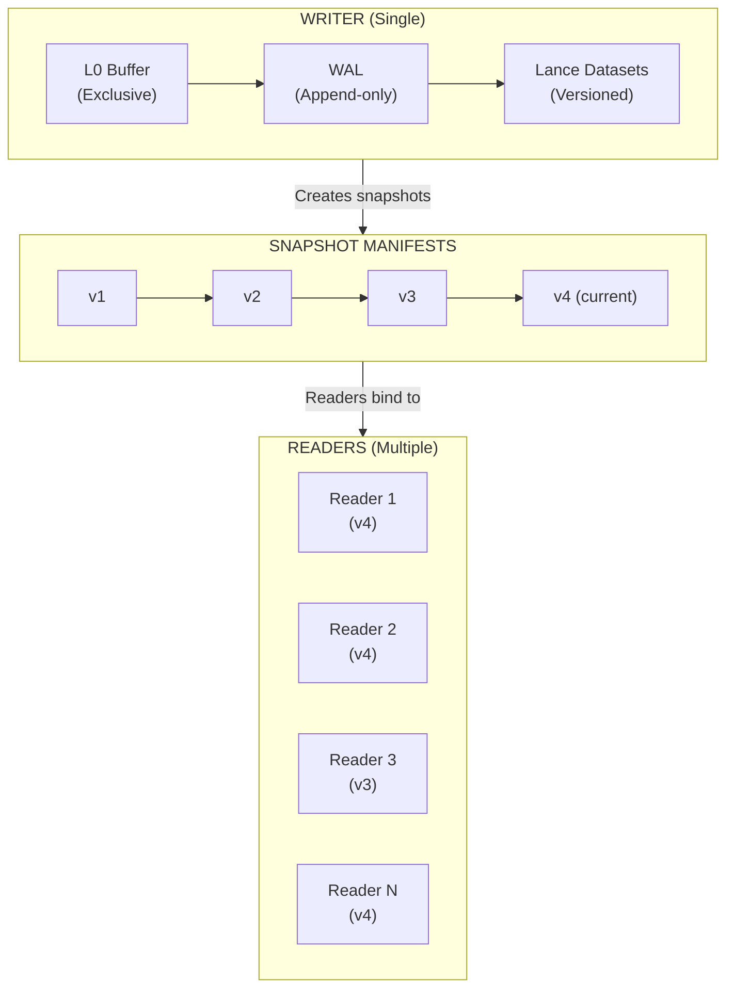
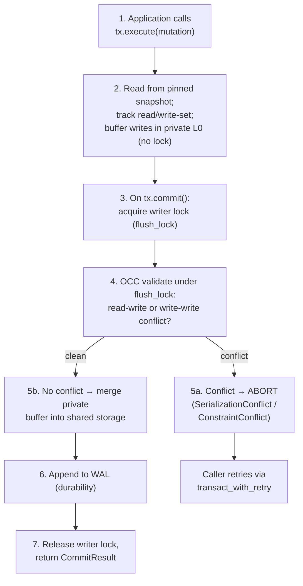
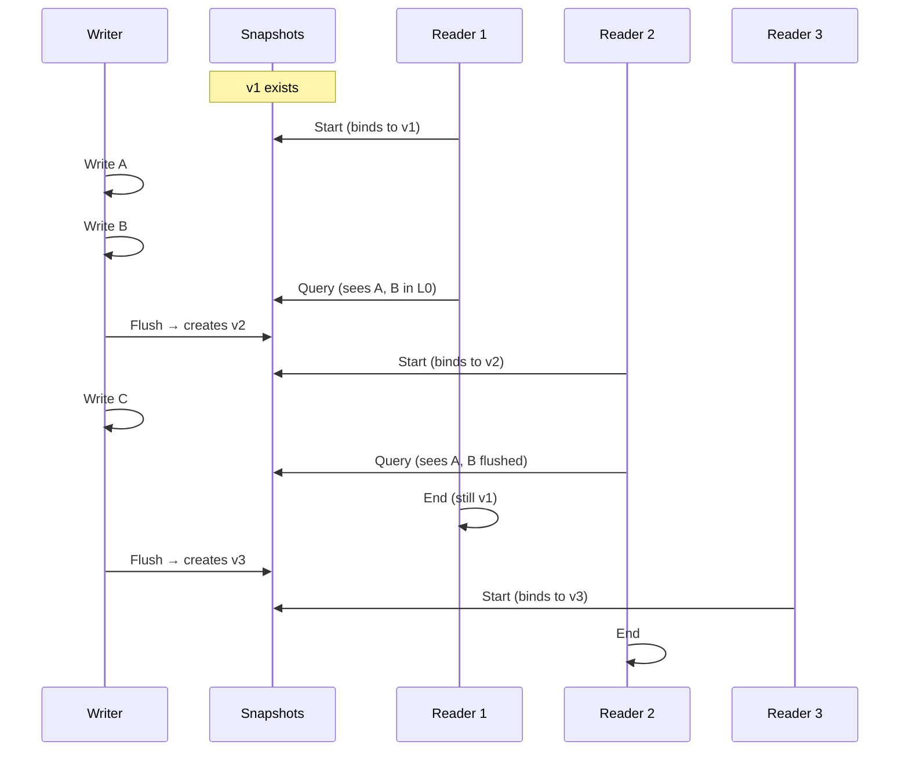
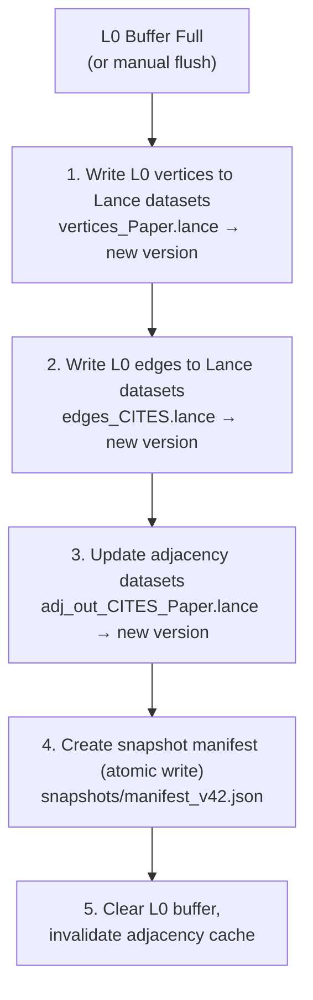
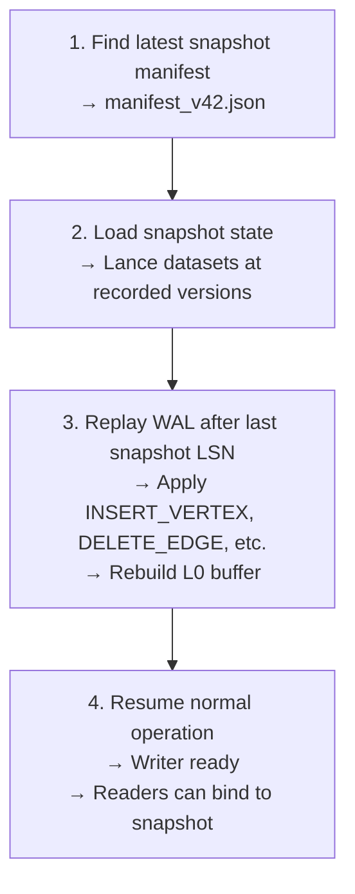

# Concurrency Model

Uni provides snapshot isolation with **Serializable Snapshot Isolation (SSI)** via optimistic concurrency control (OCC) as the default. Multiple sessions and transactions can coexist, each with its own plan cache and private write buffers. Read-write transactions read from a pinned L0 snapshot and track an item-level read/write-set; the writer lock acquired at commit time is the *validation* point, where a transaction whose reads or writes conflict with a commit that landed since its snapshot is **aborted** and must be **retried**. SSI is controlled by `UniConfig.ssi_enabled` (default `true`); setting it to `false` reverts to the older last-writer-wins behavior.

## Design Philosophy

Traditional distributed databases require complex consensus protocols (Raft, Paxos) to maintain consistency across replicas. Uni takes a different approach:

| Traditional Distributed | Uni's Approach |
|------------------------|----------------|
| Multiple writers | Optimistic concurrency (commit-time validation) |
| Network consensus | Local coordination |
| Eventual consistency | Snapshot isolation (SSI) |
| Complex conflict resolution | Abort-and-retry on conflict |
| Operational complexity | Embedded simplicity |

This model is ideal for:
- Embedded databases in applications
- Multi-session workloads (each session has its own plan cache)
- Batch processing pipelines
- Single-node analytics workloads
- Development and testing environments

---

## Architecture



---

## Sessions and Transactions

### Multi-Session Architecture

Multiple sessions can coexist, each with its own plan cache. Sessions are created from the `Uni` instance and implement `Clone` (clones share the plan cache but get independent parameters and write guards):

```rust
let db = Uni::open("./my_db").build().await?;
let session = db.session();              // Each session has its own plan cache
let session2 = session.clone();          // Shares plan cache, independent params

// Sessions are read-only — mutations require a transaction
let tx = session.tx().await?;            // Start a transaction
tx.execute("CREATE (:User {name: 'Alice'})").await?;
tx.commit().await?;                      // Writer lock + OCC validation (may abort → retry)

// session.query("CREATE ...") would return an error
```

### Optimistic Concurrency & Commit-Time Validation

Multiple transactions can prepare writes concurrently in their private L0 buffers. When SSI is enabled (the default), a read-write transaction also pins an L0 snapshot at start and records the items it reads and writes. The writer lock acquired at commit is where Uni **validates** that read/write-set against any commits that landed since the snapshot:



The commit (including the `flush_lock` acquisition and validation) is bounded by `UniConfig.commit_timeout` (default 5s); exceeding it returns `UniError::CommitTimeout`. Pure CRDT-mergeable property writes are excluded from the write-set (the CRDT carve-out), so they never cause a spurious conflict.

### Why Optimistic Concurrency?

| Benefit | Explanation |
|---------|-------------|
| **Concurrent preparation** | Multiple transactions can prepare writes in parallel |
| **Conflicts are detected** | Write-write and read-write conflicts abort with `SerializationConflict` (duplicate unique `MERGE` → `ConstraintConflict`); no silent lost updates |
| **Automatic retry** | Wrap contended writes in `transact_with_retry` / `execute_with_retry`; `is_retriable()` identifies retriable conflicts |
| **Simple recovery** | WAL replay is deterministic |
| **No spurious CRDT conflicts** | CRDT-mergeable writes are carved out of the write-set |
| **Efficient batching** | Buffer many writes before flush |

### WriteLease

For distributed or multi-agent deployments, Uni supports a `WriteLease` mechanism to coordinate write access across processes. This ensures only one process holds the write lease at a time, preventing conflicting commits from separate instances.

### Handling Conflicts: Abort and Retry

With SSI enabled, a conflicting commit fails fast rather than silently overwriting. Callers should wrap contended read-modify-write logic in a retry helper, which re-runs the closure on a retriable conflict (`is_retriable()` classifies `SerializationConflict`, `ConstraintConflict`, and `CommitTimeout`):

```rust
// Retries the whole transaction body on a retriable conflict.
session.transact_with_retry(RetryOptions::default(), |tx| async move {
    let n: i64 = tx.query_scalar("MATCH (c:Counter {id:'x'}) RETURN c.n").await?;
    tx.execute("MATCH (c:Counter {id:'x'}) SET c.n = $v", params).await?;
    Ok(())
}).await?;

// Single-statement convenience wrapper:
session.execute_with_retry("MERGE (u:User {email:'a@b.com'})").await?;
```

### `FOR UPDATE` Row Locks

For read-modify-write hotspots, `FOR UPDATE` provides pessimistic per-key row locks held from `MATCH` until commit, serializing contending writers on those keys instead of letting them race to validation:

```cypher
MATCH (c:Counter {id: 'x'}) FOR UPDATE
SET c.n = c.n + 1
```

`FOR UPDATE` requires SSI; with `ssi_enabled = false` it is a no-op (a `tracing::warn!` is emitted when a query requests it).

### CRDT Carve-Out

Pure CRDT-mergeable property writes (e.g. counters, LWW registers/maps, OR-sets — see [CRDT Types](crdt-types.md)) are excluded from a transaction's write-set. Because their merge semantics are commutative, concurrent CRDT writes can be combined deterministically and therefore never trigger a spurious `SerializationConflict`.

### Disabling SSI

Setting `UniConfig.ssi_enabled = false` reverts to the legacy **last-writer-wins (LWW)** model: read-write transactions read the live L0 with no snapshot pinning, no read/write-set is tracked, and commits are not validated. This reproduces the pre-2.0 behavior and skips the (near-zero) validation overhead, but concurrent read-modify-write transactions can **silently lose updates** and concurrent `MERGE` can create duplicate unique keys. Use it only for single-writer workloads or when read-modify-write is guarded externally.

---

## Multiple Readers

### Snapshot Isolation

Readers operate on consistent snapshots of the database. Each snapshot represents a point-in-time view:

```rust
pub struct SnapshotManifest {
    snapshot_id: String,
    version: u64,
    timestamp: DateTime<Utc>,
    labels: HashMap<String, LabelSnapshot>,      // Lance version per label
    edge_types: HashMap<String, EdgeSnapshot>,   // Lance version per type
    adjacencies: HashMap<String, Vec<String>>,   // Adjacency chunks
}
```

### Reader Independence



### Read-Your-Writes

Readers can optionally include uncommitted L0 buffer data:

```rust
pub struct ExecutionContext {
    storage: Arc<StorageManager>,
    l0_buffer: Option<Arc<RwLock<L0Buffer>>>,  // Optional L0 access
    snapshot: SnapshotManifest,
}
```

**With L0 access:**
```cypher
-- Sees both committed (Lance) and uncommitted (L0) data
CREATE (n:Paper {title: "New Paper"})
MATCH (p:Paper) WHERE p.title = "New Paper"  -- Finds it immediately
RETURN p
```

**Without L0 access (snapshot-only):**
```cypher
-- Reader bound to v2, sees only committed data at v2
MATCH (p:Paper) RETURN COUNT(p)  -- Consistent count at v2
```

---

## Snapshot Management

### Snapshot Creation

Snapshots are created when L0 buffer is flushed to Lance:



### Snapshot Manifest Structure

```json
{
  "snapshot_id": "snap_20240115_103045_abc123",
  "version": 42,
  "timestamp": "2024-01-15T10:30:45.123Z",
  "labels": {
    "Paper": {
      "dataset_version": 15,
      "vertex_count": 1000000
    },
    "Author": {
      "dataset_version": 8,
      "vertex_count": 250000
    }
  },
  "edge_types": {
    "CITES": {
      "dataset_version": 12,
      "edge_count": 5000000
    }
  },
  "adjacencies": {
    "CITES_out": ["chunk_0.lance", "chunk_1.lance"],
    "CITES_in": ["chunk_0.lance", "chunk_1.lance"]
  }
}
```

### Snapshot Lifecycle

| State | Description |
|-------|-------------|
| **Active** | Current snapshot, new readers bind to this |
| **Referenced** | Old snapshot still in use by active readers |
| **Unreferenced** | No readers, candidate for garbage collection |
| **Deleted** | Removed, storage reclaimed |

---

## Consistency Guarantees

### ACID Properties

| Property | Guarantee |
|----------|-----------|
| **Atomicity** | Flush is all-or-nothing (manifest written last) |
| **Consistency** | Schema validated on write, constraints enforced |
| **Isolation** | Snapshot isolation for readers; Serializable Snapshot Isolation (OCC) for read-write transactions by default |
| **Durability** | WAL ensures writes survive crashes |

### Isolation Level Comparison

| Level | Uni Equivalent | Anomalies Prevented |
|-------|----------------|---------------------|
| Read Uncommitted | With L0 access | None |
| Read Committed | N/A | Dirty reads |
| Repeatable Read | Snapshot isolation (`ssi_enabled = false`, LWW) | Dirty reads, non-repeatable reads |
| Serializable | SSI / OCC (default, `ssi_enabled = true`) | All anomalies (write skew and lost updates prevented by commit-time conflict detection) |

Serializability comes from the SSI/OCC conflict detection described above — read/write-sets validated under the writer lock at commit, not from forcing writes through a single writer. With `ssi_enabled = false`, snapshot pinning and validation are disabled, so the engine offers snapshot-isolation-style reads but is subject to lost updates (LWW).

---

## Write-Ahead Log (WAL)

The WAL ensures durability for uncommitted writes:

```
┌─────────────────────────────────────────────────────────────────────────────┐
│                              WAL STRUCTURE                                   │
├─────────────────────────────────────────────────────────────────────────────┤
│                                                                             │
│   wal/                                                                      │
│   ├── 00000000000000000001_<uuid>.wal                                       │
│   ├── 00000000000000000002_<uuid>.wal                                       │
│   └── 00000000000000000003_<uuid>.wal (current)                             │
│                                                                             │
│   Segment Format:                                                           │
│   ┌──────────┬──────────┬──────────┬──────────────────────────────────┐    │
│   │  Length  │   CRC    │   Type   │            Payload               │    │
│   │ (4 bytes)│ (4 bytes)│ (1 byte) │         (variable)               │    │
│   └──────────┴──────────┴──────────┴──────────────────────────────────┘    │
│                                                                             │
│   Record Types:                                                             │
│   ├── INSERT_VERTEX { vid, properties }                                    │
│   ├── DELETE_VERTEX { vid }                                                │
│   ├── INSERT_EDGE { eid, src_vid, dst_vid, edge_type, properties }         │
│   └── DELETE_EDGE { eid, src_vid, dst_vid, edge_type }                     │
│                                                                             │
└─────────────────────────────────────────────────────────────────────────────┘
```

### Recovery Process



---

## Concurrency Primitives

### Thread-Safe Components

| Component | Primitive | Pattern |
|-----------|-----------|---------|
| L0 Buffer | `Mutex<L0Buffer>` | Exclusive write access |
| Adjacency Cache | `DashMap<K, V>` | Concurrent read, partitioned write |
| Property Cache | `Mutex<LruCache>` | Exclusive access with LRU eviction |
| ID Allocator | `AtomicU64` | Lock-free increment |
| Snapshot Manager | `RwLock<SnapshotManager>` | Read-heavy access pattern |

### Example: Concurrent Reads

```rust
// Multiple readers can execute concurrently
let snapshot = snapshot_manager.current().await;

// Reader 1 (thread A)
tokio::spawn(async move {
    let results = executor.execute(query1, &snapshot).await?;
});

// Reader 2 (thread B)
tokio::spawn(async move {
    let results = executor.execute(query2, &snapshot).await?;
});

// Both run concurrently, both see same consistent snapshot
```

---

## Scaling Considerations

### Single-Writer Throughput

| Operation | Latency | Throughput |
|-----------|---------|------------|
| L0 insert | ~550µs / 1K vertices | ~1.8M vertices/sec |
| WAL append | ~10µs per record | ~100K records/sec |
| Flush | ~6.3ms / 1K vertices | Batched |

### Scaling Strategies

1. **Batch Writes**: Group many operations before commit
2. **Async Flush**: Flush in background while accepting new writes
3. **Multiple Databases**: Shard data across independent Uni instances
4. **Read Replicas**: Sync snapshots to read-only replicas

---

## Best Practices

### Write Optimization

```rust
// Good: Batch many writes
let mut batch = Vec::with_capacity(1000);
for item in items {
    batch.push(create_vertex(item));
}
writer.insert_batch(batch).await?;

// Bad: Many small writes
for item in items {
    writer.insert_vertex(item).await?;  // Overhead per call
}
```

### Reader Management

```rust
// Good: Bind to snapshot once, reuse
let snapshot = snapshot_manager.current().await;
for query in queries {
    executor.execute(query, &snapshot).await?;  // Same snapshot
}

// Bad: New snapshot per query (may see inconsistent data)
for query in queries {
    let snapshot = snapshot_manager.current().await;  // Might change
    executor.execute(query, &snapshot).await?;
}
```

---

## Next Steps

- [Architecture](architecture.md) — System overview
- [Storage Engine](../internals/storage-engine.md) — Lance integration and LSM design
- [Performance Tuning](../guides/performance-tuning.md) — Optimization strategies
