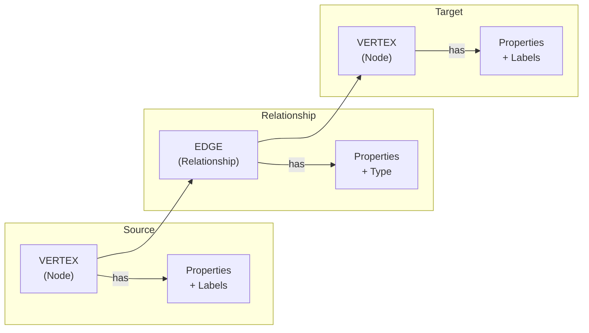

# Data Model

Uni combines Property Graph and Vector concepts into a unified data model. This page explains the core entities, their relationships, and how to define schemas.

## Core Concepts

Uni's data model has three primary entity types:



---

## Vertices (Nodes)

Vertices represent entities in your domain. Each vertex has:

| Component | Description | Example |
|-----------|-------------|---------|
| **VID** | Internal 64-bit identifier | `0x0001_0000_0000_002A` |
| **Label(s)** | Type classification (one or more) | `:Paper`, `:Author`, `:Person:Employee` |
| **Properties** | Key-value attributes | `{title: "...", year: 2023}` |

### Labels

Labels categorize vertices and determine their schema. A vertex can have one or more labels. Multi-label vertices are stored in each label's per-label table, and the complete label set is persisted as a `_labels: List<Utf8>` column in every per-label table.

```cypher
// Create vertices with labels
CREATE (p:Paper {title: "Attention Is All You Need"})
CREATE (a:Author {name: "Ashish Vaswani"})
CREATE (v:Venue {name: "NeurIPS", year: 2017})

// Multi-label vertex
CREATE (e:Person:Employee {name: "Alice", dept: "Engineering"})
```

**Label Best Practices:**
- Use singular nouns: `:Paper` not `:Papers`
- Use PascalCase: `:ResearchPaper` not `:research_paper`
- Be specific: `:AcademicPaper` vs generic `:Document`

### Properties

Properties can be **schema-defined** (strongly-typed columns) or **schemaless** (stored in `overflow_json`).

#### Schema-Defined Properties

Strongly-typed properties defined in the schema provide optimal performance:

```json
{
  "Paper": {
    "title": { "type": "String", "nullable": false },
    "year": { "type": "Int32", "nullable": true },
    "abstract": { "type": "String", "nullable": true },
    "embedding": { "type": "Vector", "dimensions": 768 }
  }
}
```

**Benefits:**
- ⚡ Fast filtering and sorting (columnar)
- 📊 Type-specific compression (5-20x)
- 🔍 Can be indexed
- ✅ Type safety

#### Schemaless Properties (Overflow)

Properties not in the schema are automatically stored in `overflow_json` (JSONB binary format):

```cypher
-- Label with NO properties defined
CREATE LABEL Document;

-- Create with arbitrary properties
CREATE (:Document {
    title: 'Article',
    author: 'Alice',
    tags: ['tech', 'ai'],
    year: 2024
});

-- Query works normally (automatic rewriting)
MATCH (d:Document)
WHERE d.author = 'Alice'
RETURN d.title, d.year;
```

**Benefits:**
- 🚀 No schema migration needed
- 🔄 Rapidly evolving schemas
- 🎯 Optional/rare properties
- 📝 User-defined metadata

**Trade-offs:**
- 🟡 Slower than typed columns (JSONB parsing)
- ❌ Cannot be indexed
- 🔴 Less compression

#### Mixed Schema + Schemaless

You can mix both approaches for optimal flexibility and performance:

```rust
// Define core properties in schema
db.schema()
    .label("Person")
    .property("name", DataType::String)    // Typed (fast)
    .property("email", DataType::String)   // Typed (fast)
    .apply().await?;

// Create with schema + overflow properties
let session = db.session();
let tx = session.tx().await?;
tx.execute("CREATE (:Person {
    name: 'Bob',           -- Schema property (typed column)
    email: 'bob@x.com',    -- Schema property (typed column)
    city: 'NYC',           -- Overflow property (overflow_json)
    verified: true         -- Overflow property (overflow_json)
})").await?;
tx.commit().await?;
```

**Best Practice:** Use schema properties for frequently-queried core fields, overflow properties for optional metadata.

---

## Edges (Relationships)

Edges connect vertices with typed, directed relationships.

| Component | Description | Example |
|-----------|-------------|---------|
| **EID** | Internal 64-bit identifier | `0x0002_0000_0000_0015` |
| **Type** | Relationship classification | `:CITES`, `:AUTHORED_BY` |
| **Source** | Origin vertex (VID) | Paper vertex |
| **Destination** | Target vertex (VID) | Author vertex |
| **Properties** | Edge attributes | `{position: 1, role: "lead"}` |

### Edge Direction

Edges are always directed (source → destination):

```cypher
// Paper cites another Paper
(paper1:Paper)-[:CITES]->(paper2:Paper)

// Paper is authored by Author
(paper:Paper)-[:AUTHORED_BY]->(author:Author)

// Query in either direction
MATCH (a:Author)<-[:AUTHORED_BY]-(p:Paper)  // Incoming to Author
MATCH (p:Paper)-[:AUTHORED_BY]->(a:Author)  // Outgoing from Paper
```

### Edge Type Constraints

Edge types can constrain which label combinations are valid:

```json
{
  "edge_types": {
    "CITES": {
      "id": 1,
      "src_labels": ["Paper"],
      "dst_labels": ["Paper"]
    },
    "AUTHORED_BY": {
      "id": 2,
      "src_labels": ["Paper"],
      "dst_labels": ["Author"]
    }
  }
}
```

### Edge Properties

Edges can carry their own properties:

```cypher
CREATE (p:Paper)-[:AUTHORED_BY {position: 1, contribution: "lead"}]->(a:Author)

MATCH (p:Paper)-[e:AUTHORED_BY]->(a:Author)
WHERE e.position = 1
RETURN p.title, a.name
```

---

## Data Types

Uni supports a rich set of data types for properties:

### Primitive Types

| Type | Size | Range / Description | Example |
|------|------|---------------------|---------|
| `String` | Variable | UTF-8 text | `"Hello, World"` |
| `Int32` | 4 bytes | -2³¹ to 2³¹-1 | `42` |
| `Int64` | 8 bytes | -2⁶³ to 2⁶³-1 | `9223372036854775807` |
| `Float32` | 4 bytes | IEEE 754 single precision | `3.14159` |
| `Float64` | 8 bytes | IEEE 754 double precision | `3.141592653589793` |
| `Bool` | 1 byte | true / false | `true` |
| `Timestamp` | 8 bytes | Microsecond precision UTC | `"2024-01-15T10:30:00Z"` |

### Temporal Types

| Type | Description | Example |
|------|-------------|---------|
| `Date` | Calendar date | `2024-01-15` |
| `Time` | Time of day | `10:30:00` |
| `DateTime` | Date + time with timezone | `2024-01-15T10:30:00Z` |
| `Duration` | Time duration | `P1Y2M3DT4H5M6S` |

### Complex Types

| Type | Description | Example |
|------|-------------|---------|
| `Json` | Structured JSON document | `{"nested": {"key": [1, 2, 3]}}` |
| `Vector` | Fixed-dimension float32 array | `[0.1, -0.2, 0.3, ...]` |
| `List<T>` | Variable-length array | `["a", "b", "c"]` |
| `Map(K, V)` | Key-value map | `{key1: "value1", key2: "value2"}` |
| `CypherValue` | Dynamic Cypher value | Any Cypher-compatible value |
| `Point(PointType)` | Spatial point | `point({x: 1.0, y: 2.0})` |
| `Crdt(CrdtType)` | Conflict-free replicated data type | CRDT-specific values |

### Vector Type

Vectors are first-class citizens for embedding-based search:

```json
{
  "embedding": {
    "type": "Vector",
    "dimensions": 768,
    "nullable": false
  }
}
```

**Vector Characteristics:**
- Fixed dimension (immutable after schema creation)
- Float32 elements (for storage efficiency)
- Indexable with HNSW, IVF_PQ algorithms
- Searchable via Cypher procedures

### JSON Type

For semi-structured data with flexible schema:

```json
{
  "metadata": {
    "type": "Json",
    "nullable": true
  }
}
```

**JSON Capabilities:**
- Store arbitrary nested structures
- Query with JSON path expressions
- Index specific paths for performance

```cypher
// Access JSON fields
MATCH (p:Paper)
WHERE p.metadata.venue.location = 'Vancouver'
RETURN p.title
```

---

## Schema Definition

Uni uses a strict schema for performance and storage efficiency. Define schemas via **Cypher DDL** or the **Rust/Python schema builders**. The on-disk schema is stored as JSON, but includes additional metadata and enum casing details.

### Conceptual Schema Example (illustrative)

> This is a conceptual schema representation that mirrors current field names and casing,  
> but omits some optional metadata (e.g., `added_in`, `embedding_config`) for brevity.  
> See the Configuration reference for the precise on-disk schema format.

```json
{
  "schema_version": 1,

  "labels": {
    "Paper": {
      "id": 1,
      "created_at": "2024-01-01T00:00:00Z",
      "state": "Active"
    },
    "Author": {
      "id": 2,
      "created_at": "2024-01-01T00:00:00Z",
      "state": "Active"
    },
    "Venue": {
      "id": 3,
      "created_at": "2024-01-01T00:00:00Z",
      "state": "Active"
    }
  },

  "edge_types": {
    "CITES": {
      "id": 1,
      "src_labels": ["Paper"],
      "dst_labels": ["Paper"],
      "state": "Active"
    },
    "AUTHORED_BY": {
      "id": 2,
      "src_labels": ["Paper"],
      "dst_labels": ["Author"],
      "state": "Active"
    },
    "PUBLISHED_IN": {
      "id": 3,
      "src_labels": ["Paper"],
      "dst_labels": ["Venue"],
      "state": "Active"
    }
  },

  "properties": {
    "Paper": {
      "title": { "type": "String", "nullable": false },
      "abstract": { "type": "String", "nullable": true },
      "year": { "type": "Int32", "nullable": true },
      "doi": { "type": "String", "nullable": true },
      "embedding": { "type": { "Vector": { "dimensions": 768 } }, "nullable": true },
      "metadata": { "type": "Json", "nullable": true }
    },
    "Author": {
      "name": { "type": "String", "nullable": false },
      "email": { "type": "String", "nullable": true },
      "affiliation": { "type": "String", "nullable": true },
      "h_index": { "type": "Int32", "nullable": true }
    },
    "Venue": {
      "name": { "type": "String", "nullable": false },
      "type": { "type": "String", "nullable": true },
      "location": { "type": "String", "nullable": true }
    },
    "AUTHORED_BY": {
      "position": { "type": "Int32", "nullable": true },
      "contribution": { "type": "String", "nullable": true }
    }
  },

  "indexes": [
    {
      "type": "Vector",
      "name": "paper_embeddings",
      "label": "Paper",
      "property": "embedding",
      "index_type": { "Hnsw": { "m": 16, "ef_construction": 200, "ef_search": 100 } },
      "metric": "Cosine"
    },
    {
      "type": "Scalar",
      "name": "author_email",
      "label": "Author",
      "properties": ["email"],
      "index_type": "BTree"
    }
  ]
}
```

### Schema Element States

Labels and edge types can be in different lifecycle states:

| State | Description | Queryable | Writable |
|-------|-------------|-----------|----------|
| `Active` | Normal operation | Yes | Yes |
| `Deprecated` | Marked for removal | Yes | Yes |
| `Hidden` | No longer queryable | No | No |
| `Tombstone` | Deleted | No | No |

---

## Identity Model Summary

| ID Type | Bits | Purpose | Example |
|---------|------|---------|---------|
| **VID** | 64 | Internal vertex identifier | `0x0001_0000_0000_002A` |
| **EID** | 64 | Internal edge identifier | `0x0002_0000_0000_0015` |
| **UniId** | 256 | Content-addressed hash | `bafkrei...` |

[Learn more about Identity Model →](identity.md)

---

## Querying the Data Model

### Pattern Matching

```cypher
// Simple node match
MATCH (p:Paper)

// Node with properties
MATCH (p:Paper {year: 2023})

// Relationships
MATCH (p:Paper)-[:AUTHORED_BY]->(a:Author)

// Multi-hop
MATCH (p1:Paper)-[:CITES]->(p2:Paper)-[:CITES]->(p3:Paper)
```

### Filtering

```cypher
// Property comparisons
WHERE p.year > 2020 AND p.year < 2025

// String operations
WHERE p.title CONTAINS 'Transformer'

// Null checks
WHERE a.email IS NOT NULL

// List membership
WHERE p.venue IN ['NeurIPS', 'ICML', 'ICLR']
```

### Projections

```cypher
// Select properties
RETURN p.title, p.year

// Aliases
RETURN p.title AS paper_title

// Aggregations
RETURN COUNT(p) AS total, AVG(p.year) AS avg_year
```

---

## Best Practices

### Schema Design

1. **Choose labels carefully** — Multi-label vertices are supported, but each label table stores only its own schema-defined columns
2. **Keep properties typed** — Avoid overusing JSON for queryable data
3. **Use edge types** — Don't store relationships as vertex properties
4. **Plan for vectors** — Dimension can't change after creation

### Performance Considerations

1. **Index frequently queried properties** — Especially for WHERE clauses
2. **Use vector indexes for embeddings** — HNSW for quality, IVF_PQ for scale
3. **Avoid wide vertices** — Many properties = larger Lance rows
4. **Leverage label partitioning** — Queries on single label are faster

---

## Next Steps

- [Identity Model](identity.md) — Deep dive into VID/EID encoding
- [Indexing](indexing.md) — Vector, scalar, and full-text indexes
- [Schema Design Guide](../guides/schema-design.md) — Best practices and patterns
