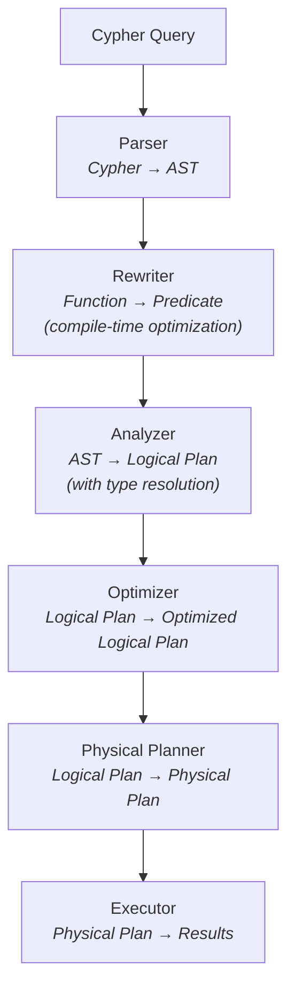

# Query Planning

This document describes how Uni transforms Cypher queries into optimized physical execution plans. The query planner is responsible for parsing, semantic analysis, optimization, and code generation.

!!! note "Design Model"
    This document describes the **design model** behind Uni's query planning pipeline. The six-phase flow (parse → rewrite → analyze → plan → optimize → execute) and the optimization principles (predicate pushdown, projection pushdown, limit pushdown, scan-to-index) are accurate. The actual implementation delegates to **Apache DataFusion** for logical/physical planning and execution, so the Rust struct and enum names shown here (e.g., `LogicalPlan`, `PhysicalPlan`, `CypherParser`) are **conceptual illustrations**, not literal source code.

## Planning Pipeline Overview



---

## Phase 1: Parsing

The parser transforms Cypher text into an Abstract Syntax Tree (AST).

### Parser Architecture

Uni's parser is a [pest](https://pest.rs) PEG grammar — `crates/uni-cypher/src/grammar/cypher.pest`, extended for Locy by `locy.pest`:

```rust
pub struct CypherParser {
    /// Token stream
    lexer: Lexer,

    /// Current token
    current: Token,

    /// Lookahead token
    peek: Token,
}

impl CypherParser {
    pub fn parse(&mut self) -> Result<Statement> {
        match self.current {
            Token::Match => self.parse_match_clause(),
            Token::Create => self.parse_create_clause(),
            Token::Call => self.parse_call_clause(),
            Token::Return => self.parse_return_clause(),
            _ => Err(UnexpectedToken(self.current)),
        }
    }
}
```

### AST Structure

```rust
pub enum Statement {
    /// READ queries
    Query(QueryStatement),

    /// WRITE queries
    Create(CreateStatement),

    /// DDL
    CreateIndex(CreateIndexStatement),
    DropIndex(String),

    /// Procedures
    Call(CallStatement),
}

pub struct QueryStatement {
    pub match_clause: Option<MatchClause>,
    pub where_clause: Option<Expression>,
    pub with_clause: Option<WithClause>,
    pub return_clause: ReturnClause,
    pub order_by: Option<Vec<OrderByItem>>,
    pub skip: Option<Expression>,
    pub limit: Option<Expression>,
}

pub struct MatchClause {
    pub patterns: Vec<Pattern>,
    pub optional: bool,
}

pub struct Pattern {
    pub elements: Vec<PatternElement>,
}

pub enum PatternElement {
    Node(NodePattern),
    Relationship(RelationshipPattern),
}

pub struct NodePattern {
    pub variable: Option<String>,
    pub labels: Vec<String>,
    pub properties: Option<HashMap<String, Expression>>,
}

pub struct RelationshipPattern {
    pub variable: Option<String>,
    pub types: Vec<String>,
    pub direction: Direction,
    pub properties: Option<HashMap<String, Expression>>,
    pub length: Option<PathLength>,
}
```

### Example Parse

```cypher
MATCH (p:Paper)-[:CITES]->(cited:Paper)
WHERE p.year > 2020
RETURN p.title, cited.title
```

Parses to:

```
QueryStatement {
  match_clause: MatchClause {
    patterns: [
      Pattern {
        elements: [
          Node { variable: "p", labels: ["Paper"], properties: None },
          Relationship { variable: None, types: ["CITES"], direction: Outgoing },
          Node { variable: "cited", labels: ["Paper"], properties: None }
        ]
      }
    ]
  },
  where_clause: BinaryOp {
    left: PropertyAccess { variable: "p", property: "year" },
    op: GreaterThan,
    right: Literal(2020)
  },
  return_clause: ReturnClause {
    items: [
      PropertyAccess { variable: "p", property: "title" },
      PropertyAccess { variable: "cited", property: "title" }
    ]
  }
}
```

---

## Phase 2: Query Rewriting

Before semantic analysis and logical planning, Uni applies compile-time query rewrites to transform function calls into equivalent predicate expressions. This enables predicate pushdown to storage and eliminates runtime function evaluation overhead.

### Rewriter Architecture

The query rewriter operates on the AST produced by the parser:

```rust
pub fn plan_with_scope(&self, query: Query, vars: Vec<String>) -> Result<LogicalPlan> {
    // Apply query rewrites before planning
    let rewritten_query = crate::query::rewrite::rewrite_query(query)?;

    match rewritten_query {
        Query::Single(stmt) => self.plan_single(stmt, vars),
        // ... rest of planning
    }
}
```

### Rewrite Rules

Rules implement the `RewriteRule` trait:

```rust
pub trait RewriteRule: Send + Sync {
    fn function_name(&self) -> &str;
    fn validate_args(&self, args: &[Expr]) -> Result<(), RewriteError>;
    fn rewrite(&self, args: Vec<Expr>, ctx: &RewriteContext) -> Result<Expr, RewriteError>;
}
```

### Example Rewrite

```cypher
// Original query with temporal function
MATCH (p)-[e:EMPLOYED_BY]->(c)
WHERE uni.temporal.validAt(e, 'start', 'end', datetime('2021-06-15'))
RETURN c.name

// Rewritten to predicates (automatic)
MATCH (p)-[e:EMPLOYED_BY]->(c)
WHERE e.start <= datetime('2021-06-15')
  AND (e.end IS NULL OR e.end >= datetime('2021-06-15'))
RETURN c.name
```

The rewritten form enables:
- Predicate pushdown to Lance/DataFusion
- Index utilization on `start` and `end` columns
- Storage-level filtering before materialization

### Built-in Rewrites

| Function | Rewrite |
|----------|---------|
| `uni.temporal.validAt(e, 'start', 'end', ts)` | `e.start <= ts AND (e.end IS NULL OR e.end >= ts)` |
| `uni.temporal.isOngoing(e, 'end')` | `e.end IS NULL` |
| `uni.temporal.precedes(e, 'end', ts)` | `e.end < ts` |

See [Query Rewriting](query-rewriting.md) for detailed documentation.

---

## Phase 3: Semantic Analysis

The analyzer resolves types, validates schemas, and builds a logical plan.

### Scope Management

```rust
pub struct Analyzer {
    /// Schema for type resolution
    schema: Arc<SchemaManager>,

    /// Variable scope stack
    scopes: Vec<Scope>,
}

pub struct Scope {
    /// Variables in scope: name → (type, label/edge_type)
    variables: HashMap<String, VariableBinding>,
}

pub struct VariableBinding {
    /// Variable type (Node, Relationship, Property)
    var_type: VariableType,

    /// Label ID (for nodes) or edge type ID (for relationships)
    type_id: Option<TypeId>,

    /// Property schema
    properties: Option<Arc<PropertySchema>>,
}

impl Analyzer {
    fn analyze_node_pattern(&mut self, pattern: &NodePattern) -> Result<LogicalNode> {
        // Resolve label to schema
        let label_id = if let Some(label) = pattern.labels.first() {
            Some(self.schema.get_label_id(label)?)
        } else {
            None
        };

        // Register variable in scope
        if let Some(var) = &pattern.variable {
            self.current_scope().bind_variable(
                var.clone(),
                VariableBinding {
                    var_type: VariableType::Node,
                    type_id: label_id.map(TypeId::Label),
                    properties: label_id.and_then(|id| self.schema.get_properties(id)),
                }
            );
        }

        Ok(LogicalNode { label_id, variable: pattern.variable.clone() })
    }
}
```

### Type Inference

```rust
impl Analyzer {
    fn infer_expression_type(&self, expr: &Expression) -> Result<DataType> {
        match expr {
            Expression::Literal(lit) => Ok(lit.data_type()),

            Expression::PropertyAccess { variable, property } => {
                let binding = self.resolve_variable(variable)?;
                let prop_schema = binding.properties
                    .ok_or(UnknownProperty(property.clone()))?;
                prop_schema.get_type(property)
                    .ok_or(UnknownProperty(property.clone()))
            }

            Expression::BinaryOp { left, op, right } => {
                let left_type = self.infer_expression_type(left)?;
                let right_type = self.infer_expression_type(right)?;

                match op {
                    // Comparison operators return boolean
                    Op::Eq | Op::Lt | Op::Gt | Op::Lte | Op::Gte | Op::Neq => {
                        Ok(DataType::Boolean)
                    }
                    // Arithmetic operators preserve type
                    Op::Add | Op::Sub | Op::Mul | Op::Div => {
                        self.common_numeric_type(&left_type, &right_type)
                    }
                    // Boolean operators require boolean
                    Op::And | Op::Or => {
                        if left_type == DataType::Boolean && right_type == DataType::Boolean {
                            Ok(DataType::Boolean)
                        } else {
                            Err(TypeMismatch("boolean", left_type))
                        }
                    }
                }
            }

            Expression::FunctionCall { name, args } => {
                self.infer_function_return_type(name, args)
            }
        }
    }
}
```

---

## Phase 4: Logical Plan

The logical plan represents the query as a tree of relational-style operators.

### Logical Operators

```rust
pub enum LogicalPlan {
    /// Scan vertices of a label
    Scan {
        label_id: LabelId,
        alias: String,
        filter: Option<LogicalExpr>,
    },

    /// Traverse edges
    Traverse {
        input: Box<LogicalPlan>,
        edge_type: EdgeTypeId,
        direction: Direction,
        src_alias: String,
        dst_alias: String,
        edge_alias: Option<String>,
    },

    /// Filter rows
    Filter {
        input: Box<LogicalPlan>,
        predicate: LogicalExpr,
    },

    /// Project columns
    Project {
        input: Box<LogicalPlan>,
        expressions: Vec<(LogicalExpr, String)>,
    },

    /// Aggregate
    Aggregate {
        input: Box<LogicalPlan>,
        group_by: Vec<LogicalExpr>,
        aggregates: Vec<(AggregateFunction, String)>,
    },

    /// Sort
    Sort {
        input: Box<LogicalPlan>,
        order_by: Vec<(LogicalExpr, SortOrder)>,
    },

    /// Limit/Skip
    Limit {
        input: Box<LogicalPlan>,
        skip: Option<usize>,
        limit: Option<usize>,
    },

    /// Vector search
    VectorSearch {
        label_id: LabelId,
        property: String,
        query_vector: Vec<f32>,
        k: usize,
        alias: String,
    },

    /// Cross product (for multiple MATCH patterns)
    CrossProduct {
        left: Box<LogicalPlan>,
        right: Box<LogicalPlan>,
    },
}
```

### Example Logical Plan

Query:
```cypher
MATCH (p:Paper)-[:CITES]->(cited:Paper)
WHERE p.year > 2020
RETURN p.title, COUNT(cited) AS citation_count
ORDER BY citation_count DESC
LIMIT 10
```

Logical Plan:
```
Limit(10)
  └── Sort(citation_count DESC)
        └── Aggregate(GROUP BY p, COUNT(cited))
              └── Filter(p.year > 2020)
                    └── Traverse(CITES, OUT, p → cited)
                          └── Scan(:Paper AS p)
```

---

## Phase 5: Optimization and Physical Planning

!!! warning "This chapter previously described an optimizer that does not exist"
    Earlier revisions documented `QueryOptimizer`, `OptimizationRule`,
    `PredicatePushdown`, `ProjectionPushdown`, `ScanToIndex`, `LimitPushdown`,
    `JoinReorder`, `CostEstimator`, `TableStatistics`, `ColumnStatistics`, a
    `PhysicalPlan` enum with ten variants, and `PlannerConfig`. **None of those
    types exists anywhere in the workspace**, and none ever did — they were not
    a removed design, they were invented. They are deleted here rather than
    reworded, because an absent chapter is more useful than a fictional one.

Uni does not implement its own cost-based optimizer. The Cypher front-end lowers
a validated logical plan, and **optimization and physical planning are delegated
to DataFusion**:

- `crates/uni-query/src/query/planner.rs` builds the logical plan from the AST
  and applies Uni-specific rewrites (for example fork-local index fusion, see
  `rewrite_for_fork_fusion`).
- `crates/uni-query/src/query/df_planner.rs` provides `HybridPhysicalPlanner`,
  which converts that plan into a DataFusion `ExecutionPlan`.
- DataFusion then owns predicate/projection pushdown, join ordering, statistics
  and cost estimation, using its own optimizer rule set.

Uni-specific physical operators exist only where DataFusion has no equivalent —
graph expansion, vector/FTS retrieval, and the Locy fixpoint runtime. Those live
alongside the planner in `crates/uni-query/src/query/df_graph/`.

To see the plan a query actually produces, use `EXPLAIN` (below) rather than
reasoning from a documented rule list.

## EXPLAIN Output

Use EXPLAIN to view query plans:

```bash
uni query "EXPLAIN MATCH (p:Paper) WHERE p.year > 2020 RETURN p.title" --path ./storage
```

**Output:**
```
Query Plan:
═══════════════════════════════════════════════════════════════════════════════

Logical Plan:
├── Project [p.title]
│     └── Filter [p.year > 2020]
│           └── Scan [:Paper AS p]

Physical Plan:
├── VectorizedProject [p.title]
│     └── LateMaterialize [title]
│           └── LanceScan [:Paper]
│                 ├── Projection: [_vid, year]
│                 ├── Pushdown: year > 2020
│                 └── Index: paper_year (BTree)

Statistics:
├── Estimated rows: 5,000 (50% selectivity)
├── Estimated I/O: 2.5 MB
└── Index usage: paper_year

═══════════════════════════════════════════════════════════════════════════════
```

---

## Configuration

There is no `PlannerConfig` type. Execution tuning lives on `UniConfig` (the
serializable instance config) and on DataFusion's own `SessionConfig`, which
owns batch size, memory limits and the optimizer rule set.

See [Configuration](../reference/configuration.md) for the knobs Uni actually
exposes.

---

## Next Steps

- [Vectorized Execution](vectorized-execution.md) — How physical plans execute
- [Storage Engine](storage-engine.md) — Data persistence layer
- [Benchmarks](benchmarks.md) — Query performance measurements
