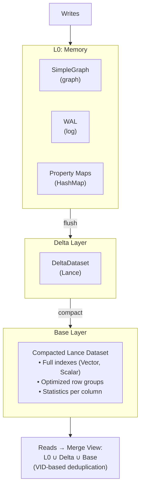
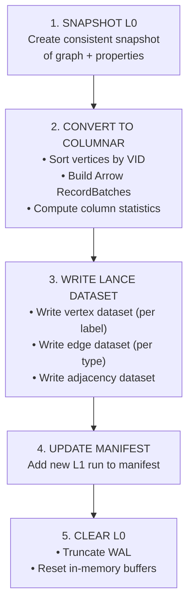
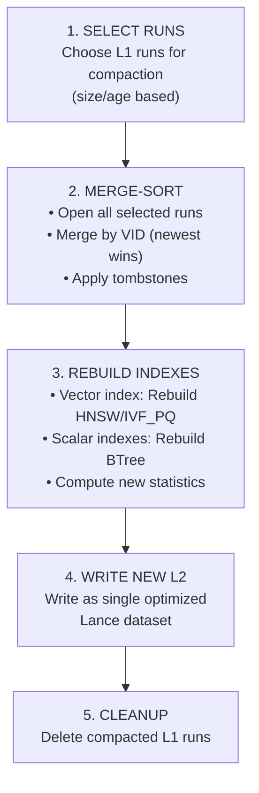
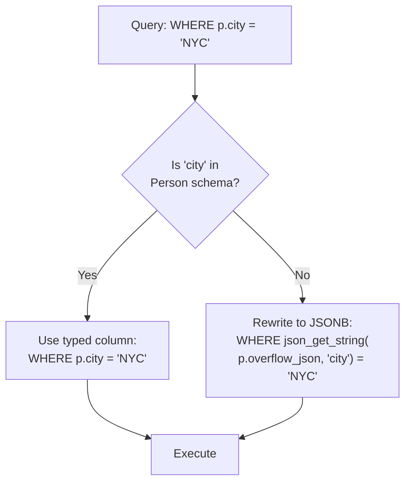

# Storage Engine Internals

Uni's storage engine is architected for high-throughput ingestion and low-latency analytics, leveraging a tiered LSM-tree-like structure backed by **Lance** columnar format. This design enables both OLTP-style writes and OLAP-style analytical queries on the same data.

## Architecture Overview



---

## Tiered Storage Model

### L0: Memory Buffer

The L0 layer handles all incoming writes with maximum throughput.

```rust
pub struct L0Buffer {
    /// In-memory graph structure (SimpleGraph)
    pub graph: SimpleGraph,

    /// Edge tombstones with version tracking
    pub tombstones: HashMap<Eid, TombstoneEntry>,

    /// Vertex tombstones
    pub vertex_tombstones: HashSet<Vid>,

    /// Edge version tracking
    pub edge_versions: HashMap<Eid, u64>,

    /// Vertex version tracking
    pub vertex_versions: HashMap<Vid, u64>,

    /// Edge properties (separate from graph structure)
    pub edge_properties: HashMap<Eid, Properties>,

    /// Vertex properties (separate from graph structure)
    pub vertex_properties: HashMap<Vid, Properties>,

    /// Edge endpoint mapping (eid -> (src, dst, type_id))
    pub edge_endpoints: HashMap<Eid, (Vid, Vid, u16)>,

    /// Current version number
    pub current_version: u64,

    /// Mutation counter for flush triggering
    pub mutation_count: usize,

    /// Write-ahead log reference
    pub wal: Option<Arc<WriteAheadLog>>,

    /// WAL LSN at last flush
    pub wal_lsn_at_flush: u64,
}
```

**Characteristics:**

| Property | Value | Notes |
|----------|-------|-------|
| Format | SimpleGraph + HashMap | Row-oriented for inserts |
| Durability | WAL-backed | Survives crashes |
| Latency | ~550µs per 1K writes | Memory-speed |
| Capacity | Configurable (default 128MB) | Auto-flush when full |

**Write Path:**

```
1. Acquire write lock (single-writer)
2. Append to WAL (sync or async based on config)
3. Insert into SimpleGraph (vertex/edge)
4. Store properties in HashMap
5. Increment mutation counter
6. If threshold reached → trigger async flush
```

### Auto-Flush Triggers

L0 buffer is automatically flushed to L1 (Lance storage) based on two configurable triggers:

| Trigger | Default | Description |
|---------|---------|-------------|
| **Mutation Count** | 10,000 | Flush when mutations exceed threshold |
| **Time Interval** | 5 seconds | Flush after time elapsed (if mutations > 0) |

**Configuration:**

```rust
let config = UniConfig {
    // Flush on mutation count (high-transaction systems)
    auto_flush_threshold: 10_000,

    // Flush on time interval (low-transaction systems)
    auto_flush_interval: Some(Duration::from_secs(5)),

    // Minimum mutations before time-based flush triggers
    auto_flush_min_mutations: 1,
    ..Default::default()
};
```

**Flush Decision Logic:**

```
┌─────────────────────────────────────────────────────────────────────────────┐
│                         AUTO-FLUSH DECISION                                  │
├─────────────────────────────────────────────────────────────────────────────┤
│                                                                             │
│   After each write:                                                         │
│                                                                             │
│   mutations >= 10,000?  ─────Yes────►  FLUSH IMMEDIATELY                   │
│           │                                                                 │
│           No                                                                │
│           │                                                                 │
│           ▼                                                                 │
│   Background timer (every 5s):                                              │
│                                                                             │
│   time_since_last_flush >= 5s                                               │
│   AND mutations >= min_mutations?  ─────Yes────►  FLUSH                    │
│           │                                                                 │
│           No                                                                │
│           │                                                                 │
│           ▼                                                                 │
│   Continue buffering                                                        │
│                                                                             │
└─────────────────────────────────────────────────────────────────────────────┘
```

**Interval Tradeoffs:**

| Interval | Min Mutations | Data at Risk | I/O Overhead | Use Case |
|----------|---------------|--------------|--------------|----------|
| 1s | 1 | ~1s | High | Critical data, local storage |
| **5s** | **1** | **~5s** | **Moderate** | **Default** |
| 30s | 100 | ~30s | Low | Cost-sensitive cloud workloads |
| None | - | All unflushed | None | Legacy behavior, WAL-only |

!!! note "WAL Still Provides Crash Recovery"
    Regardless of flush interval, the Write-Ahead Log ensures no committed data is lost on crash. Time-based flush determines when data reaches L1/cloud storage for query visibility and durability.

### Delta Layer

When L0 fills up, it flushes to the Delta layer as Lance datasets.

```rust
pub struct DeltaDataset {
    /// Lance dataset for deltas
    dataset: Arc<Dataset>,

    /// Edge type this delta is for
    edge_type: EdgeTypeId,

    /// Direction (outgoing or incoming)
    direction: Direction,
}

pub struct L0Manager {
    /// Current L0 buffer
    buffer: Arc<RwLock<L0Buffer>>,

    /// Storage backend
    store: Arc<dyn ObjectStore>,

    /// Schema manager reference
    schema: Arc<SchemaManager>,

    /// Configuration
    config: L0ManagerConfig,
}
```

**Flush Process:**



### L2: Base Layer

The L2 layer contains fully compacted, indexed data.

```rust
pub struct L2Layer {
    /// Main vertex dataset (per label)
    vertex_datasets: HashMap<LabelId, Dataset>,

    /// Main edge dataset (per type)
    edge_datasets: HashMap<EdgeTypeId, Dataset>,

    /// Adjacency datasets (per edge type + direction)
    adjacency_datasets: HashMap<(EdgeTypeId, Direction), Dataset>,

    /// Vector indexes
    vector_indexes: HashMap<IndexId, VectorIndex>,

    /// Scalar indexes
    scalar_indexes: HashMap<IndexId, ScalarIndex>,
}
```

**Compaction Process:**



### Compaction Tiers

Uni uses a three-tier compaction strategy, each operating at a different level of the storage stack:

#### Tier 1: CSR Overlay Compaction

Automatic in-memory merge of frozen L0 CSR segment overlays into the main CSR after flush. Triggers when `frozen_segments >= 4`. Runs inline during the flush path — no background scheduling needed.

#### Tier 2: Semantic Compaction

Background process that consolidates L1 delta runs into L2. Operations include:

- Vertex deduplication (newest VID wins)
- CRDT merge for conflict-free property resolution
- L1 → L2 delta consolidation
- Tombstone cleanup (remove soft-deleted records)

Triggered by any of the three compaction thresholds (ByRunCount, BySize, ByAge). Executed via `Compactor::compact_all()`.

#### Tier 3: Lance Storage Optimize

Background process that runs immediately after Tier 2 in the same compaction cycle. Operations include:

- Fragment consolidation (merge small fragments)
- Index rebuild on optimized data
- Space reclamation

Optimizes all table types: delta datasets, vertex datasets, adjacency datasets, and main tables.

---

## Lance Integration

Uni uses [Lance](https://lancedb.github.io/lance/) as its core columnar format.

### Why Lance?

| Feature | Benefit |
|---------|---------|
| **Native Vector Support** | Built-in HNSW, IVF_PQ indexes |
| **Versioning** | Time-travel, ACID transactions |
| **Fast Random Access** | O(1) row lookup by index |
| **Columnar Scans** | Efficient analytical queries |
| **Object Store Native** | S3/GCS support built-in |
| **Zero-Copy** | Arrow-compatible memory layout |

### Lance File Format

```
Lance Dataset Structure:

data/
├── _versions/                    # Version metadata
│   ├── 1.manifest               # Version 1 manifest
│   ├── 2.manifest               # Version 2 manifest
│   └── ...
├── _indices/                     # Index data
│   ├── vector_idx_001/          # Vector index
│   │   ├── index.idx
│   │   └── ...
│   └── scalar_idx_002/          # Scalar index
└── data/                         # Column data
    ├── part-0.lance              # Data fragment
    ├── part-1.lance
    └── ...
```

### Data Fragment Structure

```rust
pub struct LanceFragment {
    /// Fragment ID
    id: u64,

    /// Row range in this fragment
    row_range: Range<u64>,

    /// Physical files for each column
    columns: HashMap<String, ColumnFiles>,

    /// Fragment-level statistics
    stats: FragmentStatistics,
}

pub struct FragmentStatistics {
    /// Row count
    num_rows: u64,

    /// Per-column statistics
    column_stats: HashMap<String, ColumnStats>,
}

pub struct ColumnStats {
    null_count: u64,
    min_value: Option<ScalarValue>,
    max_value: Option<ScalarValue>,
    distinct_count: Option<u64>,
}
```

---

## Dataset Organization

### Vertex Datasets

One Lance dataset per vertex label:

```
storage/
├── vertices/
│   ├── Paper/                    # :Paper vertices
│   │   ├── _versions/
│   │   ├── _indices/
│   │   │   ├── embedding_hnsw/   # Vector index
│   │   │   └── year_btree/       # Scalar index
│   │   └── data/
│   ├── Author/                   # :Author vertices
│   │   └── ...
│   └── Venue/                    # :Venue vertices
│       └── ...
```

**Vertex Schema:**

```
┌─────────────────────────────────────────────────────────────────────────────┐
│                           VERTEX DATASET SCHEMA                              │
├─────────────────────────────────────────────────────────────────────────────┤
│                                                                             │
│   System Columns:                                                           │
│   ┌───────────────┬──────────────┬────────────────────────────────────────┐│
│   │ Column        │ Type         │ Description                            ││
│   ├───────────────┼──────────────┼────────────────────────────────────────┤│
│   │ _vid          │ UInt64       │ Internal vertex ID (label bits + ID)  ││
│   │ _uid          │ Binary(32)   │ UniId (32-byte SHA3-256) - optional   ││
│   │ _deleted      │ Bool         │ Tombstone marker (soft delete)        ││
│   │ _version      │ UInt64       │ Last modified version                 ││
│   │ ext_id        │ String       │ External ID (extracted from props)    ││
│   │ _labels       │ List<String> │ Complete label set (multi-label)      ││
│   │ _created_at   │ Timestamp    │ Creation timestamp                    ││
│   │ _updated_at   │ Timestamp    │ Last update timestamp                 ││
│   └───────────────┴──────────────┴────────────────────────────────────────┘│
│                                                                             │
│   User Properties (schema-defined):                                         │
│   ┌──────────┬──────────┬────────────────────────────────────────────────┐ │
│   │ title    │ String   │ Paper title                                    │ │
│   │ year     │ Int32    │ Publication year                               │ │
│   │ abstract │ String   │ Paper abstract (nullable)                      │ │
│   │ embedding│ Vector   │ 768-dimensional embedding                      │ │
│   │ _doc     │ Json     │ Document mode flexible fields (deprecated)     │ │
│   └──────────┴──────────┴────────────────────────────────────────────────┘ │
│                                                                             │
│   Schemaless Properties:                                                    │
│   ┌────────────────┬──────────────┬──────────────────────────────────────┐ │
│   │ overflow_json  │ LargeBinary  │ JSONB binary for non-schema props   │ │
│   │                │ (JSONB)      │ - Automatically queryable           │ │
│   │                │              │ - Query rewriting to JSON functions │ │
│   │                │              │ - PostgreSQL-compatible format      │ │
│   └────────────────┴──────────────┴──────────────────────────────────────┘ │
│                                                                             │
└─────────────────────────────────────────────────────────────────────────────┘
```

### Edge Datasets

One Lance dataset per edge type:

```
storage/
├── edges/
│   ├── CITES/                    # :CITES edges
│   │   └── ...
│   ├── AUTHORED_BY/              # :AUTHORED_BY edges
│   │   └── ...
│   └── PUBLISHED_IN/
│       └── ...
```

**Edge Schema:**

```
┌─────────────────────────────────────────────────────────────────────────────┐
│                            EDGE DATASET SCHEMA                               │
├─────────────────────────────────────────────────────────────────────────────┤
│                                                                             │
│   System Columns:                                                           │
│   ┌───────────────┬──────────────┬────────────────────────────────────────┐│
│   │ Column        │ Type         │ Description                            ││
│   ├───────────────┼──────────────┼────────────────────────────────────────┤│
│   │ _eid          │ UInt64       │ Internal edge ID (type bits + ID)     ││
│   │ _src_vid      │ UInt64       │ Source vertex VID                      ││
│   │ _dst_vid      │ UInt64       │ Destination vertex VID                 ││
│   │ _deleted      │ Bool         │ Tombstone marker                       ││
│   │ _version      │ UInt64       │ Last modified version                  ││
│   │ _created_at   │ Timestamp    │ Creation timestamp                     ││
│   │ _updated_at   │ Timestamp    │ Last update timestamp                  ││
│   └───────────────┴──────────────┴────────────────────────────────────────┘│
│                                                                             │
│   Edge Properties (schema-defined):                                         │
│   ┌──────────┬──────────┬────────────────────────────────────────────────┐ │
│   │ weight   │ Float64  │ Edge weight/score                              │ │
│   │ position │ Int32    │ Author position (for AUTHORED_BY)              │ │
│   │ timestamp│ Timestamp│ When the edge was created                      │ │
│   └──────────┴──────────┴────────────────────────────────────────────────┘ │
│                                                                             │
│   Schemaless Properties:                                                    │
│   ┌────────────────┬──────────────┬──────────────────────────────────────┐ │
│   │ overflow_json  │ LargeBinary  │ JSONB binary for non-schema props   │ │
│   │                │ (JSONB)      │ - Same as vertex overflow support   │ │
│   └────────────────┴──────────────┴──────────────────────────────────────┘ │
│                                                                             │
└─────────────────────────────────────────────────────────────────────────────┘
```

### Adjacency Datasets

Optimized for graph traversal (CSR-style):

```
storage/
├── adjacency/
│   ├── CITES_OUT/                # Outgoing CITES edges
│   │   └── ...
│   ├── CITES_IN/                 # Incoming CITES edges (reverse)
│   │   └── ...
│   └── ...
```

**Adjacency Schema:**

```
┌─────────────────────────────────────────────────────────────────────────────┐
│                         ADJACENCY DATASET SCHEMA                             │
├─────────────────────────────────────────────────────────────────────────────┤
│                                                                             │
│   Chunked CSR Format (one row per chunk of vertices):                       │
│   ┌─────────────┬──────────────┬────────────────────────────────────────┐  │
│   │ Column      │ Type         │ Description                            │  │
│   ├─────────────┼──────────────┼────────────────────────────────────────┤  │
│   │ chunk_id    │ UInt64       │ Chunk identifier                       │  │
│   │ vid_start   │ UInt64       │ First VID in chunk                     │  │
│   │ vid_end     │ UInt64       │ Last VID in chunk (exclusive)          │  │
│   │ offsets     │ List<UInt64> │ CSR offsets (chunk_size + 1 elements)  │  │
│   │ neighbors   │ List<UInt64> │ Neighbor VIDs (flattened)              │  │
│   │ edge_ids    │ List<UInt64> │ Edge IDs (parallel to neighbors)       │  │
│   └─────────────┴──────────────┴────────────────────────────────────────┘  │
│                                                                             │
│   Example (chunk_size=1000):                                                │
│   ┌────────────────────────────────────────────────────────────────────┐   │
│   │ chunk_id: 0                                                         │   │
│   │ vid_start: 0, vid_end: 1000                                         │   │
│   │ offsets: [0, 3, 3, 7, 10, ...]  (1001 elements)                     │   │
│   │ neighbors: [v5, v12, v99, v4, v6, v8, v42, ...]                     │   │
│   │ edge_ids: [e1, e2, e3, e4, e5, e6, e7, ...]                         │   │
│   └────────────────────────────────────────────────────────────────────┘   │
│                                                                             │
└─────────────────────────────────────────────────────────────────────────────┘
```

---

## Write-Ahead Log (WAL)

The WAL ensures durability for uncommitted L0 data.

### WAL Structure

```rust
pub struct WriteAheadLog {
    /// Object store-backed WAL
    store: Arc<dyn ObjectStore>,

    /// WAL prefix/path
    prefix: Path,

    /// In-memory state (buffer + LSN tracking)
    state: Mutex<WalState>,
}

struct WalState {
    buffer: Vec<Mutation>,
    next_lsn: u64,
    flushed_lsn: u64,
}

/// WAL segment with LSN for idempotent recovery
pub struct WalSegment {
    pub lsn: u64,
    pub mutations: Vec<Mutation>,
}
```

### WAL Mutation Types

The WAL records mutations using the following enum:

```rust
pub enum Mutation {
    /// Insert a new edge
    InsertEdge {
        src_vid: Vid,
        dst_vid: Vid,
        edge_type: u16,
        eid: Eid,
        version: u64,
        properties: Properties,
    },

    /// Delete an existing edge
    DeleteEdge {
        eid: Eid,
        src_vid: Vid,
        dst_vid: Vid,
        edge_type: u16,
        version: u64,
    },

    /// Insert a new vertex
    InsertVertex {
        vid: Vid,
        properties: Properties,
    },

    /// Delete an existing vertex
    DeleteVertex {
        vid: Vid,
    },
}
```

Note: The label_id is encoded in the VID itself, so `InsertVertex` doesn't need a separate label_id field.

### Recovery Process

```rust
impl Wal {
    pub async fn recover(&self, l0: &mut L0Buffer) -> Result<()> {
        // Find all WAL segments
        let segments = self.list_segments()?;

        for segment in segments {
            let reader = WalReader::open(&segment)?;

            while let Some(entry) = reader.next_entry()? {
                // Verify CRC
                if !entry.verify_crc() {
                    // Truncate at corruption point
                    break;
                }

                // Replay entry
                match entry.entry_type {
                    EntryType::InsertVertex { vid, label_id, props } => {
                        l0.insert_vertex(vid, label_id, props)?;
                    }
                    EntryType::InsertEdge { eid, src, dst, type_id, props } => {
                        l0.insert_edge(eid, src, dst, type_id, props)?;
                    }
                    // ... handle other types
                }
            }
        }

        Ok(())
    }
}
```

---

## Snapshot Management

Snapshots provide consistent point-in-time views.

### Manifest Structure

```json
{
  "version": 42,
  "timestamp": "2024-01-15T10:30:00Z",
  "schema_version": 1,

  "vertex_datasets": {
    "Paper": {
      "lance_version": 15,
      "row_count": 1000000,
      "size_bytes": 524288000
    },
    "Author": {
      "lance_version": 8,
      "row_count": 250000,
      "size_bytes": 62500000
    }
  },

  "edge_datasets": {
    "CITES": {
      "lance_version": 12,
      "row_count": 5000000,
      "size_bytes": 200000000
    }
  },

  "adjacency_datasets": {
    "CITES_OUT": { "lance_version": 12 },
    "CITES_IN": { "lance_version": 12 }
  },

  "l1_runs": [
    { "sequence": 100, "created_at": "2024-01-15T10:25:00Z" },
    { "sequence": 101, "created_at": "2024-01-15T10:28:00Z" }
  ],

  "indexes": {
    "paper_embeddings": {
      "type": "hnsw",
      "version": 5,
      "row_count": 1000000
    },
    "paper_year": {
      "type": "btree",
      "version": 3
    }
  }
}
```

### Snapshot Operations

```rust
impl StorageManager {
    /// Create a new snapshot (after flush)
    pub async fn create_snapshot(&self) -> Result<Snapshot> {
        let manifest = Manifest {
            version: self.next_version(),
            timestamp: Utc::now(),
            vertex_datasets: self.collect_vertex_versions(),
            edge_datasets: self.collect_edge_versions(),
            adjacency_datasets: self.collect_adjacency_versions(),
            l1_runs: self.l1_manager.list_runs(),
            indexes: self.collect_index_versions(),
        };

        // Write manifest atomically
        self.write_manifest(&manifest).await?;

        Ok(Snapshot::new(manifest))
    }

    /// Open a specific snapshot for reading
    pub async fn open_snapshot(&self, version: u64) -> Result<SnapshotReader> {
        let manifest = self.read_manifest(version).await?;

        Ok(SnapshotReader {
            manifest,
            vertex_readers: self.open_vertex_readers(&manifest).await?,
            edge_readers: self.open_edge_readers(&manifest).await?,
            adjacency_cache: self.load_adjacency(&manifest).await?,
        })
    }
}
```

---

## Index Storage

### Vector Index Storage

Vector indexes (HNSW, IVF_PQ) are stored within Lance datasets:

```rust
pub struct VectorIndexStorage {
    /// Lance dataset with index
    dataset: Dataset,

    /// Index configuration
    config: VectorIndexConfig,
}

impl VectorIndexStorage {
    pub async fn create_index(
        dataset: &mut Dataset,
        column: &str,
        config: VectorIndexConfig,
    ) -> Result<()> {
        match config.index_type {
            IndexType::Hnsw => {
                dataset.create_index()
                    .column(column)
                    .index_type("IVF_HNSW_SQ")
                    .metric_type(config.metric.to_lance())
                    .build()
                    .await?;
            }
            IndexType::IvfPq => {
                dataset.create_index()
                    .column(column)
                    .index_type("IVF_PQ")
                    .metric_type(config.metric.to_lance())
                    .num_partitions(config.num_partitions)
                    .num_sub_vectors(config.num_sub_vectors)
                    .build()
                    .await?;
            }
        }

        Ok(())
    }
}
```

### Scalar Index Storage

Scalar indexes use Lance's built-in index support:

```rust
pub struct ScalarIndexStorage {
    /// Index metadata
    metadata: ScalarIndexMetadata,
}

impl ScalarIndexStorage {
    pub async fn create_index(
        dataset: &mut Dataset,
        column: &str,
        index_type: ScalarIndexType,
    ) -> Result<()> {
        dataset.create_index()
            .column(column)
            .index_type(match index_type {
                ScalarIndexType::BTree => "BTREE",
                ScalarIndexType::Hash => "HASH",
                ScalarIndexType::Bitmap => "BITMAP",
            })
            .build()
            .await?;

        Ok(())
    }
}
```

---

## Schemaless Properties and Query Rewriting

### Overview

Uni supports **schemaless properties** - properties not defined in the schema that can be stored and queried dynamically. This enables flexible data modeling without requiring schema migrations.

### Storage Mechanism

Properties are stored differently based on whether they're in the schema:

| Property Type | Storage Location | Format | Performance |
|---------------|-----------------|---------|-------------|
| **Schema-defined** | Typed Arrow columns | Native type (Int32, String, etc.) | ⚡ Fast (columnar) |
| **Non-schema** | `overflow_json` column | JSONB binary | 🟡 Good (parsed) |

### JSONB Binary Format

The `overflow_json` column uses JSONB binary format (PostgreSQL-compatible):

```rust
// Schema definition
overflow_json: LargeBinary  // Not Utf8!

// Encoding (on write)
let overflow_props = build_overflow_json_column(vertices, schema)?;
// Returns JSONB binary, not JSON string

// Decoding (on read)
let raw_jsonb = jsonb::RawJsonb::new(bytes);
let json_string = raw_jsonb.to_string();
let props: HashMap<String, Value> = serde_json::from_str(&json_string)?;
```

**Benefits:**
- 🚀 Faster than JSON strings (binary representation)
- 🔗 PostgreSQL-compatible (same JSONB format)
- ⚙️ Enables Lance's optimized built-in JSON UDFs

### Automatic Query Rewriting

When queries access overflow properties, the planner automatically rewrites them to use Lance's JSON functions:

**Original Cypher:**
```cypher
MATCH (p:Person) WHERE p.city = 'NYC' RETURN p.name, p.age
```

**If `city` and `age` are not in schema, rewritten to:**
```sql
WHERE json_get_string(p.overflow_json, 'city') = 'NYC'
RETURN p.name, json_get_string(p.overflow_json, 'age')
```

**Supported JSON Functions:**
- `json_get_string(overflow_json, key)` - Extract string value
- `json_get_int(overflow_json, key)` - Extract integer value
- `json_get_float(overflow_json, key)` - Extract float value
- `json_get_bool(overflow_json, key)` - Extract boolean value

### Rewriting Algorithm



### Mixed Schema + Overflow Queries

Queries seamlessly mix both types:

```cypher
// Schema: Person has 'name' property
// Overflow: 'city' and 'verified' not in schema

MATCH (p:Person)
WHERE p.name = 'Alice'        -- Typed column (fast)
  AND p.city = 'NYC'          -- overflow_json (rewritten)
  AND p.verified = true       -- overflow_json (rewritten)
RETURN p.name, p.city, p.age  -- Mixed access
```

**Planner automatically:**
1. Identifies schema vs overflow properties
2. Uses typed columns for schema properties
3. Rewrites overflow property access to JSON functions
4. Ensures `overflow_json` column is materialized in scan

### Performance Characteristics

| Metric | Schema Properties | Overflow Properties |
|--------|------------------|---------------------|
| **Filtering** | ⚡ Fast (columnar predicate pushdown) | 🟡 Good (JSONB parsing) |
| **Sorting** | ⚡ Fast (native type sorting) | 🟡 Slower (extract then sort) |
| **Compression** | ⚡ Type-specific (5-20x) | 🔴 Limited (binary blob) |
| **Indexing** | ✅ Supported (BTree, Vector, etc.) | ❌ Not indexed |
| **Schema Evolution** | ⚠️ Requires migration | ✅ No migration needed |

### Usage Guidelines

**Use Schema Properties for:**
- ✅ Frequently queried fields (filters, sorts, aggregations)
- ✅ Core data model properties
- ✅ Properties requiring indexes
- ✅ Performance-critical fields

**Use Overflow Properties for:**
- ✅ Optional/rare properties
- ✅ User-defined metadata
- ✅ Rapidly evolving schemas
- ✅ Prototyping and experimentation

### Example: Schemaless Label

```rust
// Create label without property definitions
db.schema().label("Document").apply().await?;

// Create with arbitrary properties
db.execute("CREATE (:Document {
    title: 'Article',
    author: 'Alice',
    tags: ['tech', 'ai'],
    year: 2024
})").await?;

// All properties stored in overflow_json
db.flush().await?;

// Query works transparently (automatic rewriting)
let results = db.query("
    MATCH (d:Document)
    WHERE d.author = 'Alice' AND d.year > 2020
    RETURN d.title, d.tags
").await?;
```

### Example: Mixed Schema + Overflow

```rust
// Define core properties in schema
db.schema()
    .label("Person")
    .property("name", DataType::String)  // Schema property
    .property("age", DataType::Int)      // Schema property
    .apply().await?;

// Create with schema + overflow properties
db.execute("CREATE (:Person {
    name: 'Bob',       -- Schema (typed column)
    age: 25,           -- Schema (typed column)
    city: 'NYC',       -- Overflow (overflow_json)
    verified: true     -- Overflow (overflow_json)
})").await?;

db.flush().await?;

// Query mixing both (transparent to user)
let results = db.query("
    MATCH (p:Person)
    WHERE p.name = 'Bob'      -- Fast: typed column
      AND p.city = 'NYC'      -- Rewritten: json_get_string(...)
    RETURN p.age, p.verified  -- Mixed: typed + overflow
").await?;
```

### Implementation Details

**Write Path:**
1. Properties split into schema vs non-schema
2. Schema properties → Typed Arrow columns
3. Non-schema properties → Serialized to JSONB binary
4. `overflow_json` column written to Lance dataset

**Read Path:**
1. Query planner identifies overflow properties
2. Rewrites expressions to `json_get_*` functions
3. Ensures `overflow_json` in scan projection
4. PropertyManager decodes JSONB binary
5. Results merged with typed properties

**Flush Behavior:**
- L0 buffer stores all properties equally (no distinction)
- During flush, properties partitioned by schema
- `build_overflow_json_column()` serializes non-schema props
- Both typed columns and overflow_json written to Lance

**Read-your-writes guarantee:**
- `properties(node)` and direct property reads consult the L0 overlay before storage.
- Unflushed `SET` mutations on overflow properties are visible immediately.
- Those overflow properties persist across flush cycles and remain queryable after they reach Lance storage.

**Compaction:**
- Overflow properties preserved through L1 → L2 compaction
- Main vertices table includes all properties in `props_json`
- Per-label tables maintain separation (typed + overflow)

---

## Object Store Integration

Uni uses the `object_store` crate for storage abstraction, supporting local filesystems and major cloud providers.

### Supported Backends

| Backend | URI Scheme | Status |
|---------|------------|--------|
| Local filesystem | `file://` or path | **Stable** |
| Amazon S3 | `s3://bucket/path` | **Stable** |
| Google Cloud Storage | `gs://bucket/path` | **Stable** |
| Azure Blob Storage | `az://container/path` | **Stable** |
| Memory | (in-memory) | **Stable** (testing) |

### Using Local Storage

```rust
// Standard local storage
let db = Uni::open("./my-database").build().await?;

// Explicit file:// URI
let db = Uni::open("file:///var/data/uni").build().await?;

// In-memory for testing
let db = Uni::in_memory().build().await?;
```

### Cloud Storage

Open databases directly from cloud object stores:

```rust
// Amazon S3
let db = Uni::open("s3://my-bucket/graph-data").build().await?;

// Google Cloud Storage
let db = Uni::open("gs://my-bucket/graph-data").build().await?;

// Azure Blob Storage
let db = Uni::open("az://my-container/graph-data").build().await?;
```

**Credential Resolution:**

Cloud credentials are resolved automatically using standard environment variables and configuration files:

| Provider | Environment Variables | Config Files |
|----------|----------------------|--------------|
| AWS S3 | `AWS_ACCESS_KEY_ID`, `AWS_SECRET_ACCESS_KEY`, `AWS_SESSION_TOKEN`, `AWS_REGION`, `AWS_ENDPOINT_URL` | `~/.aws/credentials` |
| GCS | `GOOGLE_APPLICATION_CREDENTIALS` | Application Default Credentials |
| Azure | `AZURE_STORAGE_ACCOUNT`, `AZURE_STORAGE_ACCESS_KEY`, `AZURE_STORAGE_SAS_TOKEN` | Azure CLI credentials |

### Hybrid Mode (Local + Cloud)

For optimal performance with cloud storage, use hybrid mode to maintain a local write cache:

```rust
use uni_common::CloudStorageConfig;

let cloud = CloudStorageConfig::s3_from_env("my-bucket");

let db = Uni::open("./local-cache")
    .hybrid("./local-cache", "s3://my-bucket/graph-data")
    .cloud_config(cloud)
    .build()
    .await?;
```

**Hybrid Mode Operation:**

```
┌─────────────────────────────────────────────────────────────────────────────┐
│                            HYBRID MODE                                       │
├─────────────────────────────────────────────────────────────────────────────┤
│                                                                             │
│   WRITES                           READS                                    │
│   ┌─────────┐                      ┌─────────────────────────────────┐     │
│   │ Client  │                      │ Query                           │     │
│   └────┬────┘                      └──────────────┬──────────────────┘     │
│        │                                          │                         │
│        ▼                                          ▼                         │
│   ┌─────────────┐                  ┌─────────────────────────────────┐     │
│   │ Local L0    │◄────────────────►│ Merge View                      │     │
│   │ (WAL+Buffer)│                  │ (Local L0 ∪ Cloud Storage)      │     │
│   └──────┬──────┘                  └─────────────────────────────────┘     │
│          │                                        ▲                         │
│          │ flush                                  │                         │
│          ▼                                        │                         │
│   ┌─────────────┐                                 │                         │
│   │ Cloud       │─────────────────────────────────┘                         │
│   │ (S3/GCS)    │                                                           │
│   └─────────────┘                                                           │
│                                                                             │
└─────────────────────────────────────────────────────────────────────────────┘
```

**Benefits:**
- **Low-latency writes**: All mutations go to local WAL + L0 buffer
- **Durable storage**: Data flushed to cloud storage on interval/threshold
- **Cost efficiency**: Minimize cloud API calls through batching
- **Crash recovery**: WAL provides local durability before cloud sync

---

## Performance Characteristics

### Write Performance

| Operation | Latency | Throughput | Notes |
|-----------|---------|------------|-------|
| L0 insert (vertex) | ~50µs | ~20K/sec | Memory only |
| L0 insert (edge) | ~30µs | ~33K/sec | Memory only |
| L0 batch insert (1K) | ~550µs | ~1.8M/sec | Amortized |
| L0 → L1 flush | ~6ms/1K | - | Lance write |
| L1 → L2 compact | ~1s/100K | - | Background |

### Read Performance

| Operation | Latency | Notes |
|-----------|---------|-------|
| Point lookup (indexed) | ~2.9ms | BTree index |
| Range scan (indexed) | ~5ms + 0.1ms/row | B-tree index |
| Full scan | ~50ms/100K rows | Columnar |
| Vector KNN (k=10) | ~1.8ms | HNSW index |

### Storage Efficiency

| Data Type | Compression | Ratio |
|-----------|-------------|-------|
| Integers | Dictionary + RLE | 5-20x |
| Strings | Dictionary + LZ4 | 3-10x |
| Vectors | No compression | 1x |
| Booleans | Bitmap | 8x |

---

## Configuration Reference

Storage behavior is configured via `UniConfig` (see the Configuration reference). Key storage-related fields include:

- `auto_flush_threshold`, `auto_flush_interval`, `auto_flush_min_mutations`
- `wal_enabled`
- `compaction.*` (e.g., `max_l1_runs`, `max_l1_size_bytes`)
- `object_store.*`
- `index_rebuild.*`

Example:

```rust
use std::time::Duration;
use uni_db::UniConfig;

let mut config = UniConfig::default();
config.auto_flush_threshold = 10_000;
config.auto_flush_interval = Some(Duration::from_secs(5));
config.compaction.max_l1_runs = 4;
config.compaction.max_l1_size_bytes = 256 * 1024 * 1024;
```

---

## Next Steps

- [Vectorized Execution](vectorized-execution.md) — Query execution engine
- [Query Planning](query-planning.md) — From Cypher to physical plan
- [Benchmarks](benchmarks.md) — Performance measurements
