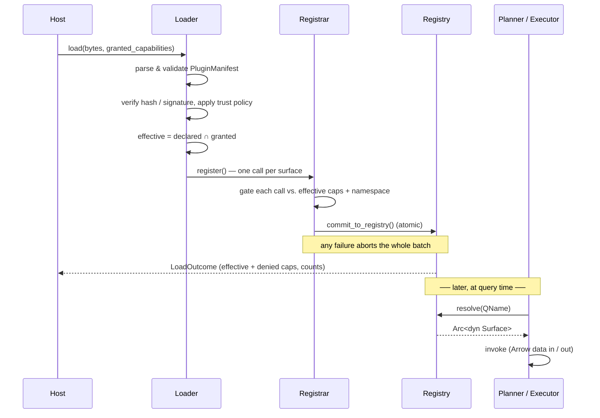

# Plugin Concepts

Uni's extensibility is a single registry-backed plugin framework. Whether you are adding a scalar function, a custom aggregate, a Locy aggregate, a procedure, a storage backend, an index kind, a CRDT, or an auth provider, the path is the same: you implement one of the framework's *surface traits*, describe your extension with a `PluginManifest`, register it through a `PluginRegistrar`, and the engine resolves it at call time from a shared `PluginRegistry`.

The whole model fits in two axes and one lifecycle:

- **Surfaces** — *what* you extend. There are 23 capability surfaces (scalar functions, aggregates, index kinds, storage backends, triggers, …). Picking a surface means picking which trait you implement.
- **Loaders** — *how* you author and sandbox the code. The same surface can be authored in native Rust, in WebAssembly (Component Model or Extism), in Rhai, or in Python via PyO3. The loader decides the language, the boundary, and the sandbox — not what the extension does.
- **Declare → register → resolve** — the lifecycle every plugin follows regardless of surface or loader. A manifest *declares* identity, surfaces, and capabilities; a registrar *registers* the surfaces (gated by trust); the planner and executor *resolve* them by name at query time.

Built-in functionality is dogfooded through this exact path — the vector index is one index-kind provider among many, the Lance backend is one storage registration, and Locy's `MNOR`/`MPROD` aggregates are ordinary `LocyAggregate` registrations. If the framework can't express a built-in, the framework is wrong.

This page is the mental model. For hands-on authoring see [Authoring](authoring.md); for loader specifics see [Loaders](loaders/index.md); for the security boundary see [Trust & Capabilities](trust-and-capabilities.md).

---

## Surfaces

A **surface** is a single extension point — one trait in `crates/uni-plugin/src/traits/`. There are 23 of them, each `Send + Sync + 'static` and each speaking Arrow at its boundary. They group into three layers by *when* they run.

| Layer | Surface | Trait | Built-ins shipped |
|---|---|---|---|
| **Query-time** | Scalar function | `ScalarPluginFn` | APOC-core + examples |
| | Aggregate function | `AggregatePluginFn` + `PluginAccumulator` | — |
| | Window function | `WindowPluginFn` | — |
| | Procedure (`CALL`) | `ProcedurePlugin` + `ProcedureHost` | 38 APOC + schema/algo/search |
| | Locy aggregate | `LocyAggregate` + `LocyAggState` | **10** (see below) |
| | Locy predicate | `LocyPredicate` | — |
| **Engine** | Operator / plan node | `OperatorProvider` | — |
| | Optimizer rule | `OptimizerRuleProvider` | pushdown negotiation |
| | Index kind | `IndexKindProvider` | vector index |
| | Storage backend | `StorageBackend` + `Storage` | Lance backend |
| | Algorithm | `AlgorithmProvider` + `AlgorithmHost` | label propagation + 36 via adapter |
| | Pregel program | `PregelProgramProvider` | — |
| | CRDT kind | `CrdtKindProvider` + `CrdtState` | 5 (LWW / OR-Set / G-Counter / MV-Register / RGA) |
| | Logical type | `LogicalTypeProvider` | 5 (uri / geo.point / email / ipv4 / ipv6) |
| | Collation | `CollationProvider` | 5 (ascii ×2, unicode ×2, natural) |
| **Lifecycle / integration** | Session hook | `SessionHook` | phased + legacy bridge |
| | Trigger | `TriggerPlugin` | — |
| | Background job | `BackgroundJobProvider` + `JobHost` | ttl_sweep / compaction / statistics_refresh |
| | CDC output | `CdcOutputProvider` + `CdcStream` | — |
| | Connector | `Connector` | — |
| | Catalog | `CatalogProvider` + `CatalogTable` | — |
| | Auth | `AuthProvider` | — |
| | Authz | `AuthzPolicy` | — |

The authoritative count is the 23 *extension variants* of the `Capability` enum — registering a surface requires holding its capability. (Neural predicates register through the `LocyPredicate` surface; rerankers are *not* a plugin surface — they are a separate subsystem.)

**Rust-only vs. loader-portable.** Only the native Rust loader can author all 23 surfaces today. The sandboxed and scripted loaders (WASM Component Model, Extism, Rhai, PyO3) author exactly three: **scalar function, aggregate, and procedure**. The remaining twenty surfaces are deep in-process contracts — `&Expr` trees, async streams, trait objects — that are Rust-only in v1. So "what can a Python plugin do?" has a crisp answer: scalar fns, aggregates, and procedures.

### Locy aggregates

The Locy logic engine plugs into the same `LocyAggregate` surface. Ten aggregates ship built-in — `MIN`, `MAX`, `SUM`, `MSUM`, `COUNT`, `COUNTALL`, `AVG`, `COLLECT`, `MNOR`, `MPROD` — each a registration, none hardcoded. Non-recursive Locy `FOLD` dispatches through `LocyAggState` rather than a name match (this was gap **G1**, now fixed), so a user-registered Locy aggregate is a first-class citizen in `FOLD`. The trait lives in `traits/locy.rs`; a `LocyAggregate` declares its semilattice and ingests Arrow index batches.

---

## Loaders

A **loader** turns plugin *bytes or source* into registered surfaces. All five loaders converge on the same `PluginRegistrar`, so a registered `Arc<dyn ScalarPluginFn>` looks identical to the executor regardless of where it came from.

| Loader | Language | Boundary | Sandbox |
|---|---|---|---|
| **Rust** | native Rust | native trait object | none (trusted, compile-time) |
| **WASM Component Model** | any WASM language | WIT bindings, Arrow IPC | wasmtime + WIT |
| **Extism** | any WASM language | Arrow IPC / JSON over linear memory | Extism host-fn ABI |
| **Rhai** | Rhai script | `rhai::Engine` | Rhai engine |
| **PyO3** | Python | Arrow C Data Interface (PyCapsule) | none (trusted, in-process) |

Pick Rust for hot paths, PyO3/Rhai for in-process ops and data-science authoring, and the WASM loaders for untrusted or polyglot third-party code. See [Loaders](loaders/index.md) for the full matrix and per-loader guides.

---

## QName resolution

Every registered extension is addressed by a **qualified name**: `QName { namespace, local }` (`crates/uni-plugin/src/qname.rs`). The `namespace` part is a reverse-DNS plugin id; the `local` part is the per-plugin item name. Written out, a qname looks like `ai.example.geo.haversine` — namespace `ai.example.geo`, local `haversine`.

Reverse-DNS namespacing keeps two plugins from colliding on a common local name (two vendors can both ship a `distance` without clashing). A handful of single-token ids are reserved for framework built-ins and migration aids (`builtin`, `apoc-core`, `custom`, `user.legacy`); third-party plugins must use reverse-DNS form.

Resolution happens at **query-plan time**, not at parse time and not by a hardcoded `match`. The planner and executor consult the registry by qname via point-lookups — there are zero hardcoded dispatch arms left. Cypher call sites match qnames case-insensitively; Locy call sites match case-sensitively. For procedures, the dispatcher tries the exact `namespace.local` first, then strips a leading `uni.` prefix and probes the conventional namespaces, falling back only if nothing resolves.

---

## Manifest & ABI

A plugin's `PluginManifest` (`crates/uni-plugin/src/manifest.rs`) is its self-description — read and validated *before* any surface is registered. It declares:

- **Identity** — `id` (reverse-DNS), `version` (semver), and the host `abi` range the plugin targets.
- **Surfaces** — `provides` (a `ProvidedSurfaces` inventory) enumerates exactly what `register()` will populate, so the host can validate and route before registration runs.
- **Capabilities** — the `CapabilitySet` the plugin *requests* at load time (see below).
- **Semantics & provenance** — `determinism` (`Pure` / `SessionScoped` / `Nondeterministic`), `side_effects`, `scope`, an optional Blake3 `hash`, and an optional Ed25519 `signature`.

**The wire format for sandboxed loaders is Arrow IPC.** When a plugin runs outside the host process — WASM Component Model or Extism — columnar data crosses the boundary as Arrow IPC bytes: the host serializes input columns, the plugin deserializes, computes, and serializes results back. (The in-process loaders avoid the copy: PyO3 uses the Arrow C Data Interface, native Rust passes trait objects directly.) This is why cross-loader **byte-parity** is testable — the CM and Extism paths produce bit-identical results to the Rust reference.

The ABI range is a semver `VersionReq` (`^1`, `>=1, <99`, …) keyed off the host *major* version, which lets two ABI majors coexist for hot-reload.

---

## The capability model

A capability is permission to do one thing — register a particular surface, or call a particular host service (filesystem, network, host query), or consume a bounded resource. The governing rule is one line:

> **effective = declared ∩ granted**

The manifest *declares* the capabilities the plugin wants; the host *grants* a set at load time; the plugin runs with the intersection. A capability the plugin declared but the host did not grant is simply absent — and absence is enforced, not advisory. There is intentionally **no global `PluginConfig`**: every grant is a deliberate, per-load decision.

How that absence takes effect differs by loader:

- **Extism filters host functions at load.** Only the host functions for *granted* capabilities are linked into the plugin; an ungranted host function is never installed.
- **WASM Component Model** records the effective set and surfaces it as `effective_capabilities` / `denied_capabilities`. The only host import wired today is `host-log`; effectful host imports (filesystem, network, …) are not yet present.

Either way, a registrar call that needs a capability outside the effective set fails the whole `register()` — partial registration is never observable, and the load outcome surfaces a `denied_capabilities` list.

**Per-call resource limits.** `FuelPerCall` and `MemoryBytes` cap per-call fuel/operations and linear memory. The Rhai engine enforces them from the granted quota capabilities; the WASM Component Model and Extism loaders take the equivalent limits from their manifest fields.

See [Trust & Capabilities](trust-and-capabilities.md) for the full capability taxonomy, signing, and trust policy.

---

## Load → register → resolve

Every plugin, on every loader, flows through one lifecycle: the host loads bytes, the loader validates the manifest and applies trust, the registrar commits surfaces into the registry, and — later, at query time — the planner resolves a qname and invokes the surface.

The two halves are deliberately decoupled. **Load → register** happens once, eagerly, with full validation and trust enforcement. **Resolve → invoke** happens per query, as a cheap point-lookup against the registry — and because the registry hands back an `Arc`, a long-running query keeps invoking the version it started with even if the plugin is hot-reloaded underneath it.
